# Day14

[개인학습](#-개인학습)

[Sequential Data and RNN1](#-강의---임성빈-교수님)

[Sequential Data and RNN2](#-강의---최성준-교수님)

[Transformer](#transformer)

[실습](#실습)

# | 회고

정말 많이 궁금했던 RNN/LSTM에 대한 기초 지식을 알 수 있었습니다. 기초... 라고 하기에는 너무나 어려운 내용들이었지만, 시계열 데이터를 처리하는 다양한 방법론들의 흐름은 알 수 있었습니다. 최성준 교수님께서 기술의 흐름을 요약해주실 때면 정말 대단하시다는 생각이 드네요 :sparkles:

오늘 피어세션때는 진로 이야기도 했고, 아이패드로 줌 화이트보드를 예쁘게 활용하는 걸 시작해보기도 했습니다. 더 원활하게 소통할 생각을 하니 기쁩니다. 그리고 특강 때 웹앱과정 수료자분이 말씀해주신 "위를 보기보다는 옆을 봐라"라는 말은 정말 인상깊었습니다. 딥러닝을 이미 잘하시는 분들 보면서 좀 위축되고는 했는데, 함께 공부하고 계신 캠퍼분들, 도와주시는 부스트캠프 관계자분들 떠올리면서 마음을 다잡아야 할 것 같습니다~~ㅎㅎ 오늘도 감사한 하루였습니다! XD


# | 개인학습

## RNN : 순환신경망 (Recurrent Neural Network)
- MLP,CNN과 같은 신경망들은 은닉층에서 activation func 씌우면 결과가 출력층 방향으로 향함.(**Feed Forward Neural Network**)
- 그러나 RNN은 출력층 방향으로도 보내지만, 다시 은닉층 노드의 다음 계산의 입력으로 보내는 특징을 가짐
    - cell : RNN에서 은닉층에서 activation func통해 결과 내보내는 역할을 하는 노드
    - 이전값을 기억하려고 하는 `일종의 메모리 역힐` 수행하므로 이를 메모리셀, RNN셀이라고 부름
    - 은닉층의 메모리셀은 각 시점에서 바로 `이전 시점에서의 은닉층의 cell에서 나온 값을 입력으로 사용하는 재귀적 활동`을 한다.
    - 은닉 상태 (hidden state) : cell이 출력층 방향, 그리고 t+1시점의 자신에게 보내는 값
    - RNN에서는 뉴런이라는 단위보다는 입력벡터/출력벡터/은닉상태 라는 표현을 주로 사용

- [EXAMPLE]     
    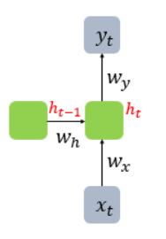
    * activation func : f - 보통은 하이퍼볼릭탄젠트(tanh) (ReLU로 바꿔 사용하는 시도도 있긴 함)
    * 은닉층 : $h_t=tanh(W_xX_t+W_hh_{t-1}+b)$
        * 은닉층 연산 : 벡터와 행렬의 연산. 
            * 보통 입력 $x_t$는 대부분 단어 벡터로 간주되는데, 단어 벡터의 차원을 d, 은닉상태 크기 $D_h$라고 할떄 다음이 성립
                * $x_t:(d*1)$
                * $W_x:(D_h*d)$
                * $W_h:(D_h*D_h))$
                * $h_{t-1}=(D_h*1)$
                * $b:(D_h*1)$
                * 배치 크기 1, d와 $D_h$ 모두 4라고 가정했을 때 은닉층 연산
                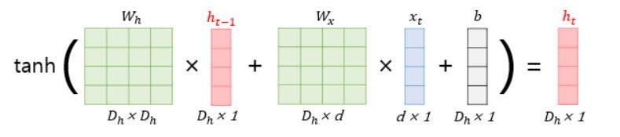
    * 출력층 : $y_t=f(W_yh_t+b)$
        * $y_t$계산하기 위한 activation func으로는 이진분류-sigmoid, 다중클래스분류-softmax 사용
- 코드 구현
    ```python
    import numpy as np

    # cell에서 은닉상태 계산하는 과정 (은닉층 하나- not Deep RNN)
    timesteps=10 # 시점의 수. NLP에서는 문장의 길이
    input_size=4 # 입력의 차원. NLP에서는 보통 단어 벡터의 차원
    hidden_size=8 # 은닉 상태의 크기. 메모리 셀의 용량. 8차원으로 구성된 벡터

    inputs=np.random.random((timesteps,input_size))
    hidden_state_t=np.zeros((hidden_size,)) # 초기 은닉 상태는 0으로 벡터 초기화

    Wx=np.random.random((hidden_size,input_size)) # 입력 가중치(은닉상태크기x입력차원)
    Wh=np.random.random((hidden_size,hidden_size)) # 은닉 상태 가중치(은닉상태크기x은닉상태크기)
    b=np.random.random((hidden_size,)) # bias (은닉상태크기)

    total_hidden_states=[]
    for input_t in inputs:
        output_t=np.tanh(np.dot(Wx,input_t)+np.dot(Wh,hidden_state_t)+b)
        total_hidden_states+=[list(output_t)]
        print(np.shape(total_hidden_states))
        hidden_state_t=output_t
    total_hidden_states=np.stack(total_hidden_states)
    print(total_hidden_states) # 크기:(timesteps,output_dim)
    ```


## LSTM 살짝 맛보기 (강의때 심층적 접근)
- RNN의 장기 의존성 문제(the problem of Long-Term Dependencies)
- 보완하고자 나온 것이 LSTM
- LSTM은 은닉층의 `메모리 셀에 입력 게이트, 망각 게이트, 출력 게이트를 추가`하여 불필요한 기억을 지우고, 기억해야할 것들을 정한다. 이 3개의 게이트에는 공통적으로 sigmoid가 존재한다. 즉, 0~1사이값으로 나온 값들로 게이트를 조절한다.
- pytorch에서 LSTM셀 사용법
    ```python
    nn.LSTM(input_dim, hidden_size, batch_fisrt=True)  
    ```


# | 강의 - 임성빈 교수님
# Sequence Data
* MLP,CNN과 달리 RNN에서는 sequence 데이터 다룸
    * 소리, 문자열, 주가 등 시간 순서에 따라 나열된 데이터를 sequence 데이터로 분류 
    * sequence 데이터는 독립동등분포(i.i.d) 가정을 위배하기 떄문에 순서를 바꾸거나 과거 정보에 손실이 발생하면 데이터의 확률분포도 바뀌게 됨
* `이전 sequence 정보` 가지고 `앞으로 발생할 데이터 확률분포를 다루기 위해 조건부확률` 이용 (베이즈 정리)
* $P(X_1,...X_t)=P(X_t|X1,...X_{t-1})P(X_1,...,X_{t-1})$
    * $=P(X_t|X_1,...X_{t-1})P(X_{t-1}|X_1,...,X_{t-2})P(X_1,...X_{t-2})$
    * $=\prod{p(X_s|X_{s-1},...,X_1)}$
    * 조건부 확률은 과거의 모든 정보를 사용하지만, 시퀀스 데이터를 분석할 때 `모든 과거 정보들이 필요한 것은 아님`
* sequence 데이터를 다루기 위해선 `길이가 가변적`인 데이터를 다룰 수 있는 모델이 필요
    * $X_t \sim P(X_t|X_{t-1},...,X_1)$
    * $X_{t+1} \sim P(X_{t+1}|X_t,...,X_1)$
    * 위 두 식처럼 조건부에 들어가는 데이터 길이가 가변적
* Autoregressive Model(AR) 그리고 잠재 AR 모델
    * AR 모델
        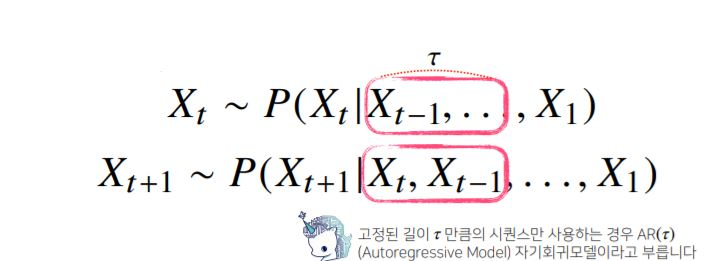
    * 그러나 tao를 결정하거나 바꾸는 것은 힘들때가 있다. 잠재 AR은 직전 시점의 정보와 그게 아닌 정보들을 묶어서 활용
    * 즉 `바로 이전 정보를 제외한` 나머지 정보들을 $H_t$라는 잠재변수로 인코딩해 활용하는 것이 잠재 AR 모델
        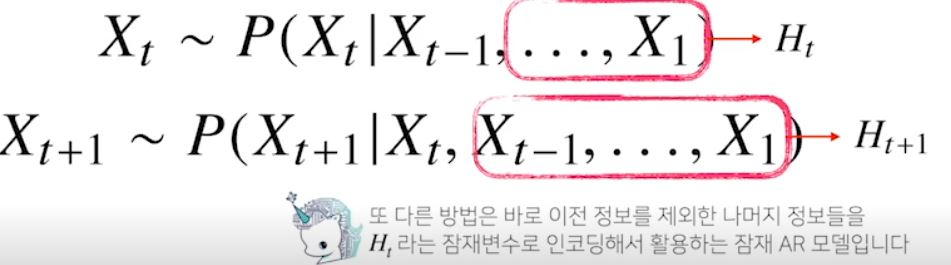
        * 두가지 데이터 사용 + 고정된 길이의 데이터로 모델링 활용할 수 있음
        * 즉 과거 모든 데이터 활용하지만 가변 데이터 문제를 바꿀 수 있어서 장점이 있다.
        * 그러나, 인코딩하는 방식이 문제가 된다. 이걸 `해결하는게 RNN`
    * 잠재변수 $H_{t}$를 `신경망을 통해` 반복해 사용하여 `sequence 데이터 패턴을 학습하는 모델이 RNN`
    * $H_t=Net_{\theta}(H_{t-1},X_{t-1})$
    * $X_t \sim P(X_t|X_{t-1},H_{t})$
    * $X_{t+1} \sim P(X_{t+1}|X_t,H_{t+1})$

# RNN
* Recurrent Neural Network
* 가장 기본적인 모형 (MLP와 유사한 모양) - 과거 정보를 담을 수는 없다.
    * $O_t=H_tW^{(2)}+b^{(2)}$
    * $H_t=\sigma{(X_tW^{(1)})+b^{(1)})}$
    * $H_t: 잠재변수$ 
    * $\sigma:활성화 함수$
    * $W:가중치 행렬$  -시퀀스와 상관없이 불변인 행렬 
    * $b:bias$
* RNN은 이전 순서의 잠재변수와 현재의 입력을 활용해 모델링
    * $O_t=H_tW^{(2)}+b^{(2)}$
    * $H_t=\sigma{(X_tW_{X}^{(1)})+H_{t-1}W_H^{(1)}+b^{(1)})}$
    * $W_X^{(1)}$ : 입력으로부터 전달하게 되는 가중치 행렬
    * $W_H^{(1)}$ : `이전 잠재변수로부터 전달받게 되는 가중치 행렬`  
    * 잠재 변수인 $H_t$를 복제해서 다음 순서의 잠재변수를 인코딩하는데 사용
    * (주의) $W_{(2)}$, $W_X^{(1)}$, $W_H^{(1)}$ 은 t에 따라 변하지 않는 가중치 행렬. t에 따라 변하는 것은 잠재 변수와 입력 데이터만 해당  
        
* RNN의 역전파는 잠재변수의 연결그래프에 따라 순차적으로 계산
    * BPTT : Backpropagation Through Time 
    * BPTT는 RNN의 역전파 방법
    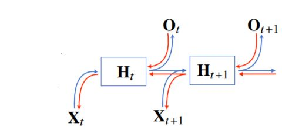  
    * BPTT로 RNN 가중치 행렬의 미분 계산 시 미분의 곱으로 이루어진 항 계산됨
    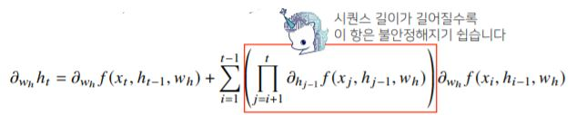  
* truncated BPTT
    * 시퀀스 길이가 `길어지는 경우` BPTT를 통한 역전파 알고리즘 계산이 불안정해지므로 길이를 끊어내야 한다는 것  
    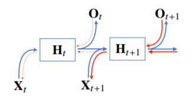
    * BPTT를 관찰되는 모든 시점에 대해서 적용하면 gradient계산이 불안정해짐. gradient vanishing 현상이 큰 문제가 됨. 미래 시점에 갈수록 grdient가 있고 이전 시점에 대한 예측이 쉽지 않아서 과거 정보를 누락하게 된다. trancated BPTT가 해결책(?)
    * vanila RNN은 길이가 긴 시퀀스 처리하는데 문제가 있다. 
        * Vanishing gradient 문제 해결하기 위해 나온 RNN네트워크가 LSTM과 GPU
    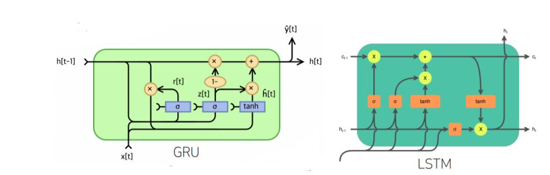  

# | 강의 - 최성준 교수님
## RNN
1. MLP : 한 벡터를 다른 벡터로 바꿈
2. CNN : 이미지를 내가 원하는 형태로 바꿔줌
    1. classification : 이미지를 one-hot vector로
    2. detection : NN출력값이 각 영역의 bounding 값을 찾는
    3. semantic segmentation : 이미지의 픽셀 벼로 어떤 클래스에 속할지를 말하는
3. RNN 
    * 주어진 데이터가 sequence data

## Sequential Model
* sequential 데이터 처리하는 가장 큰 어려움?
    * 얻고 싶은 것은 어떤 라벨/하나의 정보인데
    * 이 데이터는 정의상 길이가 언제 끝날지 모름
    * 입력의 차원을 알 수가 없다.
    * Fully connected Network, CNN 사용할 수가 없는 것
    * 입력 차원 상관없이 모델이 동작해야 되는 문제
* 이전 데이터로 다음 데이터를 예측해보자
    * Naive model      
    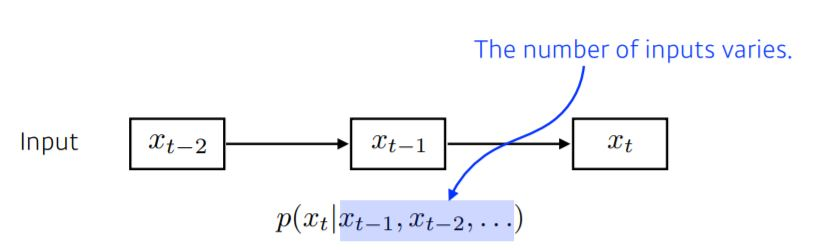  
    * 그런데, 과거에 고려해야 하는 정보가 `시간 지날수록 점점 늘어가서 어려움`
* Autoregressive model  
    * 그러면, fix the past timestep해보자     
    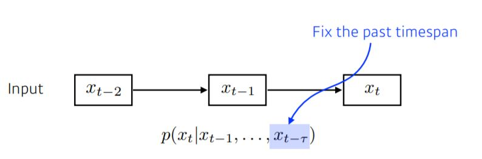 
    * Markov model(first-order AR model)    
      
        * 가정하기에 현재는 바로 전 과거에만 dependent하다
        * 근데, 현실에서는 말이 안됨. 전날 공부한걸로 수능점수 예측?
        * 많은 과거 정보가 유실됨
    * Latent AR mdoel    
    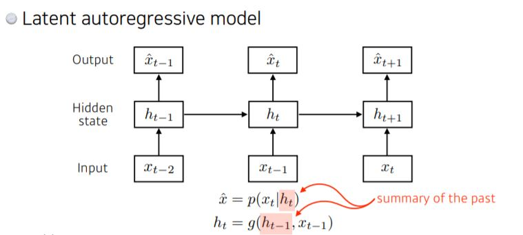      
        * hidden state하나를 넣어서 과거의 정보를 요약하도록
        * 그래서 다음번 state는 hidden state 하나로만 결정
        * 결국 하나의 과거 정보에만 dependent하지만 summary한 정보였다는 점

## RNN
* 자기 자신으로 돌아오는 구조가 하나 있다.  
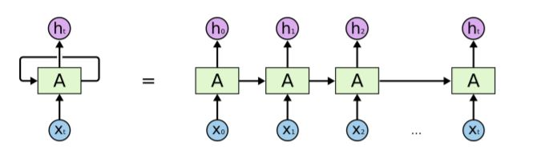
    * 현재 입력이 들어가고, 이전 입력이 recurrent로 들어옴
    * recurrency 구조가 있을 때 timestep fix+시간순으로 풀면 Fully connected layer로 볼 수 있음
    * 가장 큰 단점 : short-term dependencies는 잘 잡을 수 있지만 `long-term dependencies 잡는게 어려움`
        * 과거의 정보들이 다 취합되어서 미래를 고려해야 되는데, RNN은 과거의 fix된 정보로 취합을 하기 때문에 오래된 정보가 미래에 살아남기 힘듬
        * 문장이 길어져도 중요한 정보 잘 저장하다가 필요할 때 써먹어야 하는데, 그걸 못함
        * 학습의 어려움도 있음       
        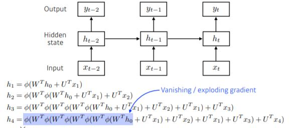
            * 중첩된 구조로, 똑같은 weight을 곱하고 activation func 통과시켜야 함
            * `Vanishing gradient문제` : 활성함수가 `sigmoid`라고 하면 값을 계속 0~1 로 squashing(줄여버림). W+squashing이 반복되므로 그 값이 의미없어질 수 있다.
            * `Exploding gradient문제` : 활성함수가 `ReLU`일 때 W가 양수일 때 W를 n번 곱하게 됨. 크게 발현됨

# LSTM  
* Vanilla RNN     
    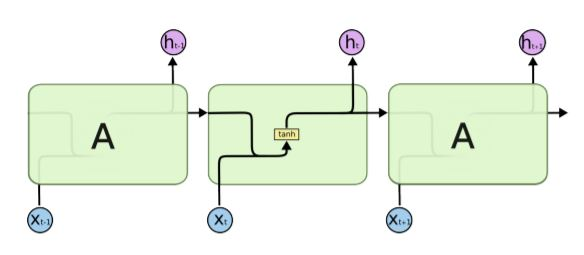
* LSTM          
    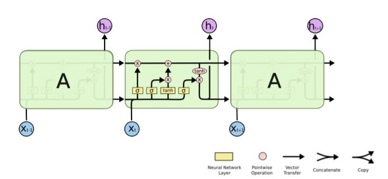
    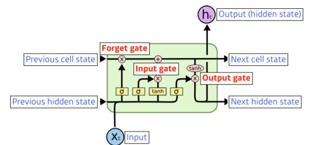  
    * input : language model의 경우 word-embedding vector
    * ouput : 다음 번의 hidden state 
    * previous cell state : LSTM `내부에서만` 흘러감. 현재까지 timestep의 정보를 summary해둠
    * previous hidden state : t+1 LSTM의 previous hidden state로 들어감. `LSTM 입력으로 들어감`.
* LSTM은 **gate 위주로 이해**하는 것이 좋음   
    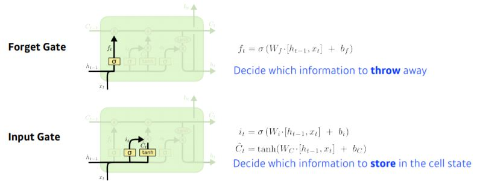
      
    1. **Forget gate**
    - Decide which info to `throw away`
    - sigmoid 거치므로 $f_t$는 0~1 사이 값. cell state 정보 일부를 throw away하는 것과 맞닿은 부분
    2. **Input gate**
    - Decide which info to `store` in the cell state
    - tilda $C_t$는 현재 정보와 이전 출력값을 가지고 만들어지는 cell state candidate
    이전까지 memorized된 summarized cell state와 현재,이전 정보로부터 얻어진 새로운 cell state를 섞어서 **Update cell** 
    3. **Output gate**  
    - Make output using the updated cell state
    - output gate를 만들어서 cell state를 `한번 더 조작한뒤 (어떤 값 밖으로 내보낼지 결정)` next hidden state로 흘러가도록 함

# GRU
1. reset gate
2. update gate
* cell state 없고 hidden state가 바로 있음. output gate 필요없음
* 두개의 gate만 가지고도 LSTM과 비슷한 효과 가져옴
* 네트워크 파라미터 더 적게 활용해 `generalizied performance` 높다.


*Transformer 등장으로 RNN을 많이 사용하지는 않는 추세*

# 현재까지 정리
1. RNN - 단점 : long-term dependency 잘 못잡음
2. 그래서 LSTM 나옴
3. LSTM은 gate가 3개 필요해 파라미터 수가 많이 필요
4. GRU는 LSTM에서 gate 하나 없애서 파라미터 수 줄임. LSTM보다 성능 좋음

</br>

# **Transformer 
- sequential data를 다루는 방법론
- sequential model이 왜 어려울까?
    - `[Trimmed sequence]`문장은 길이가 항상 달라질 수 있다. 
    - `[Omitted sequence]`중간에 단어가 빠질 수도 있다. 완벽한 대응구조가 아닐 수 있다.
    - `[Permuted sequence]`순서가 뒤바뀔 수도. 밀리거나
- 위 문제들을 해결하고자 Transformer 등장. 
- **self attention 구조**를 사용하게 됨
- "Transformer is the first sequence transduction model based entirely on `attention`"
- 기계어 번역뿐만 아니라, 이미지 분류, 글자->이미지 추출의 기반이 되기도
- *Jay Alammar 그림 찾아보자*

- [EXAMPLE]
    - 불어 -> 영어 문장 : sequence to sequence
    - `입력 시퀀스 도메인 != 출력 시퀀스 도메`인 일 수 있다.
    - `입력 시퀀스 단어 개수 != 출력 시퀀스 단어 개수` 일 수 있다.
    - 하나의 모델로!
    - RNN은 3개의 단어가 입력으로 들어가면 3번 RNN을 거침
    - 그러나 trnasformer encoder은 재귀적으로 돌지 않고, 한번에 x개 단어를 인코딩 (self attention 부분)
 
- **[Questions - focus on]**
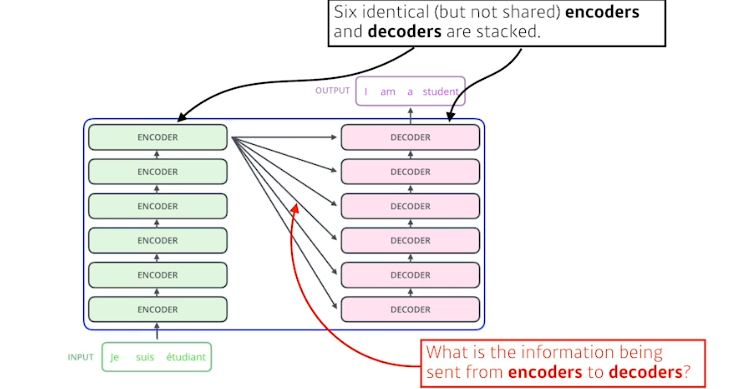
1. n개의 단어 어떻게 한번에 인코더 부분에서 처리될까?
2. 인코더 ~ 디코더 사이에 어떤 정보를 공유할까?
3. 디코더가 어떻게 generalization 할 수 있는지?

## Self Attention
- X1이 Z1으로 들어갈 때 X1의 정보만 활용하는 것이 아니라 X2,X3 정보 같이 활용함.    
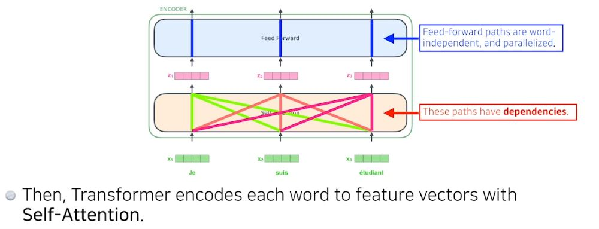
- feed forward dependency가 없음
- [EXAMPLE]
    - "The animal didnt cross the street because it was too tired"
    - 이 문장 이해하기 위해서는 it이 뭔지를 알야아 함 - 단어 간의 `interaction`이 중요하다.    
        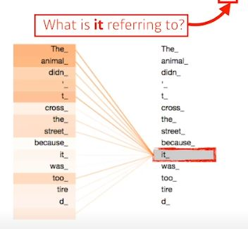

- 단어마다 transformer은 `3가지 벡터를 만든다. (3개의 nn)` 
    * 이 세개의 벡터는 embedding vector을 새로운 벡터로 바꿔줄 것
    1. Query
    2. Key
    3. Value
    * (1+2+3)으로 단어에 대한 score 벡터를 만든다. 인코딩하고자 하는 Query 벡터와 나머지 모든 n개에 대한 key벡터를 구해 내적. 두 벡터가 얼마나 align이 잘되었는지 본다. i번째 단어가 나머지 n개의 단어와 얼마나 유사도가 있는지 확인
    * 내가 인코딩하는 벡터의 `query` 벡터와 나머지 벡터(자신을 포함)들의 `key 벡터`를 구해 `내적`
    * i번째 단어와 나머지 단어 사이에 얼마나 `interaction`해야 하는지 알아서 학습하게 함. (`attention` - 특정 timestep에 어떤 입력 더 주의깊게 볼지를 보는.)
    * softmax로 attention weights(interaction에 대한 scalar) 본다.
    * value vector : 각 입력 임베딩 벡터마다 query,key 벡터 만들었고 key와 value벡터 내적으로 score 만들었고 softmax씌워 각각 단어에서 나오는 value 벡터들과 weighted sum한 것이 우리가 구하고자 하는 값. 임베딩 벡터의 인코딩 벡터. 
    * (주의) query vector, key vector은 차원이 같아야 한다.내적해야 되므로. (*But MHA에서는 달라도 되는듯*) 하지만 value vector는 차원 달라도 됨 (weighted sum만 하면 되므로)    
    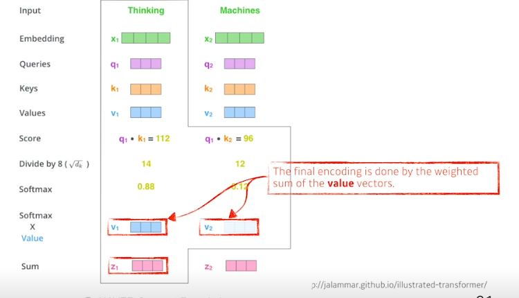  
    - [행렬 사용으로 이해!]      
    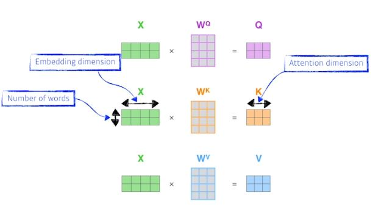
    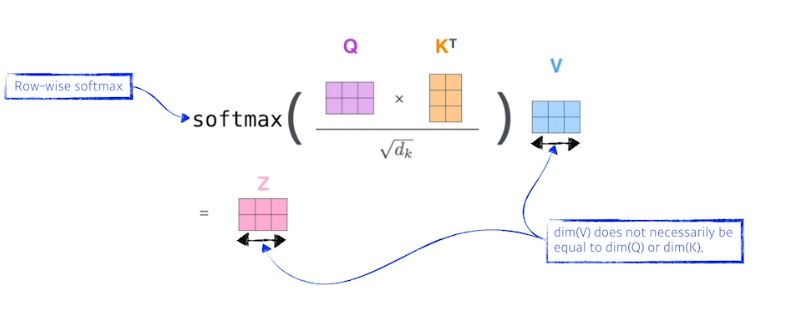
- Transformer 왜 잘될까?
    - 이미지 하나가 주어지면, MLP,CNN에서는 input fix되면 줄력이 고정됨. convolution filter 나 weight이 고정되어 있으므로
    - transformer은 하나의 input고정되어 있더라도, 인코딩하려는 단어와 옆의 단어들에 따라서 인코딩 값이 달라짐. MLP보다 더 `flexible`한 모델. 입력 고정되었을 때도 옆에 주어진 입력 달라짐에 따라 출력 달라지는 여지가 있기 때문에
    - 이 말은 `더 많은 computation 필요`하다는 것. 한번에 처리하고자 하는 단어가 1000개면 한번에 1000x1000으로 함. RNN은 1000번 돌리기만 하면 되는데
        - 즉, 단어 길이가 길어졌을 때 처리할 수 있는 `한계`가  있다. 그래도 flexible, 많은 걸 표현할 수 있는 네트워크 만들 수 있다. 

    https://nlpinkorean.github.io/illustrated-transformer/


## `Multi-headed attention(MHA)`  
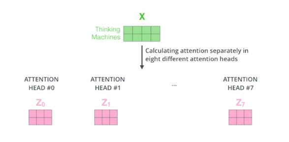
- attention 여러번 (하나의 임베딩 벡터에 대해서 query-key vector만드는 과정 여러번)
- 인코더 하난데, 여러번 적용되려면 embedding된 dimension과 encoding되어서 self attention으로 나오는 vector의 dimension이 `같아야 한다`.
- position encoding이 추가됨
    - 사용하는 이유 : sequential하게 단어 넣어줘도 sequential한 정보가 포함되어 있지가 않음. abcd와 dacb 등등 단어들이 인코딩 되는 값은 달라질 수가 없다. self attention에서는. 따라서 문장 만들때는 단어의 순서가 중요하므로 position encoding이 중요하게 됨  

- `Encoder-Decoder Attention`
    - encoder : 주어진 단어를 표현하는 것, decoder : 그걸로 결과를 생성
    - encoder -> decoder 보내는 것? :  key와 value 벡터
    


## Vision transformer
- self-attention을 이미지 도메인에도 많이 사용한다.
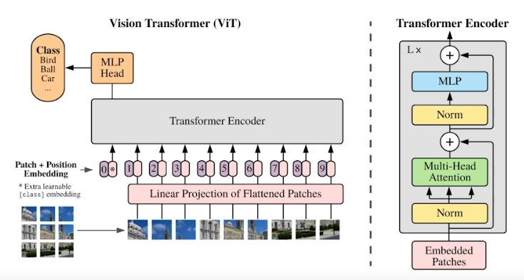

## DALL-E
문장이 주어지면 문장에 대한 이미지를 만들어줌. (*신기하다....*)
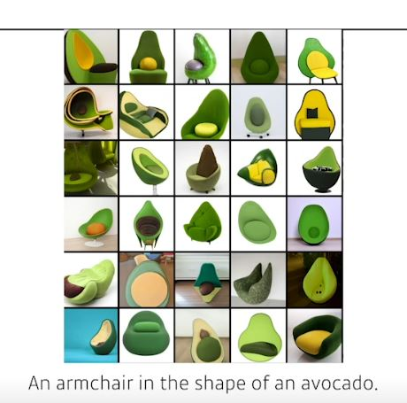


# 실습
[Classification with LSTM](../notes/jupyter/Day14_Classification_with_LSTM.ipynb)

[MHA](../notes/jupyter/Day14_MHA.ipynb)