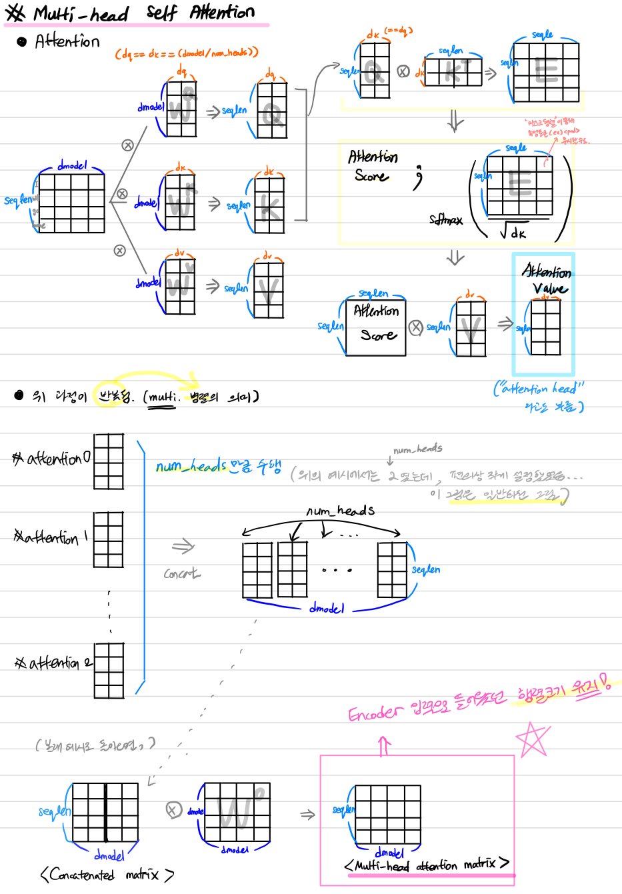
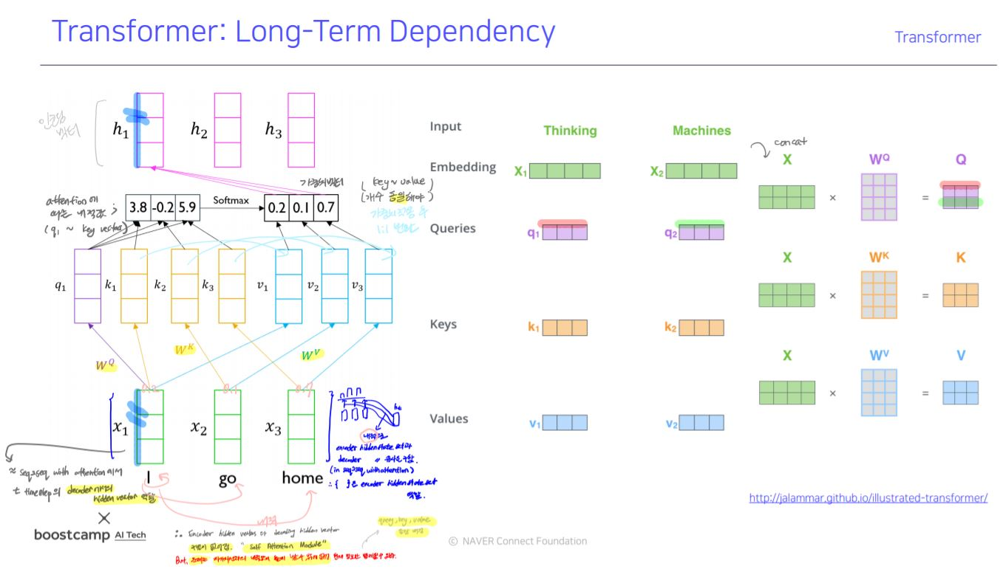
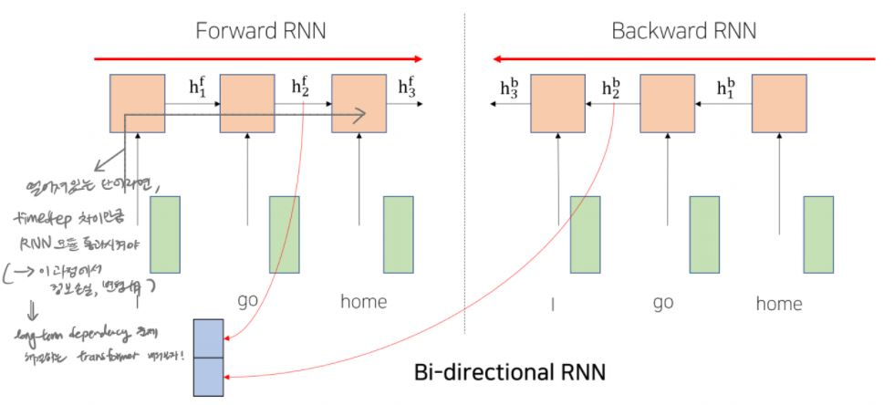
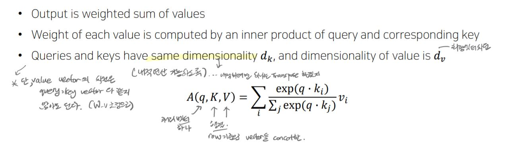
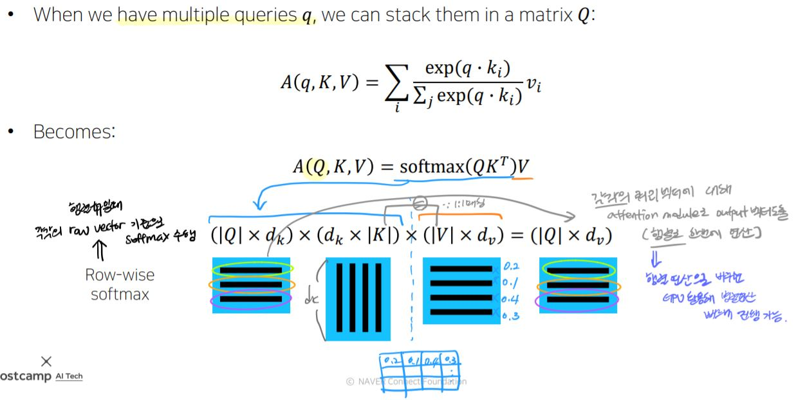
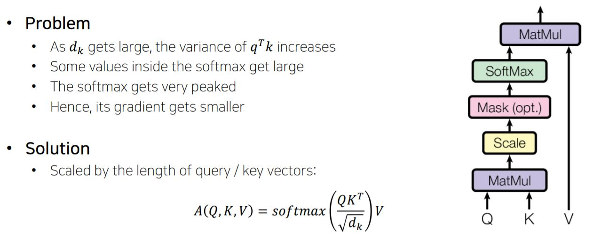
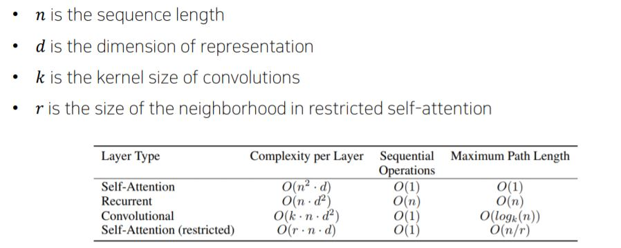

# Day19
[1. transformer intro](#transformerintro)

[2. transformer-Multi-Head Attention](#transformer)

[3. 내 질문](#내-질문)

[4. 실습 과제](#실습과제)
# | 회고
오늘은 공부하다가 막힌 부분이 있어서, 강의를 아직도 다 못들었습니다. 학습 정리도 이제야 올리네요 ㅠㅠ Transformer에서 Multi-head attention 부분을 하나 하나 그려보고 나서야 다음 진도를 나갈 수 있게 되었습니다. 마저 듣고 강의록도 업데이트 하겠습니다!

# | 개인학습

# | 강의
# Transformer(Intro)

- LSTM이나 GRU 기반의 seq2seq모델의 성능을 개선한 모델
- "Attention is all you need" - attention 모듈을 add 모듈이 아니라, seq를 입출력으로 처리할 떄 RNN 덜어내고 attention만을 사용하겠다.

- 
- [EX] 'I'에 해당되는 벡터는 decoder의 hidden state vector이자, encoder의 hidden state vectors 중 하나였음. 그런데, self attention하다보면, 자신과의 유사도가 높게 나와 현재 정보를 그대로 넘기는 문제가 생길 수 있음. 따라서, 모델 확장이 필요 => `query, key, value 나옴`
- 주어진 vector 중 `어떤 vector을 가져올지 선별`해야. 
- 선별 기준이 되는 vector : `query vector` (ex에서는 'I') 
- query vector와 내적이 되는 재료 vector들 : `key vector`
- query vector를 통해서 key vector들 중 어느 벡터가 높은 유사도 가지고 있는지 선별하게 됨
- query vector와 key vector 유사도 구하고 softmax 취해 얻은 가중치를 실제 적용한 재료 벡터 : `value vector`
- 따라서, 한 시퀀스를 인코딩하는 과정에서 각 벡터들이 query, key, value 3가지 역할을 모두 수행.
- 즉, self attention module은 동일한 벡터세트로 출발해도 역할에 따라 벡터가 서로 다른 형태로 변환되도록 도와줌. (W_q, W_k, W_v 각각 독립적으로 적용)
- (정리) encoding vector구할 때 현재 입력 벡터가 self attention시 자신과의 유사도가 높게 나오는 문제 있었음. 현재 정보 그대로 넘기기 때문에 문제. 해당 문제 어떻게 해결?
    - **query, key, value 벡터들 생성후 attention -> softamx 로 얻은 최종 가중치 벡터를 통해서라면, 자신과의 유사도가 다른 단어와의 유사도보다 낮을 수 있음.**
    - value vector에 대한 가중 평균으로서 encoding vector 생성
    - h1,h2,h3 등등 encoding 각 timestep에 맞는 encoding vector 만들 때 모든 입력 단어를 고려했음
    - timestep의 gap이 크더라도(멀리있는 단어였음에도) query vector에 의한 내적값(유사도)가 높았다면 멀리 있는 단어를 가져올 수 있음.
    - 기존에 RNN이 가졌던 멀리있는 단어를 가져오려면 RNN 모듈을 timestep 차이만큼을 반복해 통과해야 한다는 문제를 개선할 수 있었음

    - RNN 구조였다면,
        - 멀리있는 timestep에서의 정보를 배달하기에는 정보 손실/변질 발생했음
        (long term dependency, vanishing/exploding gradient)
        - Bi-Directional RNNs
            - Forward RNN
            - Backward RNN
            - encoding vector가 왼쪽,오른쪽 정보 모두 포함할 수 있도록 병렬적으로 처리
                - 두 vector를 concat한다는 의미
            - 
            - 이 결과 벡터를 만드는 방식을 Transformer에서 대체할 수 있음

## Scaled Dot Product Attention
- softmax(QK^T)에 d_k로 scale하는 이유?
    - query vector, key vector는 가우시안 분포(평균0, 표준편차1) 따른다고 가정됨
    - QK^T 평균은 0이지만, 분산은 d_k가 된다.
    - 분산은, 차원이 커질수록 커지게 되는데 그 결과를 softmax 취하면 편향이 심해져 gradient vanishing 현상을 일으킨다. 따라서, d_k로 scale해 표준편차 1로 맞춰주는 것. 이를 통해 안정적인 gradient 가지도록 도와준다.
- 
- 
- 

# Transformer : 
## 1. Multi-Head Attention
- self attention 모듈을 더 유연하게 확장함
- 동일한 query,key,vector에 대해서 여러 버전의 attention을 수행
- multi head attention 필요한 이유
    - 동일한 시퀀스 주어졌을 때, 특정한 쿼리 단어에 대해서 서로 다른 기준으로 여러 정보를 뽑아야 할 때가 있을 수 있다.
    - 예를 들어, i went to the school, i took the rest, i go swim => i라는 주체를 중심으로 went, took,go라는 행동 정보 뽑아야 할 수 도 있고, 행동 대상을 뽑을 수도 있다.
    - 각각의 head가 이런 정보를 상호보완적으로 뽑는 역할을 하게 된다.
- 계산량, 메모리 요구량 측면에서 특성 살펴보자 (RNN기반의 seq2seq와 비교해보자)

### RNN vs self attention 
- self attention의 경우 query*key까지의 step 예시
- [complexity per Layer]
- -n은 시퀀스 길이, d는 하이퍼파라미터(hidden state vector의 길이)
- 즉 n은 조정못하지만 d는 조정할 수 있다.
- n^2으로 시퀀스 길이 길어지면 self attention에서는 제곱승 
- 따라서 self attention에는 RNN보다 더 많은 메모리가 필요하다.
- [Sequential Operations]
- self attention은 시퀀스 길이 길어도 GPU 코어수가 받쳐준다면 동시 작업 가능
- 그러나 RNN의 경우는 h_t 계산하기 위해서는 h_{t-1}까지의 연산이 처리되었어야 했기 때문에, 절대로 병렬화가 불가
- [Maximum Path Length]
- RNN의 path length는 특정 시점 t1에서 t2까지의 차이만큼 RNN 레이어 거쳐가야
- self attention의 경우 가장 끝에 위치한 timestep 많이 차이나는 단어도 인접 단어같이 취급함

## 2. 
(업데이트 예정)

# 질문과 답변
## 내 질문
1. 강의자료 8p 그림에서 Key matrix의 행의 크기가 seq_len와 달라도 되는 이유가 무엇일까요? |K|와 |V|의 값이 4로, 시퀀스 길이 3보다 더 클 수 있다는 부분을 이해하지 못하겠습니다. ㅠㅠ 예를 들어 'I go home'이라는 문장이 있을 때 'l', 'go', 'home' 단어 중 특정 단어를 중복으로 사용해 key vector를 생성한다는 의미일까요?   

2. 강의 내용 중에 d_q와 d_k는 같아야 하지만, d_v는 둘과 다른 값이어도 된다는 내용이 있었습니다.   

    (d_q: Query vector dimension, d_k: Key vector dimension, d_v: Value vector dimension, d_model: transformer의 모든 층의 출력차원으로 통일하려는 값)

    d_v이 어떤 수건 Value vector들이 가중 평균된 값으로 seq_len 차원을 가진 인코딩 벡터를 형성하기 때문이라고 알고 있습니다. 제가 이해한 내용이 맞을까요? 그런데 다른 참고 자료(https://wikidocs.net/31379)에서는 d_q==d_k==d_v==(d_model/num_heads) 라는 가정이 고정되어 있더라구요. 그래서 "attention head의 shape이 (seq_len,d_v)일 때 attention head들을 모두 concat한 결과가 (seq_len,d_v*num_heads)==(seq_len,d_model)으로 입력층 행렬 크기가 그대로 유지될 수 있었다" 라는 내용이 나옵니다.

    만약 d_v가 d_q와 d_k와 같지 않다면 Multi-head attention matrix의 차원이 d_model이 되지 못할수도 있는 것 아닌가요? 제가 어떤 내용을 잘못 이해하고 있는지 몰라서 도움 요청드립니다. ㅠㅠ

## 조교님 답변
1, 2번 모두 연관되는 내용이므로 한 번에 설명을 드리면 우선 Query, Key, Value의 개념을 다시 짚고 넘어갈 필요가 있습니다.

Python에서 dict라는 자료구조를 기억하실 겁니다. Key와 value가 서로 대응이 되어 있고 key를 통해 value를 찾아낼 수 있는 구조로 되어 있죠. 기본적으로 key는 각각 자신과 대응되는 value를 가지고 있으므로 key와 value는 같은 개수로 존재하는 pair, 세트라고 보시면 됩니다. 그리고 query는 내가 실제로 찾고자 하는, 즉 내가 직접 질의하고자 하는 key가 됩니다. 예를 들어, {'a': 1, 'b': 2, 'c': 3}라는 dict가 있으면 (key, value)는 각각 ('a', 1), ('b', 2), ('c', 3)이 있는 것이고 이제 이 dict한테 내가 'b'의 value 좀 찾아달라고 요청을 하면 이 'b'가 바로 제가 질의하고자 하는 query가 되는 것이죠. 따라서 query는 key를 질의해야 하는 것이므로 query와 key는 같은 형식 또는 같은 선 상에 있는 정보여야 가능합니다.
 

Attention에서 말하는 q, k, v도 결국 위의 query, key, value와 같습니다. 다만 이 값들이 전부 벡터일 뿐인 것이고, query가 key를 찾는 과정이 단순히 있는지 없는지 찾는 것이 아닌 벡터 간 내적일 뿐인 거죠. 내가 현재 집중하고자 하는 query 벡터가 q라면 이것을 대상이 되는 모든 key 벡터인 k들과 각각 내적을 하고 그렇게 얻은 내적 값, 즉 유사도 값을 구하여 그 유사도 값에 따라 선택적으로 각 k가 pair로 가지고 있는 value인 v들을 선택적으로 가져오는 것입니다. 그게 이제 가중합이 되는 거죠.
 

기본적으로 transformer의 multi-head attention에선 어차피 동일한 문장이 각각 q, k, v로 변환된 것이기 때문에 사실 seq_len과 d_model, 또는 d_k와 같은 차원이 모두 동일합니다. 따라서 위의 위키 독스의 말이 틀린 것은 아닙니다. 그럼 왜 강의에선 달라도 된다고 설명이 된 거냐면 실제로 위의 dict 예시처럼 pair를 이루는 값이나 형식만 같아도 multi-head attention은 성립하기 때문입니다. 즉, 일반적으로 확장해서 보면 어차피 q는 k랑만 내적을 하기 때문에 q랑 k의 차원 수만 같아도 내적 계산이 가능하고 따라서 v의 차원과는 달라도 상관이 없고(2번 질문의 답) 한편 q의 개수와는 관계없이 k랑 v는 형식, 즉 차원이 달라도 개수는 무조건 같아야 하는 pair 관계이므로 각 token의 개수인 seq_len이 동일해야 하는 것이기 때문에 k와 v의 길이만 같다면 q와 k의 길이는 달라도 무방합니다.(1번 질문의 답)
 

그리고 실습 8강에서도 설명을 하지만 실제로 1번 질문처럼 q와 k의 길이가 서로 다른 케이스를 소개했는데, 바로 decoder 안에 있는 encoder-decoder 간 attention을 하는 경우입니다. Encoder에 들어가는 src sentence의 길이와 Decoder에 들어가는 trg sentence의 길이를 물론 같게 맞춰줄 수는 있지만 다를 경우도 있습니다. 이런 경우도 실습 코드에서 보시면 아시겠지만 결국 attention matrix의 row와 column 개수만 다를 뿐 계산이 가능한 것을 보실 수 있습니다. 이 경우가 바로 1번에서 나온, q의 길이(decoder input의 token 개수)와 k의 길이(encoder input의 token 개수)가 다른 경우이고 이 경우에도 k와 v의 길이는 동일하게 유지되는 것을 볼 수 있습니다.(왜냐하면 같은 encoder input의 길이이므로) 동시에 내적이 이뤄지는 q와 k의 차원 역시 같죠. (왜냐하면 query는 key와 동일한 형식이어야 하므로)

# 실습&과제

[Day19_multi_head_attentio](../notes/jupyter/Day19_multi_head_attention.ipynb)

[Day19_masked_multi_head_attention](../notes/jupyter/Day19_masked_multi_head_attention.ipynb)

[(과제)Day19_BP](../notes/jupyter/(과제)Day19_BPE.ipynb)