# Day21

[1. 그래프 intro](#그래프-intro)

[2. 그래프와 AI](#그래프-관련-인공지능-문제)

[3. 그래프 유형 및 분류](#그래프-유형-및-분류)

[4. 그래프 표현 및 저장](#그래프-표현-및-저장)

[5. 그래프 Patterns](#그래프-patterns)

[6. 실습 및 과제](#실습--과제) 

# | 회고
오늘 수업 정말 재미있었습니다. ㅎㅎ 알고리즘 문제를 풀면 그래프 문제들을 접하게 되는데, 그래프로 현실에 있는 문제들을 실제로 정의하고 해결하고 있다는 점이 흥미로웠습니다. 기회가 된다면, 네이버 블로그 이웃분들을 정점으로 생각하고, 그분들의 이웃분들을 이웃분들... 을 모두 추가하면 제 이웃수가 몇명까지 늘어날 지 테스트해보고 싶습니다. ㅎㅎ 피어세션은 알고리즘 코드 리뷰로 진행되었습니다. 코드 중 쓰지 않는 배열을 출력할 때 pop해서 배열을 비워놓는 것이 좋은 접근인지 여쭤봤고, 실시간적인 이슈가 아니고(memory leak이 critical) GC가 제공되기 때문에 코딩테스트에서는 굳이 신경쓰지 않아도 된다는 피드백을 얻을 수 있었습니다. 피드백을 받을 때마다 한단계씩 성장하는 느낌입니다! 그리고 수업이 그래프 관련해서인지, 그래프 알고리즘 문제를 더 풀고 싶은 욕구가 뿜뿜하네요.. 오늘도 감사한 하루였습니다!

# | 강의
# 그래프 Intro
- graph
- 정점 집합과 간선 집합으로 이루어진 수학적 구조
- 복잡계를 효과적으로 표현, 분석하기 위한 언어
    - social network
        - 친구:node, 친구관계:edge
    - 전자상거래 구매 내역
        - node: 사용자, 판매물품 , 구매이력:edge
    - internet
        - 라우터간 사용작용
    - 웹페이지
        - HTML간의 연결관계
    - 뇌, knewledge graph, 화학 분자 등등
- 복잡계는 구성 요소들 간의 상호작용으로 이루어진다. 이를 표현하기 위한 수단으로 그래프 사용됨

# 그래프 관련 인공지능 문제
1. Node classification 문제
- 트위터에서의 공유(Retweet) 관계 분석해, 각 사용자 정치적 성향 알 수 있을까?
    - 보수적/진보적 정치적 성향으로 나눴을 때, 어떤 글이 표현하는 성향을 둘 중 하나로 분류할 수 있음
- 단밸질의 상호작용 분석해 단백질 간 상호역할을 알아낼 수 있음

2. Link Prediction 문제
- (거시적 관점 - 주어진 그래프가 어떻게 성장할 것인가?)
- facebook social network 진화 과정
- (미시적 관점 - 각 정점이 앞으로 어떤 정점과 연결될 것인가를 예측)
- 추천시스템
- 각 사용자가 어떤 물건을 구매할 것인가? 어떤 물건을 구매해야 만족도가 높을까? 까지 발전될 수 있음

3. Community Detection 문제
- 군집 분석 문제
- 연결 관계로부터 social circle(가족, 동창, ...) 찾아낼 수 있을까? 
- 그래프 주어졌을 때 연결된 정점간의 집합을 자동으로 찾아내는 알고리즘 만드는 문제가 될 수 있음

4. Ranking 및 Information Retrieval 문제
- web이라는 거대한 graph로부터 어떻게 중요한 web page를 찾아낼까? 의 해답이 될 수 있음

5. Information Cascading 및 viral Marketing문제
- 정보는 network 통해 어떻게 전달될까?
- 어떻게 정보 전달 최대화할 수 있을까?

# 최첨단 기술
- 그래프 신경망(Graph Neural Networks)

# 그래프 유형 및 분류
1. Undirected Graph
    1. 간선에 방향이 없는 그래프
    2. [ex] 협업 관계 그래프, 페이스북 친구 그래프
    3. 두 정점이 `대등`한 관계 맺을때
2. Directed Graph
    1. 간선에 방향이 있는 그래프
    2. [ex] 인용 그래프, 트위터 팔로우 그래프
    3. 주체와 대상 등 방향성이 있는 (대등한 관계가 아닐 때)
    4. 관계 맺을 때 `주체와 대상 분리`될 수 있을 때 
-------
3. Unweighted Graph
    1. 간선에 가중치가 없는 그래프
    2. [ex] 웹 그래프, 페이스북 친구 그래프
    3. 그러나, 가중치가 없는 혹은 무시해도 된다고 판단하는 것은 주관적일 수 있다. 페이스북 친구 데이터 활용해서도 가중치 부여할 수 있음. 가지고 있는 데이터/상황에 따라서 다르게 접근할 수 있는, 정답이 없는 문제 
4. Weighted Graph
    1. 간선에 가중치가 있는 그래프
    2. [ex] 전화 그래프(몇번 전화걸었는지로 친밀도 읽을 수도), 유사도 그래프
-------
5. 동종 그래프(Unpartite Graph)
    1. 동종 그래프는 단일 종류의 정점 가짐
    2. [ex] 웹 그래프, 페이스북 친구 그래프
6. 이종 그래프(Bipartite Graph)
    1. `두 종류의 정점` 가짐
    2. 다른 종류의 정점 사이에서만 간선이 연결됨
    3. [ex] 전자 상거래 구매내역(사용자, 상품), 영화 출연 그래프(배우, 영화)
-------
Q. 다음 전자 상거래 구매 내역은 어떤 유형의 그래프?    
A. `방향이 없고`, `가중치가 있는` `이종` 그래프
- 방향을 줄 수도 있지만, 사람->상품으로 이어지는 관계가 명확하기 때문에 굳이 방향을 주지 않았다. (복잡도 굳이 높일 필요가 없다.)     
 
-------
7. 그래프 수학적 구조
- 정점 집합과 간선 집합으로 이루어진 수학적 구조
- 보통 정점 집합을 V, 간선 집합을 E, 그래프를 G=(V,E)로 적는다. 
8. 정점의 이웃(Neighbor)
- 한 정점과 연결된 다른 정점 의미
- 정점 v의 이웃들의 집합을 $N(v)$ 혹은 $N_v$ 로 표시
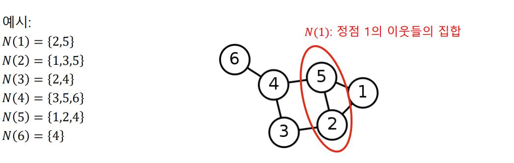 
- **방향성이 있는 그래프에서는 나가는 이웃과 들어오는 이웃을 구분한다.**
    - 정점 v에서 간선이 나가는 이웃(out-neighbor) 집합 : $N_{out(v)}$
    - 정점 v로 들어오는 이웃(In-neighbor) 집합 : $N_{in(v)}$    
    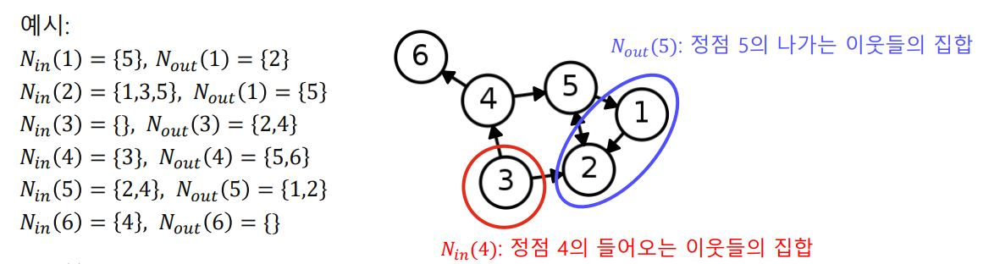 

# 그래프 표현 및 저장
1. 간선 리스트(Edge List)
    - 그래프를 `간선들`을 리스트로 저장
    - 각 간선은 해당 간선이 연결하는 두 정점들의 순서쌍(pair)로 저장됨        
    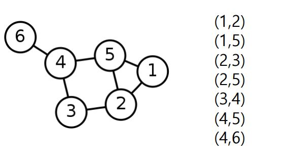 
    - 특히 `방향성이 있는 경우`에는 **(출발점,도착점)** 순서로 저장됨            
    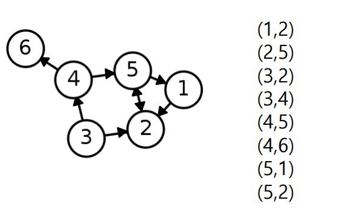     
    - 장점
        - 그래프 단순화
    - 단점
        - 사용시 비효율적
        - 리스트 선형 탐색해야 target 간선 찾을 수 있기 때문
2. 인접 리스트(Adjacent list) 
    - (방향성 없는 경우) 각 정점의 `이웃들`을 리스트로      
    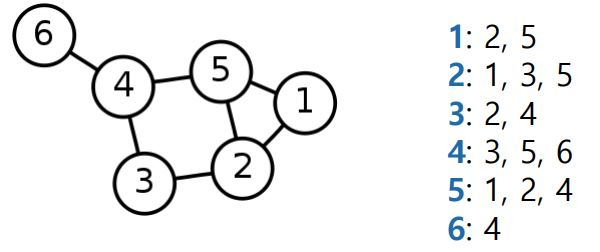 
    - (방향성이 있는 경우) 각 정점의 `나가는 이웃`들과 `들어오는 이웃`들을 각각 리스트로 저장     
    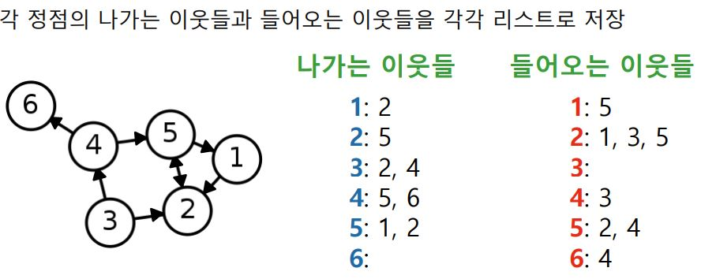 
    - 장점
        - 간선리스트에 비해 효율적 사용 가능
        - a~b 정점 사이에 간선있는지 선형 탐색할 필요없이, a의 이웃들 중 b있는지 확인하면 됨 
        - (jy, 그러나, 이웃들 중 b있는지는 역시 선형 탐색 - 인접 행렬이 보완할 수 있는 부분)
3. 인접 행렬(Adjacency Matrix)
    - (방향성 없는 경우) 대각 행렬   
    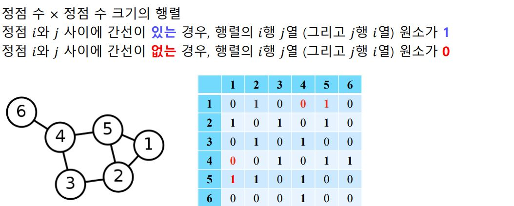   
    - (방향성 있는 경우) 대각 행렬 보장할 수 없음
    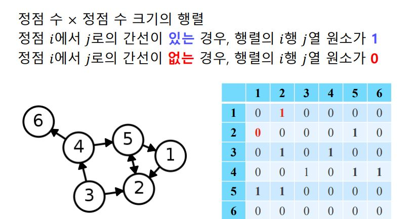   

- NetworkX 이용해 그래프 표현 및 저장
    - 일반 행렬은 전체 원소 저장하므로 V^2에 비례하는 저장 공간 사용
    - 희소 행렬은 0이 아닌 원소만을 저장하므로 E에 비례하는 저장 공간 사용(메모리 효율적)
    - [ex] 정점수 10만, 간선 수 100만 이라면
    - 일반행렬 : 100억 
    - 희소행렬 : 100만
    - 저장 공간으로 비교시 일반행렬>>희소행렬
    - 하지만, 구성 원소 대부분이 0이 아닐 경우에는 일반 행렬 사용하는 것이 속도면에서 더 우월
    ```python
    import networkx as nx

    # 그래프를 인접 리스트로 저장
    nx.to_dict_of_lists(G)
    # 그래프를 간선 리스트로 저장
    nx.to_edgelist(G)
    # 그래프를 인접 행렬(일반 행렬)로 저장
    nx.to_numpy_array(G)
    # 그래프를 인접 행렬(희소 행렬)로 저장
    nx.to_scipy_sparse_matrix(G)
    ```

# 그래프 patterns
## Intro
- 실제 그래프들(facebook network etc)은 랜덤으로 생성한 그래프 모델들과 다른 패턴들을 보임. 실제 그래프의 패턴들을 이용해서 효과적으로 그래프를 분석할 수 있다. 
- 실제 그래프의 패턴들 : 작은 세상 효과, 연결성의 두터운 꼬리 분포, 군집 구조 등

## 실제 그래프 vs 랜덤 그래프
- 실제 그래프 : 다양한 복잡계로부터 얻어진 그래프
    - 소셜 네트워크, 전자상거래 구매 내역, 인터넷, 웹, 뇌, 단백질 상호작용, 지식 그래프 등
- 확률적 과정을 통해 생성한 그래프
    - 에르되스-레니 랜덤 그래프
    - 임의의 두 정점 사이에 간선이 존재하는지 여부는 동일한 확률 분포에 의해 결정된다.
    - $G(n,p)$
    - n개의 정점 가짐, 임의의 두 개의 정점 사이에 간선 존재할 확률은 p
    - 정점 간 연결은 서로 Independent(연결 a가 연결 b에 영향을 미치지 않는다.)
    - [ex] $G(3,0.3)$에 의해 생성될 수 있는 그래프와 확률은?
    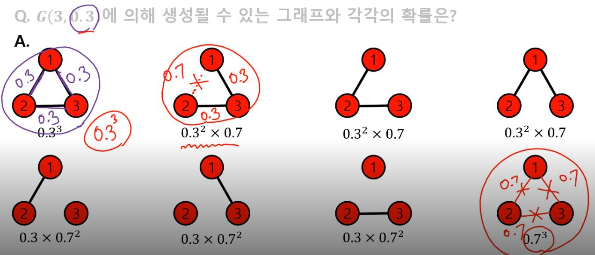

## 작은 세상 효과
- 필수 개념 : 경로, 거리 및 지름
    - 경로(path)
        - 정점 u와 v의 사이의 경로는 다음의 조건을 만족하는 `순열(sequence)`이다.
        - 1\. u에서 시작해 v에서 끝나야 한다.
        - 2\. 순열에서 연속된 정점은 간선으로 연결되어 있어야 한다.     
        - 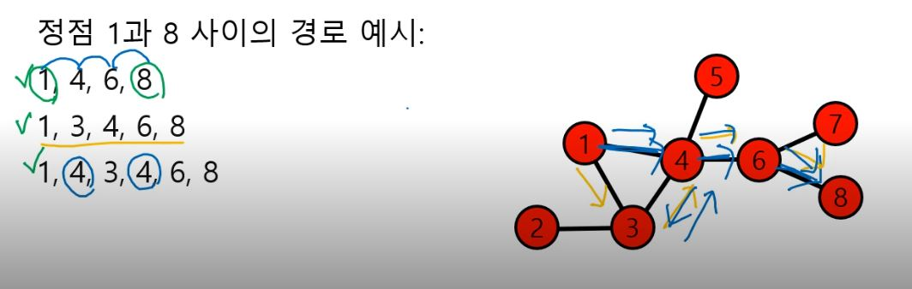
        - 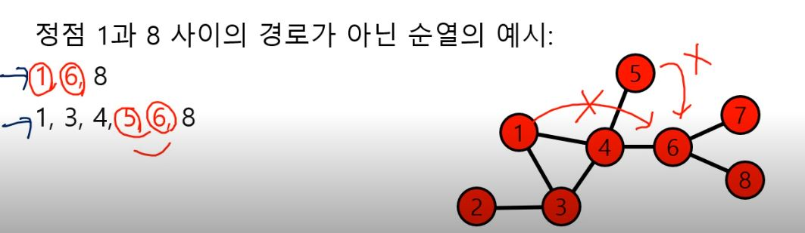
        - `경로의 길이`: 해당 경로 상에 놓이는 간선의 수    
        - 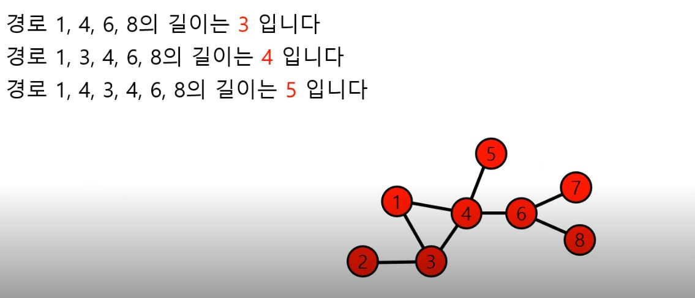
    - 거리(Distance)
        - 정점 u와 v 사이의 거리는 u와 v 사이의 `최단 경로의 길이`
        - 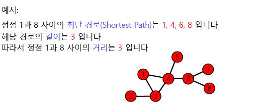
    - 그래프의 지름(Diameter)
        - `정점 간 거리의 최댓값`
        - 그래프에 존재하는 모든 정점들의 쌍에 대해서 거리를 계산하면
        - 그 `거리들 중 가장 큰 값이 그래프의 지름`
        - 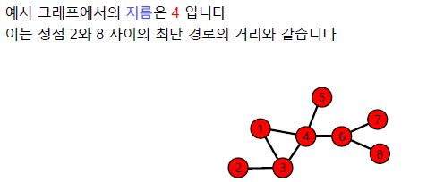
- 작은 세상 효과(small-world effect)
    - 실제 그래프 내 임의의 두 정점 사이의 거리가 작다는 사실을 표현
    - [ex] 사돈의 팔촌. 사람들이 소수의 공통된 지인을 통해서 연결되어 있다. 아무리 먼 관계도 결국 사돈의 팔촌(10촌 관계)이다.
    - 이 효과는 높은 확률로 랜덤 그래프에도 존재
        - 모든 사람에게 100명의 지인이 있다고 가정
        - 다섯 단계 거치면 최대 100^5명의 사람과 연결될 수 잇다.
        - 지인의 중복이 있어 100억명보다는 적은 사람일 것이지만, 여전히 많은 사람들과 연결될 가능성이 높다.
    - 하지만, 모든 그래프에서 작은 세상 효과가 존재하는 것은 아님
        - chain, cycle, grid 그래프에서는 존재하지 않음
        - 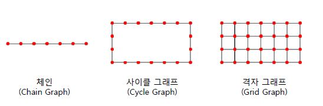
## 연결성의 두터운 꼬리 분포
- 연결성(Degree)
    - 정점의 연결성은 그 정점과 연결된 간선의 수를 의미
    - 따라서, 해당 정점의 이웃들의 수와 같음
    - $d(v)$ or $d_v$ or $|N(v)|$ 등으로 표시
    - 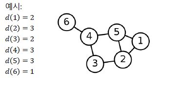
    - 특히, `방향성이 있는` 그래프의 경우
        - 나가는 연결성(Out Degree)은 그 정점에서 나가는 간선의 수 의미
            - $d_{out}(v)$ or $|N_{out}(v)|$로 표시
        - 들어오는 연결성(In Degree)는 그 정점으로 들어오는 간선으 ㅣ수 의미
            - $d_{in}(v)$ or $|N_{in}(v)|$로 표시
            - 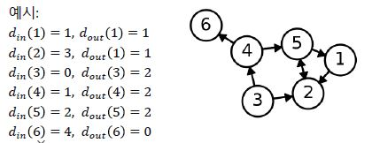
- 실제 그래프의 연결성 분포는 `두터운 꼬리(Heavy Tail)`를 갖는다.
    - 즉, 연결성이 매우 높은 `허브(Hub)` 정점이 존재한다.
    - 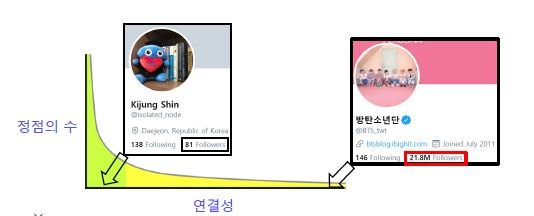
- 반면, 랜덤 그래프의 연결성 분포는 높은 확률로 `정규분포`와 유사
    - 연결성이 매우 높은 Hub정점이 존재할 가능성은 0에 가까움
    - 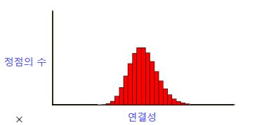   
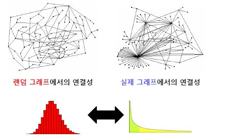

## 거대 연결 요소
- 연결 요소(Connected Component)
    - 다음 조건들을 만족하는 정점들의 집합
    - 1\. 연결 요소에 속하는 정점들은 경로로 연결될 수 있다.
    - 2\. 1의 조건을 만족하면서 정점을 추가할 수 없다.
    - 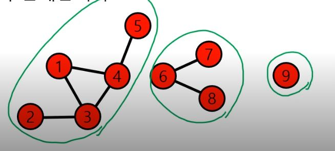
    - 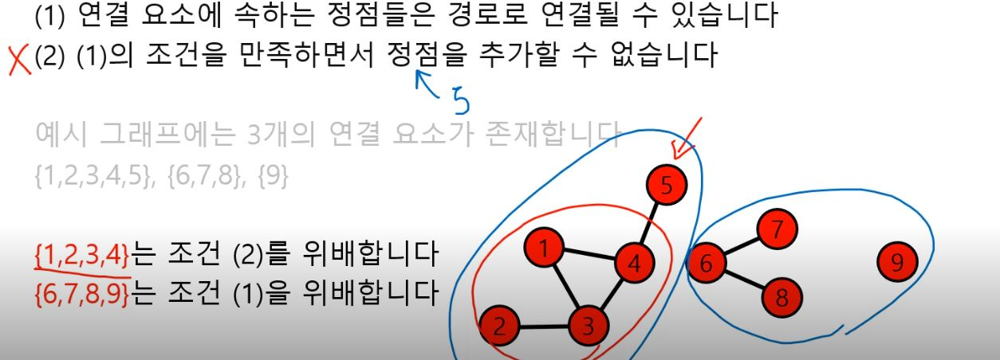
- 거대 연결 요소(Giant Connected Component)
    - 실제 그래프에는 거대 연결 요소가 존재
        - 거대 연결 요소는 대다수의 정점을 포함
        - 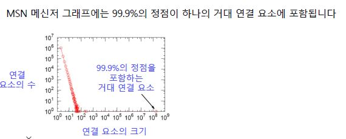
    - 랜덤 그래프에도 높은 확률로 거대연결요소 존재
    - 단, 정점들의 평균 연결성이 1보다 충분히 커야 (Random Graph Theory 참고)
    - 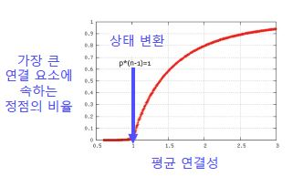
## 군집 구조
- 군집(Community)
    - 다음 조건들을 만족하는 정점들의 집합
    - 1\. 집합에 속하는 정점 사이에는 많은 간선이 존재
    - 2\. 집합에 속하는 정점과 그렇지 않은 정점 사이에는 적은 수의 간선 존재
    - 단, 수학적으로 엄밀한 정의는 아님
    - [ex] 11개의 군집
    - 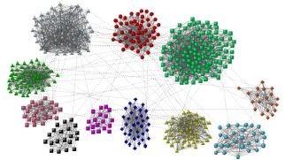
- 정점별로 지역적 군집 계수(Local Clustering Coefficient)를 정의할 수 있다.
    - 지역적 군집 계수는 한 정점에서 군집의 형성 정도를 측정
    - [ex]
    - 정점 i의 지역적 군집 계수는 `정점 i의 이웃쌍 중 간선으로 직접 연결된 것의 비율`을 의미
    - 정점 i의 지역적 군집 계수는 $C_i$로 표현   
    - 아래 예시에는 **(2,3)**,**(2,4)**,(2,3),(3,4),**(4,5)**,(3,5)의 6개의 이웃쌍 존재. 그 중 3쌍이 간선으로 **직접 연결**되어 있으므로 $C_1$=0.5
    - 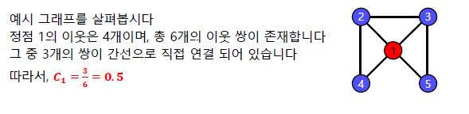
    - 이웃쌍 사이의 간선이 늘어나면 지역적 군집계수 늘어나고, 간선이 줄어들면 줄어듬
    - 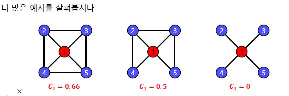
    - 참고로 연결성이 0인 정점에서는 지역적 군집 계수가 정의되지 않음
- **지역적 군집 계수 ~ 군집 과의 연관관계**
    - `정점 i의 지역적 군집 계수가 매우 높다고 하면`, 정점 i의 이웃들도 높은 확률로 서로 간선으로 직접 연결되어 있다.
    - 따라서 `정점 i와 그 이웃들은 높은 확률로 군집 형성`
- 전역 군집 계수(Global Clutering Coefficient)
    - 전체 그래프에서 군집 형성 정도를 측정
    - 그래프 G의` 전역 군집 계수`는 각 정점에서의 `지역적 군집 계수의 평균`
    - (단, 지역적 군집 계수가 정의되지 않는 정점은 제외)
- 실제 그래프에서는 `군집 계수`가 높다. (==많은 군집이 존재)
    - [reason]
    - **동질성(Homophily)** : 서로 유사한 정점끼리 간선으로 연결될 가능성 높음. ex.같은 동네에 사는 같은 나이의 아이들은 친구가 될 가능성 높다.
    - 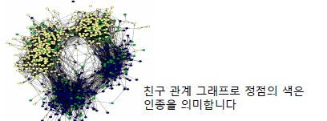
    - **전이성(Transitivity)** : 공통 이웃이 있는 경우, 공통 이웃이 매개 역할을 해줄 수 있다. ex.친구를 서로 소개
    - 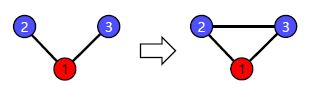
- 반면, 랜덤 그래프에서는 지역적 혹은 전역 군집 계수가 높지 않다.
    - 랜덤 그래프 $G(n,p)$에서의 군집 계수는 p
    - 간선 연결이 `독립적`이기 때문에 공통 이웃의 존재 여부가 간선 연결 확률에 영향을 미치지 않음
    -  동질성, 전이성 없어 군집 계수가 높지 않다.

# 정리
- 실제 그래프의 첫번째 구조적 특성 : 작은 세상 효과(실제 그래프의 정점들은 가깝게 연결되어 있다.)
- 두번째 구조적 특성 : 연결성의 두터운 꼬리 분포(실제 그래프에는 연결성이 매우 높은 허브 정점이 존재)
- 세번째 구조적 특성 : 거대 연결 요소(실제 그래프에는 대부분의 정점을 포함하는 거대 연결 요소가 존재)
- 네번째 구조적 특성 : 군집 구조(실제 그래프에는 군집이 존재하며, 실제 그래프는 군집 계수가 높다.)
- '작은 세상 효과'와 '거대 연결요소'는 실제/랜덤 그래프에서 모두 나타남.
- 그러나, **'연결성의 두터운 꼬리 분포'와 '군집 구조'는 실제 그래프에만 나타나는 고유한 특성**

# 실습 & 과제

[(과제)Day21_graph_info](../notes/jupyter/(과제)Day21_graph_info.ipynb)

[Day21_graph실습1](../notes/jupyter/Day21_graph실습1.ipynb)

[Day21_graph실습2](../notes/jupyter/Day21_graph실습2.ipynb)

[Day21_Graph_Property](../notes/jupyter/Day21_Graph_Property.ipynb)

[Day21_Graph_Property_solution](../notes/jupyter/Day21_Graph_Property_solution.ipynb)

- 위 실습에서는 다음 세 종류의 그래프 구조 분석
- 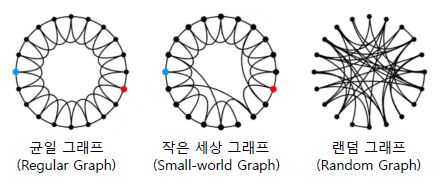
- 실습 결과 분석
- 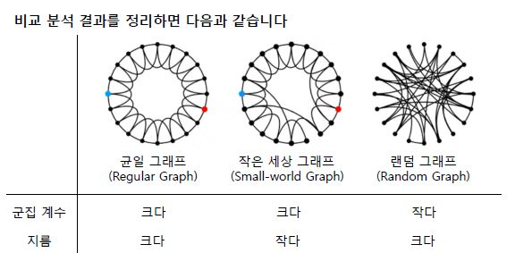
- 작은 세상 그래프는 `군집계수와 지름 측면에서 실제 그래프와 비슷한` 그래프
    - 실제 그래프는 군집 계수 크고, 지름 작다는 특성을 가지므로 