# Day9

[1.확률론](#확률론)

[2.조건부 확률분포](#조건부-확률분포)

[3.몬테카를로 샘플링](#몬테카를로-샘플링)

[4.혼동되는 개념 정리](#혼동되는-개념-정리)

# | 회고

오늘 조금 아쉬웠던 부분은, 딥러닝과 확률분포 사이에 연관성을 확실히 느끼지 못했다는 점입니다. 확률 분포에 대해서 얕게 아는게 이유일 수도 있고, 딥러닝에서 "예측"의 의미가 아직 잘 와닿지 않아서 그럴 수도 있을 것 같습니다. 원론적인 부분은 교과서처럼 모든 개념들이 집약된 서적을 완독해야 이해가 되는 편이라 주말에 선대/확률분포 개념 책을 통독해야 할 것 같아요.. ㅎㅎ 피어세션 때는 softmax,relu 등 활성화 함수에 대해 한 피어분이 설명해주셨는데, 덕분에 개념을 잘 정리할 수 있었습니다. 오늘도 감사한 하루였습니다~!

# | 강의

# 확률론
* 딥러닝은 확률론 기반의 기계학습 이론에 바탕을 둠
* loss function들의 작동 원리는 데이터 공간을 통계적으로 해석해 유도
    * 예측이 틀릴 risk를 최소화하도록 데이터를 학습한다
    * 회귀분석에서 손실함수로 사용되는 L2 노름은 `예측 오차의 분산을 가장 최소화하는 방향`으로 학습 유도
    * 분류 문제에서의 교차엔트로피(cross-entropy)는 `모델 예측의 불확실성`을 최소화하는 방향으로 학습 유도
    *  `분산 및 불확실성` 최소화하기 위해 측정하는 법을 알아야 한다.
*  확률분포는 데이터의 **초상화**
    *  데이터 공간 : X x Y
    *  데이터 공간에서 데이터를 추출하는 분포 : D (사전에 알수는 없다. 따라서 기계학습으로 D를 추론)
    *  데이터 확률 변수 표기 : (X x Y) ~ D
    *  
    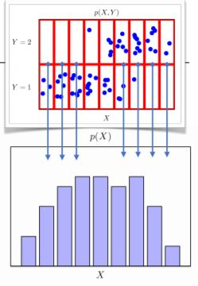 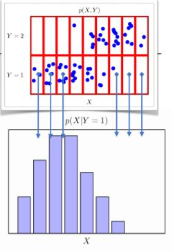 
* 확률 변수는 `확률분포 D`에 따라(==의해 결정되는) 
    * 이산형(discrete) 확률변수
        * 확률변수가 가질 수 있는 `경우의 수`를 모두 고려해 확률을 더하고 모델링
        * 이때 P는 `확률 질량` 함수
        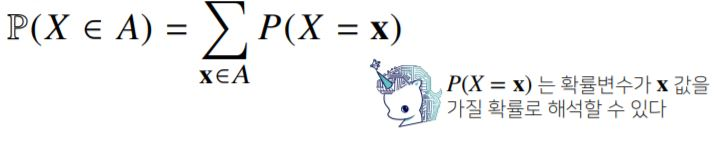
    * 연속형(continuous) 확률변수
        * 데이터 공간에 정의된 `확률 변수의 밀도(density)` 위에서의 적분을 통해 모델링
        * (주의) P는 `확률 밀도` 함수. `누적확률분포의 변화율`을 모델링하며, **확률로 해석해선 안된다**. 항상 **적분**해 모델링한다고 생각하자. 
        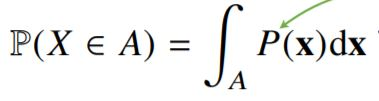
        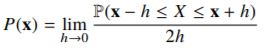
*  `결합분포` P(X,Y)는 원래의 확률 분포 D를 모델링
    *  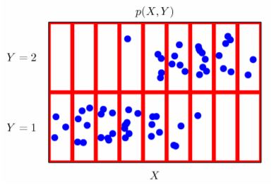 
    *  위 그림에서 Y 1,2 각각마다 X를 카운트하는 등 (X,Y 반대 상황도 같음)
    *  즉,원래 데이터의 확률분포가 이산형/연속형이던 `상관없이` 결합 분포에선 이산형/연속형으로 취급할 수 있음. 주어진 것과 실증적으로 근사한 것과 괴리 있을 수 있다.
    *  P(X,Y)는 입력 X에 대한 `주변확률분포`로 Y에 대한 정보를 주지는 않는다.
    *  그러나 결합분포 P(X,Y)에서 주변확률분포 P(X)를 유도할 수 있다.
        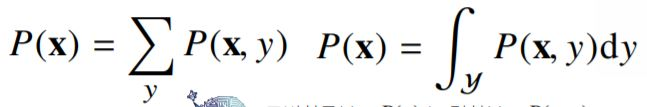

# 조건부 확률분포 
* P(X|Y)는 데이터 공간에서 입력 X와 출력 Y 사이의 관계를 모델링
    * 즉, 특정 클래스가 주어진 조건에서 데이터의 확률 분포를 보여준다.
* P(Y|X)는 `입력변수 X에 대해 정답이 Y일 확률`을 의미한다.    
    * (주의) 연속 확률 분포의 경우 P(Y|X)는 확률이 아니고 밀도다.
    * 로지스틱 회귀에서 사용했던 선형모델과 softmax 함수의 결합은 `데이터에서 추출된 패턴을 기반으로 확률을 해석`하는데 사용된다.
    * 분류 문제에서 $\text{softmax}(W\varnothing+b)$은 데이터 X로부터 추출된 특징 패턴 $\varnothing(X)$와 가중치행렬 $W$를 통해 조건부확률 P(Y|X)(==P(Y|$\varnothing(X)$))을 계산
    * 회귀 문제의 경우 `연속 확률 변수`를 보통 다룸. 밀도 함수로 해석해서 조건부 확률이 아니라 `조건부 기대값`으로 정답을 추론. 
    * 즉 조건부 기대값 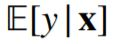을 추정
        * 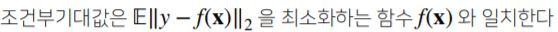
        * (jy) 조건부기댓값 역시도 확률변수다.
        * 기대값
            * 확률 분포가 주어지면 데이터를 분석하는데 사용 가능한 여러 종류의 `통계적 범함수`를 계산 가능
            * `기대값(expectation)`은 데이터를 `대표하는 통계량`이자, 확률분포를 통해 `다른 통계적 범함수를 계산`하는데 사용됨
            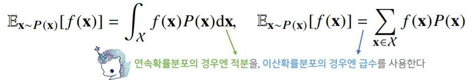
            * 기대값을 이용해 `분산, 첨도, 공분산` 등 여러 통계량 계산 가능(확률변수가 이산이냐 연속이냐에 따라서 sum 혹은 적분으로 나뉘므로 주의할것)
            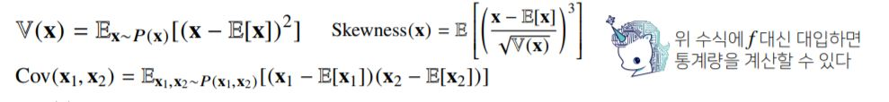
    * 딥러닝은 `다층신경망` 이용해 데이터로부터 특징패턴 $\varnothing$을 추출한다.

# 몬테카를로 샘플링
* 기계학습의 많은 문제들은 확률분포를 `명시적으로 모를 때가 대부분`이다.
* 이럴때 데이터를 이용해 기대값 계산하려면 `몬테카를로(Monte Carlo) 샘플링` 방법을 사용해야 한다.
* 몬테카를로는 확률 변수가 이산형이든, 연속형이든 상관없이 성립한다. (아래 X는 샘플링한 데이터, 이 데이터들의 산술평균을 구하면 기대값에 근사)  
    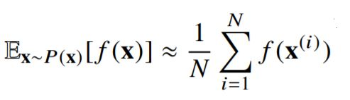
* 몬테카를로 샘플링은 `독립추출`만 보장된다면 `대수의 법칙(law of large number)`에 의해 `수렴성`을 보장한다.
* [EXAMPLE]
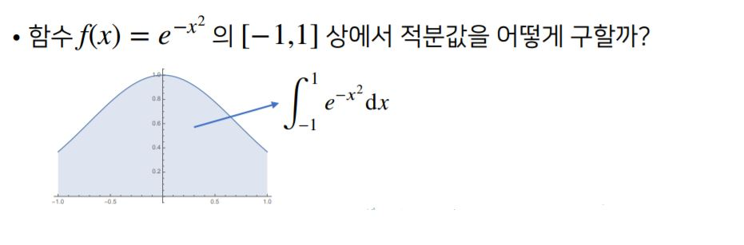
1. f(x)의 적분으로 해석적으로 구하는 것은 불가능하다.
2. 구간 [-1,1]의 길이는 2이므로 적분값을 2로 나누면, 기대값을 계산하는 것과 같으므로 몬테카를로 방법을 사용할 수 있다.
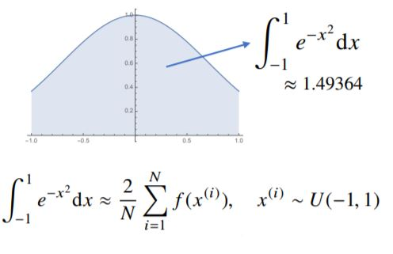
```python
import numpy as np

def mc_int(fun,low,high,sample_size=100,repeat=10):
    int_len=np.abs(high-low)
    stat=[]
    for _ in range(repeat):
        x=np.random.uniform(low=low,high=high,size=sample_size)
        fun_x=fun(x)
        int_val=int_len*np.mean(fun_x)
        stat.append(int_val)
    return np.mean(stat),np.std(stat)

def f_x(x):
    return np.exp(-x**2)

print(mc_int(f_x,low=-1,high=1,sample_size=10000,repeat=100))
#(1.4930746349215644, 0.003955748519849997) 1.49387(+-)0.0039이므로 오차 범위 안에 참값이 있다.
```
* 그럼에도, 샘플 사이즈가 작으면 오차 범위가 커져 참값과 멀어질 수 있다. 샘플 사이즈 조절에 주의하자


# 혼동되는 개념 정리

* `예측`이란?
    * 두 확률변수 X,Y에서 X의 값을 알고 있을 때 Y의 값을 알아내는 것을 `예측` 문제라고 한다. Y가 연속확률변수면 회귀분석, Y가 이산확률변수면 분류라고도 한다. X의 값 x를 알면 조건부 확률분포 $P(y|x)$의 분포를 알 수 있지만, 가장 대표성이 있는 하나의 값이 되어야 하므로 일반적으로 조건부확률분포의 기댓값인 `조건부기댓값`을 예측 문제의 답으로 하는 경우가 많다. 경우에 따라서는 예측 문제의 답($\hat{y}$)으로 중앙값, 최빈값 등을 계산할 수도 있다.  
  
    * 즉, 조건부 기댓값은 x값의 함수이므로 이 함수를 구할 수 있으면 모든 x값에 대한 예측결과를 구한 것과 같다.
    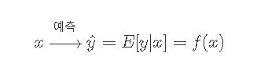

* Regression과 Classification  
    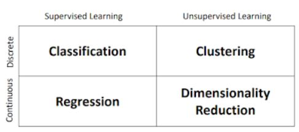
    * Regression : 연속적인 실수값을 예측하기 위해 training data에 예측 함수 f(x)를 fitting 시키는 것.
    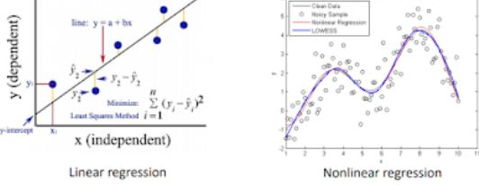
    * Classification : 새로운 Instance가 어떠한 category에 해당할지 예측하는 것.
    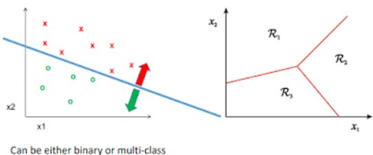
        * Classification과 확률분포
        * MNIST 데이터 떠올려보면, 숫자 데이터 X와 클래스 Y가 쌍으로 구성된 데이터셋이다. 즉 X를 입력으로 넣으면 모델이 계산한 결과를 Y랑 비교하면서 잘 분류가 되도록 학습한다. 즉, 모델은 X로 Y를 `예측`하는 `함수`를 알아내는 것
        
        * 이때의 함수를 `확률론적 관점`으로 해석해볼 수 있다.
        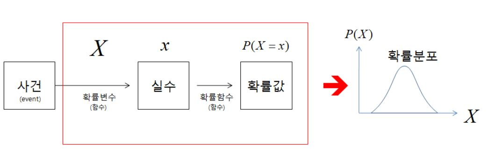
        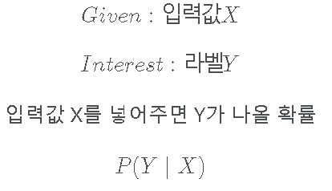

        * 확률은 가능도(Likelihood)와 다르다.
            * 가능도 : `가설`로 세워진 확률 분포에 대해 관측값을 넣어 나온 결과값
                * * 최대우도추정법(MLE) 개념 알아보기
            * 확률 : `고정`된 확률 분포에 관측값 넣었을 때 나온 결과값
            * 따라서 관측값이 고정이어도 Likelihood의 경우 결과값이 다르게 나올 수 있다.
    +) 그외 Clustering과 Demensionality Reduction
    - Clustering : 자동적으로 instance들을 그룹화한다. 이러한 그룹화는 같은 그룹내에의 instance들이 다른 group의 instance보다 유사하도록 진행한다.  
    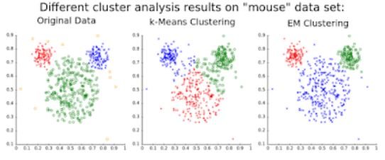
    - Dimensionality Reduction : Input data의 dimension을 줄이는 것.  
    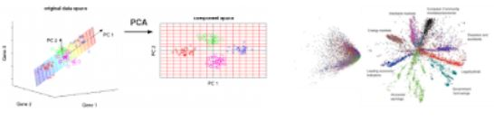

</br>

*더 공부할 것*
* 기계학습의 risk란
* 소프트맥스에서 특징 패턴을 찾는다?

*참고*  
https://www.sallys.space/blog/2017/11/19/probability-for-dl/

https://datascienceschool.net/02%20mathematics/07.06%20%EC%A1%B0%EA%B1%B4%EB%B6%80%EA%B8%B0%EB%8C%93%EA%B0%92%EA%B3%BC%20%EC%98%88%EC%B8%A1%20%EB%AC%B8%EC%A0%9C.html

https://giyeon.blogspot.com/2018/03/introduction-to-deep-learning-2.html

https://ratsgo.github.io/statistics/2017/05/31/gibbs/