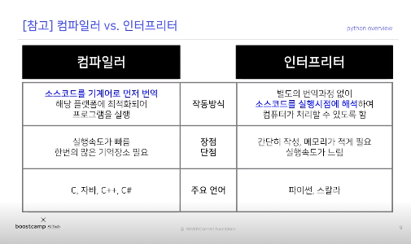
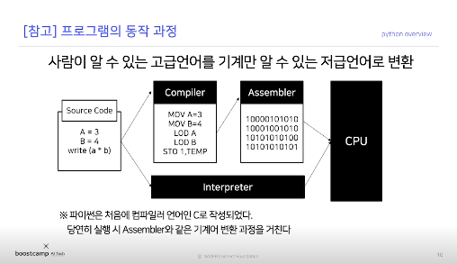
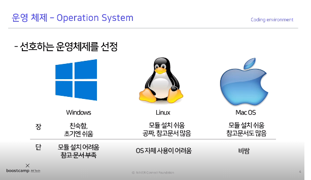

# Day1


## | 강의

1. [File System and Terminal](#file-system-and-terminal)
2. [Features of Python](#features-of-python)
3. [Settings](#settings)


## | 개인 학습

:sparkles:인터프리터 언어에 대해 **블로그에 기록하며 심화적으로 공부**했습니다.

https://blog.naver.com/sjy263942/222211624050

:sparkles:딥러닝+ 웹**프로젝트** 하나 생성했습니다. 오늘은 기술 스택 고민해보고 라이언 이미지 크롤링하는 것으로 마무리합니다.

https://github.com/ebbunnim/Practice-DeepLearning-Service


## | 회고

오늘은 떨리는 첫 교육날이었네요. 개발 환경 구성할 때 꿀팁들 올려주시는 캠퍼분들 + 명쾌한 강의해주시는 교수님 보면서 부지런히 따라가야 겠다고 생각했습니다. ㅎㅎ 그리고 베스킨라빈스31 조원분들 만나서 반갑습니다! :happy:


---

# File system and Terminal

1. 컴퓨터 os

   프로그램이 구동될 수 있는 환경. 가장 하단에는 하드웨어(메인보드/입출력/cpu/ram)가 있다. 운영 체제는 소프트웨어가 사용될 수 있도록 하드웨어 사이에서 기반이 된다. 어플리케이션은 운영체제에 의존적이다. 

   
2. 파일 시스템

   os에서 파일을 저장하는 트리구조의 저장 체계다. 파일은 크게 둘로 나뉜다.
   1. 디렉토리
      * 파일과 다른 디렉토리 포함가능
   2. 파일
      - 컴퓨터에서 정보를 저장하는 논리적인 단위
      - 파일은 파일명과 확장자로 식별됨
      - 실행,쓰기,읽기 할 수 있음
   윈도우는 c 드라이브를 기준으로 트리 구조가 시작된다. 파일 경로의 겨우 루트 디렉토리부터 파일까지를 절대 경로로 부르고, 상대 경로는 현재 있는 디렉토리부터 파일 타깃까지의 경로를 일컫는다. 

3. 터미널
   마우스가 아닌 키보드로 명령을 입력하는 환경이다. CLI는 CUI와 달리 텍스트를 사용해 컴퓨터에 명령을 입력하는 인터페이스 체계다.
   Console==Terminal==CMD : CLI로 입력하는 화면
   윈도우 - cmd 윈도우, 윈도우 터미널. cmder도 권장
   맥,리눅스 - 터미널
   각 터미널에는 프로그램을 작동하는 shell이 존재. 
   window-power shell, cmd, bash shell 등


# Features of Python

## Basic

- 1991년 귀도 반 로섬이 발표
- **플랫폼 독립적**
  플랫폼은 OS. 운영체제와 상관없이 돌아가는 언어
  해석을 해주는 인터프리터가 따로 존재하기 때문에 독립적일 수 있다. 파이썬의 문법으로 만들어진 코드를 다른 OS에 각각 맞춰서 인터프리터가 해석을 해준다. 엣지 컴퓨팅처럼 어떤 디바이스 특징괴도 어울릴 수 있다는 점에서 좋다.
- **인터프리터 언어**
- 객체 지향
- 동적 타이핑 언어
-  처음 C언어로 구현되었음


## 컴파일러 vs 인터프리터 언어

**컴파일러 언어** : 프로그램 실행시키기 전에, 컴파일러가 프로그램을 운영체제에 맞춰 번역을 해준다. 그 번역 파일은 같은 운영체제라면 어디서든 쓸 수 있다.

**인터프리터 언어** : 번역과정이 없는 것처럼 실행이 된다. 컴파일러 언어는 하이레벨 언어를 바로 컴퓨터 언어로 변환을 해주어서 더 빠르게 돌아가고 컴파일된 파일을 다른 컴퓨터에서 설치하는것에 유용하다. 반면 인터프리터는 실행할때마다 컴파일되면서 인터프리터되므로 조금 느리다. 그렇지만 간단하게 코드를 작성할 수 있다는 장점이 있다. javascript,python 등등



기본적으로 두 언어 다 os에 맞춰 번역이 된 기계어를 만들어내는데, 우리 눈에 보이기에는 컴파일러 언어가 한번 더 거쳐서 실행되는 것처럼 보인다. 




## 객체 지향적 언어, 동적 타이핑 언어

1. 객체 지향적 언어 : 실행 순서가 아닌 단위 모듈(객체) 중심으로 프로그램을 작성. 하나의 객체는 어떤 목적 달성하기 위한 `행동`과 `속성`을 가지고 있다.
2. 동적 타이핑 언어 : 프로그램이 `실행하는 시점`에 프로그램이 사용해야 할 데이터 타입을 결정한다.


## Why Python? - Life is short. You need Python.

파이썬을 사용하는 이유 : 쉽고 간단하며 다양하기 때문이다. "사람의 시간이 기계의 시간보다 중요하다". 컴파일러 언어는 작성하는데 시간이 오래걸리고 실행하는데 시간이 짧게 걸린다. 인터프리터 언어는 반대다. 파이썬 이해하기 쉬운 문법은 강점이 된다.

다양한 라이브러리 사용도 장점이다. "무엇을 생각하든 그것을 구현할 수 있다." 특히 통계, 데이터 분석에는 표준 언어로 알파고 파이썬으로 구현됐다.


# Settings

개발 환경 결정 시 고려

1. 운영 체제 

   

2. 파이썬 인터프리터

3. 코드 편집기

   여러 IDE가 있지만, jupyter / colab

   jupyter : 웹 기반 인터랙티브 코드 편집기의 표준 (python shell+코드편집도구). IPython 커널을 기반으로 한 대화형 파이썬 셀이다. 일반적 터미널 셀 + 웹 기반 데이터 분석 노트북을 제공한다. 미디어,텍스트,코드,수식 등을 하나의 문서로 표현 가능하다.

   colab : 구글에서 제공하는 클라우드 기반 인터랙티브 코드편집기


*추가로 잊지 말 것*

```python
conda activate base
```


