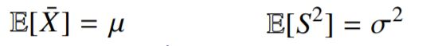
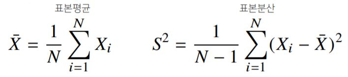
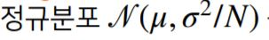
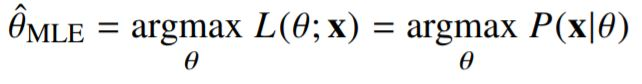
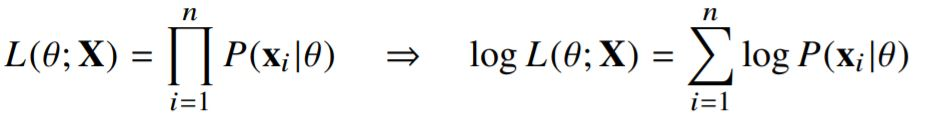
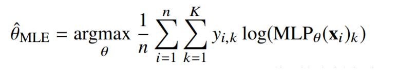
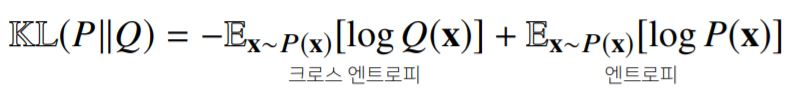

# Day10

[1. 모수](#모수)

[2. 확률분포 가정](#확률분포-가정)

[3. 모수 추정](#모수-추정)

[4. MLE](#최대가능도-추정법)

[5. 확률분포의 거리](#확률분포의-거리)

 

# | 개인 학습

[이번주 강의 flow 정리](#이번-주-내용-flow-정리)

 

# | 회고
오늘은 이번 주에 배운 개념들을 복기해보는 시간을 가졌습니다. 모든 개념을 완벽히 이해하지는 못했지만, 전반적인 flow를 이해하려고 노력했습니다. 그리고 피어 분들께 제가 정리한 내용을 보여드리고 피드백을 요청드렸습니다.  다들 내공이 깊으셔서, 말하는 내용 중 제가 혼동하고 있는 개념을 짚어주시고 생각하지 못한 개념도 추가로 알려주셨습니다. ㅎㅎ 모르는 것을 부끄러워하기 보다, 물어보면서 아는 것으로 만들어나가는 과정이 중요하단걸 피어세션을 통해 다시 한번 느낍니다. 또한 지난 수업에서 다룬 몬테카를로 샘플링 기법에 대해서 한 피어분이 정리를 해주셨습니다. 글로 보면 이해가 가지 않는 내용이 있었는데, 직접 설명해주셔서 무척 도움되었습니다. 감사합니다 누리님 ㅎㅎ

 오늘도 감사한 하루였습니다. 다음 주부터는 딥러닝에 대해 더 깊이 들어간다고 하니 두근 두근 설렙니다. 다음주도 화이팅! :sparkles:

 

# | 강의
# 모수
* 통계적 모델링은 적절한 가정 위에서 `확률분포를 추정(inference)`하는 것이 목표
* 기계학습과 통계학이 공통적으로 추구
* 유한한 개수 데이터로 모집단의 분포를 정확히 알아낼 수 없으므로, `근사적으로 확률 분포를 추정`
    * 따라서 예측모형의 목적은 분포를 정확하게 맞춘다는 것이 아니라
    * 데이터와 추정 방법의 `불확실성`을 고려해 위험을 최소화하는 것이다.
* 모수적(parametric) 방법론
    * 데이터가 특정 확률분포를 따른다고 선험적으로 가정
    * 이후 분포를 결정하는 `모수`(모평균,모분산)를 추정
* 비모수(nonparametric) 방법론
    * 특정 확률분포를 `가정하지 않고`
    * 데이터에 따라 모델의 구조 / 모수의 개수가 `유연하게 바뀐다.`
    * **기계학습의 많은 방법론은 비모수 방법론에 속함**
  
## 확률분포 가정
* 우선 히스토그램을 통해 모양을 관찰
    * 데이터가 2개의 값(0or1)만 가지는 경우 : `베르누이`분포
    * 데이터가 n개의 이산적인 값을 가지는 경우 : `카테고리`분포
    * 데이터가 [0,1] 사이에서 값을 가지는 경우 : `베타`분포
    * 데이터가 0이상의 값을 가지는 경우 : `감마`분포, `로그정규`분포
    * 데이터가 $\mathbb{R}$ 전체에서 값을 가지는 경우 : `정규`분포, `라플라스`분포
    * [주의]
    *  *기계적으로 확률분포를 가정해서는 안되며, 데이터를 생성하는 원리를 먼저 고려하는게 원칙*
    *  *또한 각 분포마다 검정법이 있으므로 모수 추정 후에는 반드시 검정을 해야 한다.*
## 모수 추정 
* 데이터 확률분포 가정했다면 모수 추정 가능
* 정규분포 모수 찾는다고 하면,  
 

* 위의 평균과 분산을 `추정`하는 `통계량(statistic)`은 다음과 같다.  
  
통계적 확률분포를 `표집분포(sampling distribution)`이라 부르며, 표본평균의 표집분포는 N(데이터 개수)가 커질수록 를 따른다. ($\because$ 중심극한정리, 모집단 분포가 정규분포를 따르지 않아도 성립)    

    * **(주의) sample distribution != sampling distribution**
    * sampling distribution(표집분포) : 표본평균과 표본분산의 확률분포 
    * sample distribution(표본분포) : 표본들(==통계량)의 분포. 표집분포와 달리 모집단 분포가 정규분포 따르지 않으면 데이터 많이 모아도 정규분포를 따를 수 없다.

## 최대가능도 추정법
* 표본평균이나 표본분산은 중요한 통계량이지만, 확률분포마다 사용하는 모수가 다르므로 적절한 통계량이 달라진다.
* 이론적으로 `가장 가능성이 높은 모수를 추정하는 방법` 중 하나는 `최대가능도 추정법(maximum likelihood estimation, MLE)`이다.  
  
    * 가능도(likelihood) 함수 : $L(\theta;x)$
    * 확률 밀도함수와 비슷하지만 관점이 다르다. 가능도 함수는 데이터 x가 주어진 상태에서 모수 $\theta$가 변하는 함수
    * 따라서 likelihood함수는 모수 $\theta$를 따르는 분포가 `x를 관찰할 가능성`을 뜻하지만, `확률로 해석해서는 안된다.`
* 데이터 집합 X가 `독립적으로 추출되었을 경우(->곱하기 연산) 로그가능도를 최적화`
  
    * [로그가능도]
    * 로그가능도를 최적화하는 모수 $\theta$는 가능도를 **최적화**하는 MLE가 된다.
    * 데이터의 숫자가 수억 단위가 된다면, 컴퓨터의 정확도로 가능도를 계산하는게 불가능하다.
    * 그러나 데이터 독립 보장 + 로그를 사용하면 가능도의 `곱셈을 로그가능도의 덧셈`으로 바꿀 수 있어 연산이 가능해진다.
    * 경사하강법으로 가능도 최적화할 때 미분 연산을 사용하게 되는데, 로그 가능도를 사용하면 연산량이 O($n^2$)에서 O($n$)으로 줄어든다. `연산의 복잡도가 선형적으로 변한다.`
    * 대개 손실함수의 경우 경사하강법을 사용하므로, `음의 로그가능도를 최적화`하게 됨 
* [EXAMPLE]
    * 정규분포를 따르는 확률변수 X로부터 독립적인 표본 $\text{\{}x_1,x_2,...,x_n\text{\}}$을 얻었을 때, MLE이용해 모수를 추정해라
    * 카테고리분포 $Mulimoulli(x;p_1,p_2,...,p_d)$을 따르는 확률변수 X로부터 독립적인 표본 $\text{\{}x_1,x_2,...,x_n\text{\}}$을 얻었을 때 MLE이용해 모수 추정해라  
* 딥러닝에서 MLE
    * MLE통해 기계학습 모델을 학습할 수 있다.
    * 딥러닝 모델의 가중치를 $\theta=(W^{(1)},...,W^{(L)})$라 표기했을 때, 분류 문제에서 softmax vector는 카테고리분포 모수 $\text{\{}p_1,p_2,...,p_n\text{\}}$를 모델링
    * 원-핫 벡터로 표현한 정답레이블 y=$\text{\{}y_1,y_2,...,y_k\text{\}}$을 관찰데이터로 이용해 확률분포인 softmax vector의 로그가능도를 최적화할 수 있다. 
    * **중요 수식!**
          
## 확률분포의 거리
* 기계학습에서 사용되는 `손실함수`들은 `모델이 학습하는 확률분포`와 `데이터에서 관찰되는 확률분포의 거리`를 통해 유도
* 데이터 공간에 두 개의 확률분포 $P(x),Q(x)$가 있을 경우 `두 확률분포 사이의 거리`를 계산할 때 아래 함수들이 이용됨
    1. 총변동 거리 (TV, Total Variation Distance)
    2. 쿨백 라이블러 발산(KL, Kullback-Leibler Divergence)
    
    `분류 문제`에서 정답레이블을 P, 모델예측을 Q로 두면 `MLE은 쿨백-라이블러 발산을 최소화하는 것과 같다.`
    3. 바슈타인 거리(Wasserstein Distance)

 

# 이번 주 내용 Flow 정리
## | 선형 모델
$\hat{y}=Xw+b$

$\hat{y}=w_1x_1+...+w_dx_d+b$

* 예측값 y, 데이터 포인트가 X 
* W추정 - 계수 추정 - (1) 현재 모델의 품질 측정 (2) 앞으로 품질을 향상 시켜야 함
* 따라서, 우리의 목표 : 모델이 예측한 값과 실제 값의 차이 즉, 오류를 최소화하는 모델 파라미터를 찾는 것
* X 각각은 결국 sample, y는 label, label을 예측하기 위한 값은 feature

## | loss func
* 선형 모델의 경우 학습 샘플들의 평균 loss(mse)를 최소화하는 파라미터(W,b 등)을 찾는 것이 모델을 `학습`시킨다는 의미
* 결국, 파라메터를 찾는 것은 "현재 모델의 품질 측정", loss를 최소화하도록 재연산하는 과정이 "학습"의 의미로 앞으로의 모델 품질을 향상시키기 위한 것. 즉, 학습은 "파라미터 최적화"
* loss를 최소화 하는 방법 - "최적화 알고리즘 정의". DNN 떠올려보면 SGD - GD+미니배치 -> 여기서 backward 함수 호출 (vanishing 문제 때문에 sigmoid -> relu 활성화함수 사용 등)
    * 학습데이터에서 정한 개수의 샘플을 균일하게 뽑아서 미니 배치를 구성하고
    * 미니배치값에 대한 평균 loss값의 모델 파라미터에 대한 `미분`을 구함
    * 마지막으로, 이 결과와 미리 정의된 lr(step의 크기)를 곱해서 loss값이 최소화되는 방향으로 파라미터 변경을 지속
    * [정리]   
    각 단계에서 데이터셋 중 임의로 선택한 배치를 이용해서, 가중치(weight)들에 대한 손실(loss)의 그래디언트(gradient)를 추정. 그리고, 손실(loss)을 줄이는 방향으로 파라미터들을 조금씩 업데이트. 여기서, 자동 미분 모듈로 계산된 그래디언트(gradient)는 샘플들의 배치의 그래디언트(gradient) 합. 평균을 구하기 위해서, 이 값을 배치 크기로 나누고, 학습 속도(learning rate) lr 로 정의된 값에 비례해서 업데이트를 하게 된다.

## | 예측
* $\hat{W},\hat(b)$를 구하놓은 상태
* 학습을 통해 loss를 최소화시키는 최적값 W,b를 찾으려 노력하되 최대한 "최적값에 근접하는 값"을 학습을 통해 찾은 것
* 결국, $\hat{y}=\hat{W}x+\hat{b}$ 로 y를 추정했다. 추정이 "모델 예측", "모델 추론"을 의미
* 예측은 regression -> 값을 추정할수도 있고, ~카테고리에 속할 확률을 계산하는 분류(softmax이용)가 될 수도 있다.
    * [softmax]
    * 벡터를 확률로 변환함 (WX는 행렬-벡터가 아니라 행렬-행렬이 된다)
        *  softmax의 경우 벡터를 인풋으로 받기 때문
        *  벡터 전체로 1이 구성된 분모, 특정 데이터가 특정 클래스에 분류될 가능성이 분자. 분자/분모 즉 확률 (*조금 더 자세히 설명해보기. 지금은 아쉬운 정리에 멈춤*)
    * softmax 연산을 이용해 얻은 결과 카테고리의 확률 분포를 이용해 분류 문제에 적용. 
    * 크로스 엔트로피는 두 확률 분포의 차이를 측정하는 좋은 방법
    * softmax의 경우에도 손실 함수 개념이 있는데, 이를 가능도 최대화라고 함
    *  회귀 문제에서 그래디언트(gradient)가 관찰된 실제 값  y  와 예측된 값 $\hat{y}$ 의 차이로 계산되었음
    * softmax가 다루는 exponential계열의 모델의 경우에는 `로그-가능도의 gradient`가 되어 그래디언트 구하는 것이 `간단`해짐

## | 전반적인 요약
* 머신러닝에서 중요한 요소
    1. 학습 데이터
    2. loss 함수
    3. 최적화 알고리즘 : lr, batch_size(SGD의 경우), epochs 등이 중요한 하이퍼파라미터
    4. 모델 자체
