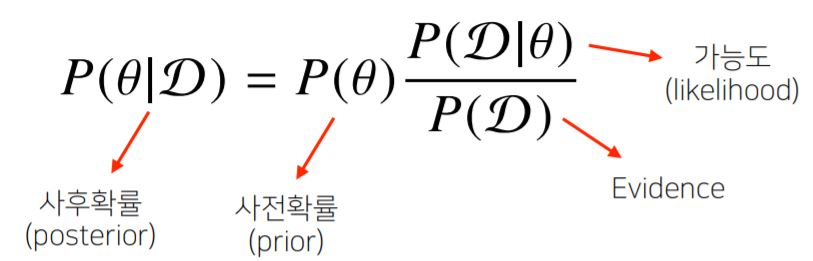
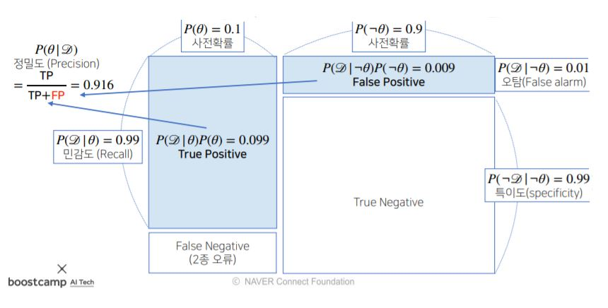
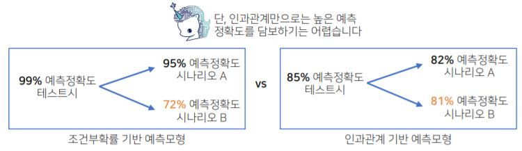
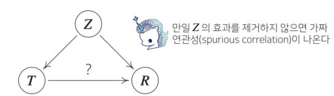
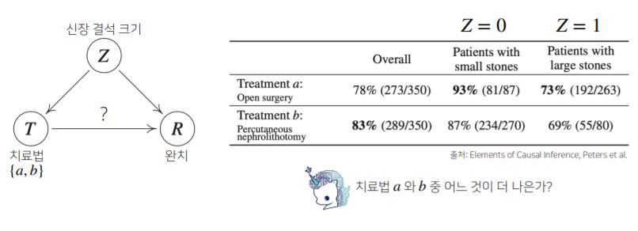
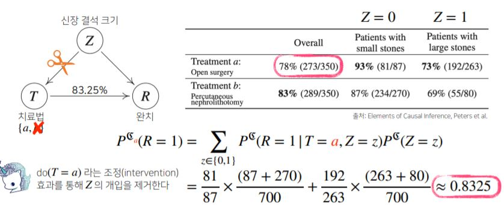
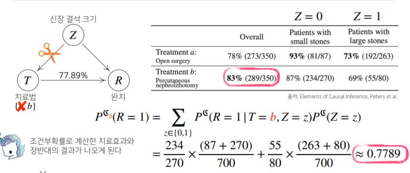
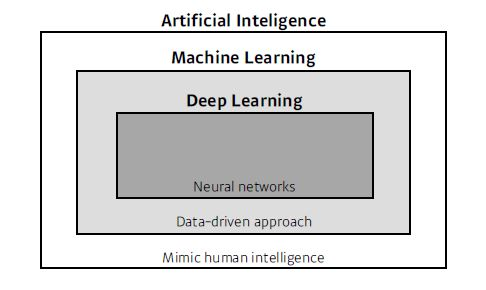
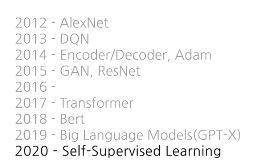
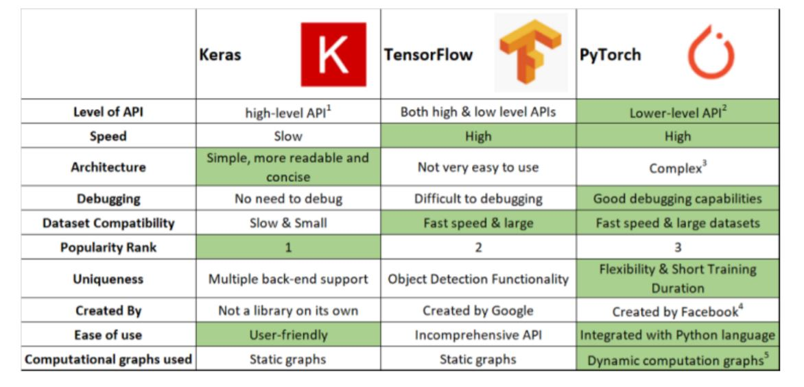

# Day11

[1. 베이즈 정리](#베이즈-정리)

[2. 딥러닝 intro](#딥러닝-intro)

[3. historical review](#historical-review)

[4. pytorch intro](#pytorch-intro)

[5. pytorch 실습 in colab](#pytorch-실습)

# | 회고
오늘은 부스트캠프 들어온 이후로 가장 바빴던 하루입니다.ㅎㅎ 체력적으로 힘들지는 않았지만 강의하시는 내용들이 정말 다 받아적고 싶을 정도로 훌륭한데 손과 머리가 못따라간다는.. 아쉬움이 많았습니다. 좀 더 분발해야 할 것 같습니다! 그래도 경제 배우면서 멀리했던 베이즈 정리가 머신러닝에서 이렇게 쓰이는 구나~ 하며 재밌었고 pytorch로 코딩해볼 수 있어서 너무 좋았습니다. 

피어세션 때는 지호님이 모바일 서비스를 만드셨던 것을 리뷰해주셨는데, 그것 또한 너무 재밌었네요 ㅎㅎ 모르는 분야는 개척할 수록 재밌습니다. ㅎㅎ 과제 정리를 마치고 custom dataset을 스스로 만들어보는 시간을 가지려고 합니다. 하루가 정말 너무 짧네요 ㅠㅠ 그래도 하루를 알차게 보내는 것 같아 뿌듯합니다. ㅎㅎ 오늘도 감사한 하루였습니다~

# | 강의

# 베이즈 정리
* 조건부 확률 기반 
    * $P(A \cap B)=P(B)P(A|B)$
    * 사건 B가 일어난 상황에서 사건 A가 발생활 확률
* 베이즈 정리는 조건부확률을 이용해 `정보를 갱신하는 방법`을 알려줌
    * `베이즈 정리의 가장 큰 장점은 데이터 들어올 때마다 사후확률 갱신해서 모델링에 활용할 수 있다는 점`
    * A라는 `새로운` 정보가 주어졌을 때 $P(B)$로부터 $P(B|A)$를 계산하는 방법을 제공  
        * $P(B|A)=\frac{P(A \cap B)}{P(A)}=P(B)\frac{P(A|B)}{P(A)}$  
        
        * 이후 갱신된 사후확률 계산하는 것은 `사전확률` $P(B)$를 앞서 계산된 `사후확률` $P(B|A)$으로 `갱신`하는 것이 됨
        * 사전 확률 : 데이터 `분석하기 전`에 모델링하고자 하는 target에 대해서 미리 가설을 세워놓고 확률 분포 설정
        * 사후 확률 : 데이터 `관찰 이후`에 측정함. 모델링하여 얻은 결과를 업데이트
    * [EXAMPLE]
        * Q1. covid-99 발병률 10%로 알려져있다. covid-99에 실제로 걸렸을 때 검진될 확률은 99%, 실제로 걸리지 않았을 때 오검진될 확률이 1%. 어떤 사람이 `질병에 걸렸다고 검진 결과가 나왔을 때` 정말로 covid-99에 감염되었을 확률은? 
            * 사전확률,민감도,오탐율 => `정밀도` 를 계산하는 문제
            * $\theta$ : covid-99 발병 사건 (관찰 불가)
            * $D$ : 테스트 결과 (관찰 가능)
            * 따라서 위 확률을 수식으로 할당해보면,
            * $P(\theta)=0.1$ : 사전확률
            * $P(D|\theta)=0.99$ : 가능도 (현재 모수/파라미터/가정에서 이 데이터가 관찰될 확률)
            * $P(D|¬\theta)=0.01$ : 오검진될 확률(1종 오류),오탐율(False alarm)
                * 1종 오류(False Positive) : 병에 걸렸다고 판단했는데, 병에 걸리지 않은 상황
                * 2종 오류(False Negative) : 병에 걸리지 않았다고 판단했으나 병에 걸린 상황 - 의료문제에서는 1종 오류보다 중요함. 따라서 2종 오류를 줄이는 것에 우선순위가 더 있음
            * $P(D)$ : Evidence (데이터 자체의 분포)
                * $P(D)=\sum_\theta{P(D|\theta)P(\theta)}$
                    * $P(D|\theta)P(\theta)+P(D|¬\theta)P(¬\theta)$=0.99 * 0.1+0.01 * 0.9=0.108
                * $\therefore P(\theta|D)=0.1*\frac{0.99}{0.108} \approx 0.916$ 
                
                * 만약에 위 문제에서 오탐율이 1%가 아니라 10%였다면?
                    * $P(\theta|D)=0.1*\frac{0.99}{0.189} \approx 0.524$
                    * 즉, 오탐율(False alarm)이 오르면 테스트의 정밀도(Precision)가 떨어진다.
        * Q2. 앞서 covid-99 판정받은 사람이 두번째 검진을 받았을 때도 양성이 나왔을 때 진짜 covid-99에 걸렸을 확률은?  (오탐율 10% 상황)
        * `갱신`된 사후 확률
            * $P(\theta|D)=0.1*\frac{0.99}{0.189}\approx0.524$ : 이 사후확률을 이제부터 `사전확률`로 사용할 것임
            * $P(D^*)=0.99*0.524+0.1*0.476\approx0.566$ : 갱신된 Evidence
            * $P(\theta|D^*)=0.524*\frac{0.99}{0.566}\approx0.917$
        * 이러한 과정들이 세번째 네번째 등등 반복될 수 있다.
    * (주의) 조건부 확률은 `인과관계(causality)`를 추론할 때 함부로 사용해서는 안된다. 데이터가 많아져도 조건부확률만을 가지고 인과관계 추론하는 것은 불가능하다.
        * 인과관계 고려하지 않고 조건부확률 기반 예측 모형 만들게되면, 실제 테스트시에 높은 예측 정확도 얻음. 그러나 데이터 분포가 바뀌게 되는 상황에서(데이터 유입 상황이 바뀌거나 새로운 치료법 도입되었을 때 등) 조건부확률만 고려하면 데이터 분포의 변화에 테스트 정확도가 바뀌게 됨. 
        * 따라서 인과관계는 `데이터 분포의 변화`에 강건한 예측모형을 만들때 필요. 즉 시나리오가 바뀌게 되어도 예측 정확도 크게 변화되지 않을 수 있다.
        * 그러나 인과관계만으로 높은 예측 정확도를 담보하기는 어렵다.  
        
        * 인과관계를 알아내기 위해서는 `중첩요인(confounding factor)의 효과를 제거`하고 원인에 해당하는 변수만의 인과관계를 계산해야 한다.  
        
        * [EXAMPLE]
            * `simpsons paradox` : 아래 상황에서는 각각의 환자군에서는 치료법 a가 더 나은데, overall에서는 b 치료법이 더 나은 상황 - 조건부확률로 계산했을 때
             
            * 이 역설을 해결하기 위해서는 a,b의 중첩효과를 제거해야 함.
             
             
            * 치료법 a or b를 원인으로 각각 선택하고(인과관계 고려) 중첩효과 제거함으로써 조건부확률로 계산한 결과보다 더 믿을만하다. 단순히 조건부확률 사용하기보다 데이터에서 추론하는 사실관계, 변수간 관계 고려해서 인과관계 추론해야 한다. 그래야 강건한 데이터 모형이 된다.

# 딥러닝 Intro
* 좋은 deep-learner?
    1. implements skills - tensorflow, pytorch 
    2. math skills (linear algebra, probility)
    3. knowing a lot of recent papers
* 인공지능  
    
    * AI-사람의 지능을 모방
    * ML-데이터를 통해서 학습하는 것. 그 알고리즘 모델을 만드는게 머신러닝
    * DL-뉴럴 네트워크를 사용하는 세부적인 분야 (딥러닝 연구하는게 AI 전체를 연구하는게 아니다.)

* key components of DL
    1. 모델이 학습할 수 있는 `데이터`
    2. 데이터를 통해서 학습하고자 하는 `모델` - 입력이 x, 출력은 y -> 입력을 출력으로 바꿔주는 모델을 정의
    3. 모델 만들면 `loss func`이 필요히다.
        * regression-mse, classification-cross entropy, probablistic task-mle
        * (주의) 위는 예시. 데이터 특성에 따라 loss func 달라질 수 있음
        * loss func: 우리가 이루고자 하는 것의 `proxy`. 단순히 loss를 줄이는 것이 목적이 아니라 풀고자 하는 문제를 실제로 해결할 수 있는지가 중요. 학습하지 않은 데이터에서 잘 동작하게 하는 것이 목적
    4. 그리고 loss func을 최소화시키는 알고리즘 ; `Optimization Algorithm` : GD,SGD,Adam

# Historical Review
https://dennybritz.com/blog/deep-learning-most-important-ideas/  

# Pytorch Intro
* 딥러닝 도구
    * google : Keras, TensorFlow(TF2.0~부터는 Keras와 사실상 하나)
    * facebook : Pytorch
    * Tensorflow와 Pytorch의 가장 큰 차이 : `static graphs` vs `dynamic computation` graphs
    
* Pytorch
    * **Numpy + AutoGrad + Function**
    * Numpy 구조를 가지는 Tensor객체를 array 표현
    * 자동 미분을 지원하여 DL연산을 지원
    * **다양한 형태의 DL을 지원하는 함수와 모델을 지원**
  

# Pytorch 실습

https://github.com/ebbunnim/Naver-AI-BoostCamp/blob/main/notes/jupyter/Day11_pytorch_info.ipynb

https://github.com/ebbunnim/Naver-AI-BoostCamp/blob/main/notes/jupyter/Day11_MLP.ipynb

https://github.com/ebbunnim/Naver-AI-BoostCamp/blob/main/notes/jupyter/Day11_dataset.ipynb