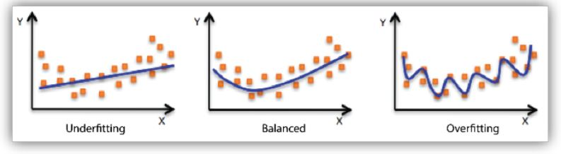
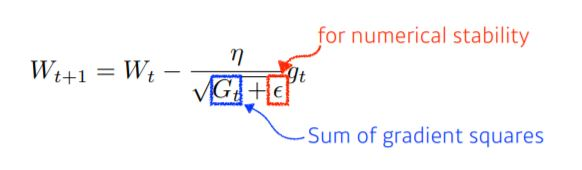

# Day12

# Optimization의 중요 개념
* 명확하게 용어를 이해하지 못하면 혼란스러울 수 있으니 주의해서 공부

1. Generalization  
- 일반화 성능을 높이는게 많은 경우 목표
- 일반화 : 학습할 때 training error는 보통 줄어들게 됨. 근데 0이라고 해서 우리가 원하는 최적값에 도달했다고는 알 수 없음. 오히려 test 데이터에 대해서는 성능이 떨어져서 error 높아질 수도. 결국 `Generalization gap`은 test error ~ training error 차이를 의미
- `"generalization 성능이 좋다"` : 만든 네트워크의 실제 성능이 학습 데이터 활용한 것과 비슷하게 나올 것이라고 보장. 반면 네트워크 안좋아서 학습 데이터 성능 자체가 좋지 못하면 generalization 좋다고 해도 좋다고 말할 수 없다. 

2. Under-fitting vs Over fitting  
- over fitting : 학습 데이터에서는 잘 동작하지만, 테스트 데이터에 대해서는 잘 동작하지 않는 현상
- under fitting : 네트워크가 너무 간단하거나 training 너무 조금 시켜서 학습 데이터도 잘 못추는 것
- 그러나 over/underfitting은 이론적. 실제로는 over/underfit graph처럼 변하는게 목적일수도

3. Cross Validation  
- k-folded validation이라고도 함
- train data와 validation data를 나누고 트레이닝 시킨다. 학습 데이터로 학습시킨 모델이 학습에 사용되지 않은 validation 기준으로 얼마나 성능이 잘 나오는지 보는 것.
- 그럼 데이터를 어떻게 나눌까>?
    -  학습 데이터 k개 중 k-1개로 training, 1개로 validation 잡는 과정 반복
- 일반적으로는 뉴럴넷 학습하는데 많은 하이퍼파라미터 존재하는데 어떤 값이 좋은 값인지 모른다. 그래서 cross validation하여 최적의 하이퍼파라미터셋 찾고 그 하이퍼파라미터 고정한 상태서 모든 학습 데이터 다 사용해서 train. 단, test data는 절대 건들이면 안됨. cheating임
    - 파라미터 - 내가 최적해에서 찾고 싶은 값
    - 하이퍼파라미터는 내가 정하는 값. lr,loss func 정함 등

4. Bias-variance tradeoff  
- Underfitting, Overfitting과 상통. 
- variance : 내가 입력을 넣었을 떄 출력이 얼마나 `일관적으로 나오는지`를 말함
    - low variance의 경우는 간단한 모델로 설정하면 됨. bias만 shift하면 되니까
    - high variance는 비슷한 입력 들어와도 출력이 많아 달라져서 overfitting 가능성 커지게 됨. 
- bias - 평균적으로 봤을 때 (비슷한 입력에 대해서 출력 많이 분산되더라도) true target에 접근하게 되면 bias가 낮다고 말함. bias가 높은 건 target에서 많이 벗어난 것   

- `Bias and Variance Tradeoff`    
    - 학습 데이터에 노이즈가 껴있다고 가정했을 떄, l2 기준으로 cost를 minimize하는 것은 세가지 파트(bias/variance/noise)로 나뉨. 
    minimize하려는 cost 값은 한가지 값인데, 이게 세가지 컴포넌트로 이루어져 있어서 세개 중 하나가 줄어들면 하나가 커지는 trade-off관계가 상정됨  
        
    - 즉 bias를 낮추면 variance가 높아질 가능성이 크다. (반대도 성립)
    (noise 껴있는 상황에서 bias,variance 둘 다 줄이는 것은 사실상 얻기 힘들다.)

5. Bootstrapping  
- 학습 데이터 중 일부 데이터를 활용해서 model 1, 일부 데이터 활용해 model2 ....
하나의 입력에 대해서 model이 다 같게 예측할 수도 있고, 다르게 예측할 수도
- 그래서 model 예측치의 `consensus`를 보고 `전체 모델의 uncertainty를 예측`하고자 할 때 사용
- 즉, 학습 데이터 고정되어 있을 때 random-subsampling을 통해서 학습 데이터를 여러개 만들고 그걸로 여러 metric or model을 만들어서 예측하겠다는 것

6. Bagging and boosting  
- Bagging(Boostrapping aggregating)
    - 학습 데이터가 고정되어 있을 때 학습 데이터 여러개 만드는 boostraping함 + 그 ouput을 평균 내겠다. 일반적으로 앙상블이라고 불리기도 함.
- Boosting 
    - 모델 만들고 학습 데이터(train-80%,test-20%)에 대해서 돌려봄. 모델이 간단해서 학습 데이터는 잘 예측하는데 test데이터로는 잘 예측하지 못할 수 있음. 
    - 그러면 모델 하나 더 만들어본다. 예측하지 못한 데이터에 대해서만 잘 예측하는 모델로.
    - 여러개 모델 만들어서 모델을 합친다. 합칠 때 여러 모델을 독립적으로 보는게 아니라, 하나 하나 (weak learner)를 sequential하게 합쳐서 `하나의 strong learner`을 만든다. 이때 weak learner들의 weight를 찾는 식으로 진행됨
  
  

# Practical Gradient Descent Methods  
1. Stochastic gradient descent
- Update with gradient computed from a `single sample`
2. **Mini-batch gradient descent**  
- Update with gradient computed from a `subset of data`
3. Batch gradient descent
- Update with gradient computed from the `whole data`

    * `Mini-batch gradient descent`  
        * Batch-size Matters  
        * large batch-size : `sharp minimizers` 도달
        * small batch-size : `flat minimizers` 도달
        * (결론) sharp minimizers에 도달하는 것보다 flat minimizers에 도달하는게 더 좋다.
        * 
            * 목적은 testing function에서의 minimum을 찾고 싶은 것 (not training func)
            * flat minimizer은 traing func에서 멀어져도 testing func에서 적당히 낮은 값 나옴. 트레이닝 데이터에서 성능이 잘 나오면 테스트 데이터에서도 성능이 잘 나옴. 즉 `generalization performance`가 좋다.
            * 반면 sharp minimzer의 경우에는 training func에서 local minimum도달했어도 testing func에서 약간만 멀어지면 testing func에서 높은 값 나옴. 트레이닝 단계에서 나온 값들이(accuary, loss 등) 테스트 데이터에서는 퍼포먼스가 안나올 수 있음. `generalization performance`가 좋지 않다.

# Gradient Descent Methods  
* GD : linear func에서 loss에 대한 gradient찾고, Weight와 같은 파라미터에서 빼주는 방식으로 Weight 업데이트. loss가 줄어들었을 때 최적화될 것이라는 func 존재하고, 찾고자 하는 파라미터에 대해서 gradient로 학습하겠다는 의미. 1차 미분값만 활용하고, 반복적으로 학습, local minimum으로 찾아감.
  
* 뉴럴 네트워크 학습 시 loss func을 자동으로 미분해주는 기능을 optimizer에서 제공함. 그리고 우리는 optimizer을 골라야 함. 
1. Stochastic gradient descent  

    - gradient를 step size(lr)만큼 곱해서 빼주면서 W(뉴럴네트워크의 weigth)를 업데이트함. 이걸 반복
    - 문제는, lr을 잡는게 너무 어려움. lr말고 gradient만 계산해도 학습할 수 있게 할 수는 없을까?
2. Momentum  

    - 뜻이 관성
    - 한번 gradient가 흐른 방향으로 train을 더 이어가보자. 
    - mini batch사용하니까 다음 batch에 이전 batch 정보를 사용해보자.
    - 장점 : gradient의 움직임이 커도 momentum잡으면서 어느정도 잘 학습이 되게 만들어짐  
3. Nesterov accelerated gradient  

    - gradient 계산시 Lookahead gradient 계산함
    - momentum은 현재 파라미터에서 gradient 계산해서 momentum accumlation
    - NAG는 현재 정보가 있으면 그 방향으로 한번 가보고, 그곳에서 gradient 계산해서 accumulate
    - momentum보다 NAG는 converge 속도가 더 빠름
4. Adagrad  
  
    - 뉴럴렛 파라미터가 얼만큼 변해왔는지(G)에 주목
    - 많이 변한 파라미터는 적게 변화시키고, 그렇지 않은 파라미터는 많이 변화시키고 싶음
    - 그러나 G가 무한대로 가게 되면, W가 업데이트되지 않는 현상이 발생. 이걸 해결하는게 Adagrad, Adam etc
5. Adadelta
  
    - Adagrad가 갖는 large $G_t$를 최대한 막겠다는 의도에서 나옴
    - no learning rate 
6. RMSprop
  

7. Adam
  
    - gradient squares를 EMA로 가져가면서 momentum 같이 활용

# Regularization
- `generalization`을 잘 되게 하도록 규제를 건다.
- 학습을 방해하는데, 목표는 학습데이터에만 잘 동작하는게 아니라`이 방법론이 test 데이터에도 잘 동작하도록 도와주도록` 하는 것

1. Early stopping
- iteration 진행되면 일반적으로는 training error 줄면 test error 커짐
- test data 활용은 cheating이므로 일반적으로는 validation error을 사용하게 됨
- training에 활용하지 않은 데이터셋에 지금까지 학습된 모델 성능(loss)를 평가하고 loss 커질것 같으면 stop
  

2. Parameter norm penalty
- 뉴럴네트워크 파라미터가 너무 커지지 않게 조정
- function space에서 function을 최대한 smooth한 func으로 보면 generalization 퍼포먼스가 높을 것이라고 가정
  

3. Data augmentation
- 데이터 많으면 왠만하면 다 잘됨
- 데이터 적으면 svd, random-forest 이런게 딥러닝보다 더 잘 됨
- 그래서 데이터 많이 확보하는게 중요한데 '주어진 데이터를 지지고 볶아서 늘리겠다'는 접근(flip,rotate 등) - label이 바뀌지 않는 선에서 
4. Noise robustness
- 입력데이터, weight에 noise 넣으면 테스트 단계에서 잘 예측할 수 있다.
- 실험적인 결과
5. Label smoothing
- training단계 data 두개를 뽑아서 섞어줌
- 분류 문제에서 decision boundary를 부드럽게 만들어주는 효과
6. Dropout
- 뉴럴 네트워크 weight를 0으로 바꿔줌. 예를 들어 dropout ratio에 대해서 dropout하면서 각 뉴런들이 robust한 feature를 담을 수 있다는 효과 있음 (*robust 부분 다시 공부하기*)
7. Batch normalization
- BN 적용하고자 하는 레이어의 statistics를 정규화시킨다.
- NN 각각 layer가 히든 레이어 X개를 가질 때, 그 파라미터에 대한 분포를 mean 0로 정규화
- 히든 레이어 많을 때 활용하면 성능 높일 수 있다고 알려져 있음