# Day13

[1.convolution](#convolution)

[2.modern](#modern-cnn)

[3.실습](#실습)

# | 회고
오늘은 wsl2를 개인적으로 설치하느라 정리가 미흡합니다. 나중에 업데이트하겠습니다.**(업데이트 되었습니다 :))** 이후 시간에는 최성철 교수님께서 강의해주신대로 file tree에 익숙하게 접근할 수 있도록 코드를 뜯어보고, 그리고 최성준 교수님께서 말씀해주신대로 convolution연산에 대해서 더 공부해보겠습니다.

피어세션 때 cnn코드에서 레이어층을 도식화해보는게 어려워서 피어분들께 설명을 부탁드렸습니다. 직접 풀이하신 내용을 공유해주셔서 그 내용을 바탕으로 더 수월하게 공부할 수 있을 것 같습니다. 오늘도 감사한 하루였습니다~ :)

# | 개인 학습
### MLP vs CNN
* MLP
    - 뉴런들이 선형모델과 활성함수로 모두 연결된 `fully connected` 구조
    - 가중치 행렬 사이즈가 굉장히 크고 학습시켜야 할 파리미터 수가 많아진다는 한계 존재  
    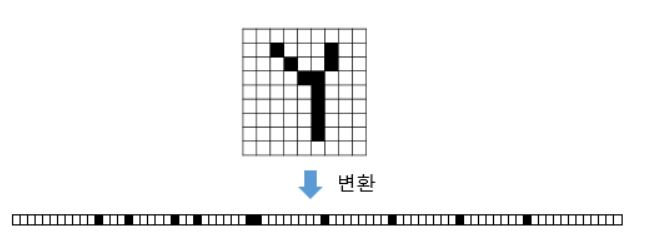
    또한 위 손글씨를 MLP로 분류한다고 하면, 이미지를 벡터(1차원 텐서)로 변환해 input layer로 사용해야 한다. 그런데, 변환된 결과는 변환 전의 공간적 구조(spatial structure)정보가 유실된 상태.
        - 공간적 구조 정보 : 거리가 가까운 픽셀간 연관관계, 비슷한 수치 등의 특성들을 알 수 없다. 
* CNN
    - `합성곱 신경망`은 `spatial structure 보존`하면서 학습할 수 있도록 해줌
    - 또한 Convolution 연산은 MLP와 달리 `커널`을 입력벡터 상에서 움직여가면서 선형모델과 합성함수가 적용되는 구조. i에 따라 가중치 행렬 바뀌는게 아니라 커널이 `고정`됨. 즉 공통된 커널 사용. `파라미터 사이즈를 굉장히 많이 줄일 수 있다는 특징` 가짐.

### feature map
* convolution : 커널로 이미지 처음부터 끝까지 훑으며 겹쳐진 부분의 (이미지*커널원소값) 모두 더한 값을 출력으로 함. 이미지 특징을 추출하는 것. (bias있으면 연산 결과에 각각 더해주면 됨)
* 커널 사용해 convolution한 결과
* padding이용해 입력층과 출력층 크기 같게할 수도
    * stride 1이라고 할 때 (커널크기,padding)->((3x3),1)/((5x5),2)/((7x7),3)

### **feature map 크기 계산**
* input size, kernel size, stride, (+padding) 알면 feature map 크기를 계산할 수 있다.
* $O=\frac{(I+2P-K)}{S}+1$

### convolution layer
* `convolution으로 feature map`얻고, `activation func`을 지나는 연산(비선형성 추가-xor문제 등 해결)을 하는 합성곱 신경망의 은닉층

### 채널
* depth라고 부르기도 함
* 이미지 : (채널,세로 픽셀수,가로 픽셀수)이라는 3D Tensor
* 이때 채널은 색 성분 (RGB이므로 채널 3개)
* 흑백 이미지라면 채널 1개이며, 각 픽셀은 0~255사이의 값을 가진다.
* **입력 데이터 채널 수 == 커널 채널 수 (같아야)**. 이때 주의할 점은 커널이 x개란 의미가 아니라 `x개의 채널을 가진 1개의 커널`이란 점
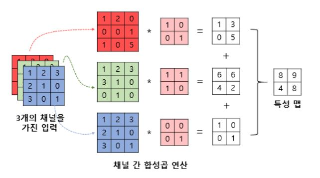

### Pooling
* 일반적으로 합성곱층(convolution operation + activation func) 다음에는 풀링층 추가함,
    *  (합성곱+활성화함수+풀링) 이렇게 하나의 합성곱층으로 보기도
* feature map을 down-sampling하여 feature map의 크기를 줄이는 연산
* max pooling / average pooling이 주로 사용됨
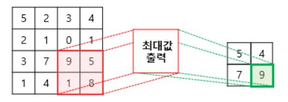
    * convolution과 마찬가지로 커널, stride 개념이 있지만 pooling하면 feature map이 절반의 크기로 down-sampling된다는 차이/이점 존재

https://wikidocs.net/62306

# | 강의

# Convolution
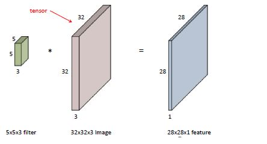  
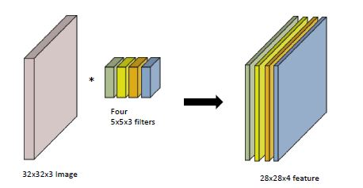  
* feature map의 채널 수는 convolution filter가 여러개가 있다고 볼 수 있는 것
* input channel과 ouput convolution feature map의 channel을 알면 여기에 적용되는 convolution feautre 크기도 알 수 있다.
* stack of convolutions
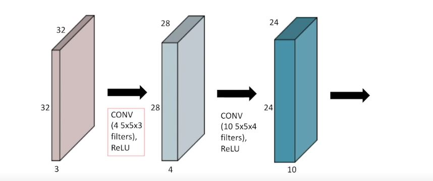  
* `파라미터 수`
    * (커널 사이즈*convolution할 input channel 수(convolution하는 feature의 dimension))*(ouput channel 수) 

## Convolutional Neural Networks
- CNN은 `convolution layer, pooling layer, fully connected layer`로 구성되어 있다.
- Convolution and pooling layers : feature extraction
- Fully connected layer : decision making (ex.classification)
- 최근에는 `Fully connected layer를 최소화시키는` 추세. 파라미터 숫자가 큰 걸 지양. 
    - 머신러닝에서는 학습할 어떤 모델의 `파라미터의 숫자가 늘어날 수록 학습 어렵고` `generalization performance가 떨어진다.`
    - CNN발전 방향은 같은 모델 만들고 최대한 `convolution layer을 deep하게 쌓고 파라미터 숫자를 최대한 줄이`는 방향
    - **그래서 항상 주의깊게 볼 것은, NN에서 네트워크의 레이어마다 몇개의 파라미터로 이루어져 있고 전체 파라미터의 숫자가 몇개인지를 확인해야 한다.**
    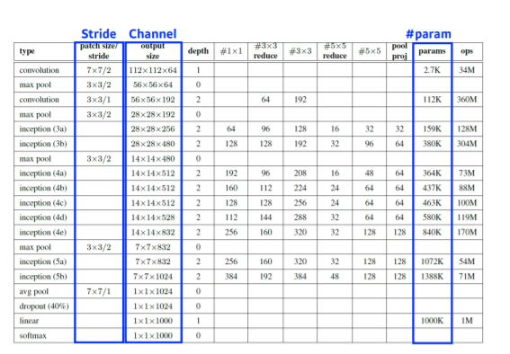  

## stride 
* 얼마나 넓게 걷는지 알려줌
* convolution filter을 얼마나 dense/sparse하게 찍을지를 말하게 됨
* stride=1 : 커널을 매 픽셀마다 옮겨 찍는다.
* Example in 1D  
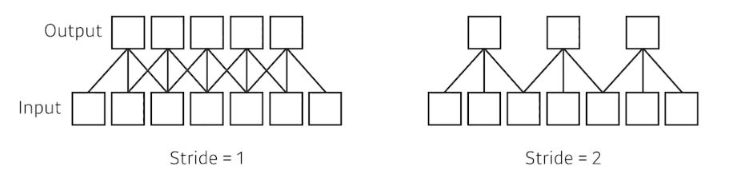  

## padding
* convolution할때 boundary정보가 버려진다.
* 가장자리도 convolution할 수 있도록 값을 덧대주는 역할
* 적절한 크기 zero padding + stride 1이면 input과 ouput의 spacial dimension이 똑같게  만들 수 있음.
    * padding 1 + stride 1 + 3*3 kernel
    * padding 2 + stride 1 + 5*5 kernel
    * padding 3 + stride 1 + 7*7 kernel

## EXAMPLE
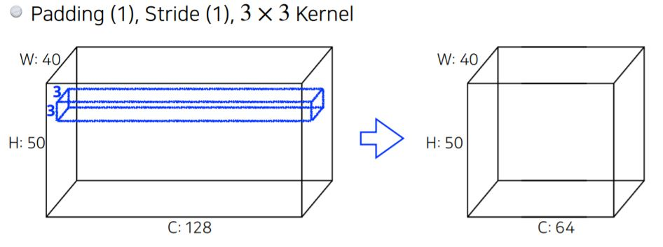
* (3*3)*128{input dimension과 자동으로 같게}*64{궁극적으로 원하는 channel수}
* 73,728
* 이처럼 네트워크에 필요한 파라미터 숫자에 대한 **감**을 잡아야 함.

## EXAMPLE - Alexnet
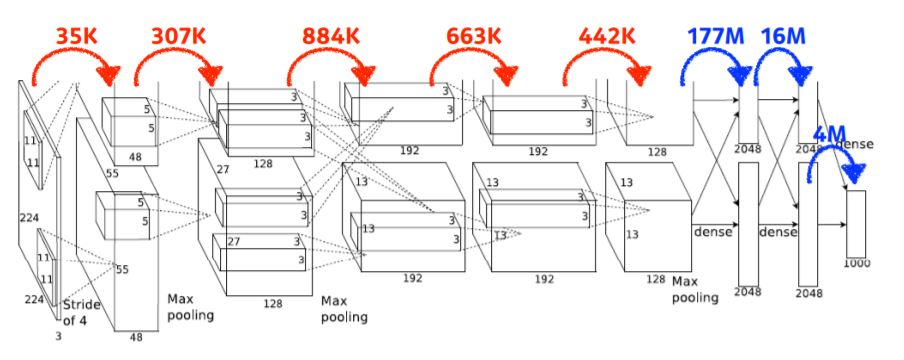
* 빨간 : `Convolution layer`
* 파랑 : `Dense layer (fully connected layer)` : input 뉴런 개수 * output뉴런 개수
* 파라미터 숫자가 dense layer로 넘어가면서 천배 이상으로 늘어나게 됨
* convolution operation은 각각의 커널이 이미지의 모든 위치에 대해서 shared됨.
* NN 성능 올리기 위해서는 fully connected layer 이 뒷단을 최대한 줄이려고 함.
    * `one by one convolution` 등의 시도를 통해서 nerual network depth는 깊어지지만 parameter 숫자는 점점 줄어들도록 함
    * one by one의 의미 : 이미지에서 한 픽셀만 본다. 채널 방향을 줄인다. 
    * "dimension reduction" : dimension은 여기서 channel
    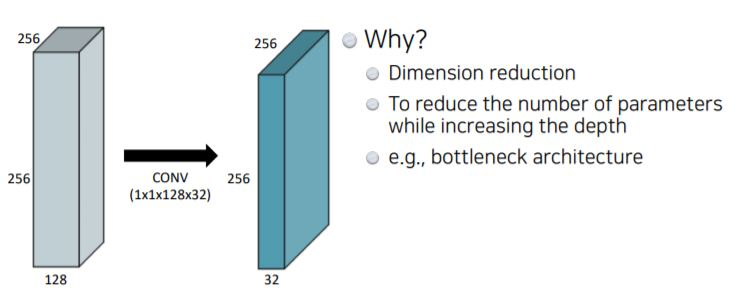

#  Modern CNN
https://cs231n.github.io/convolutional-networks/#conv
## AlexNet
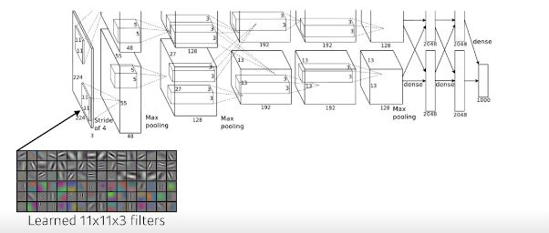
* key ideas
    1. ReLU activation  
        - Preserves properties of linear models
        - Easy to optimize with gradient descent
        - Good generalization
        - Overcome the vanishing gradient problem
    2. GPI implementation(2 GPUs)
    3. Local response normalization, Overlapping pooling
    4. Data augmentation
    5. Dropout
   
## VGGNet
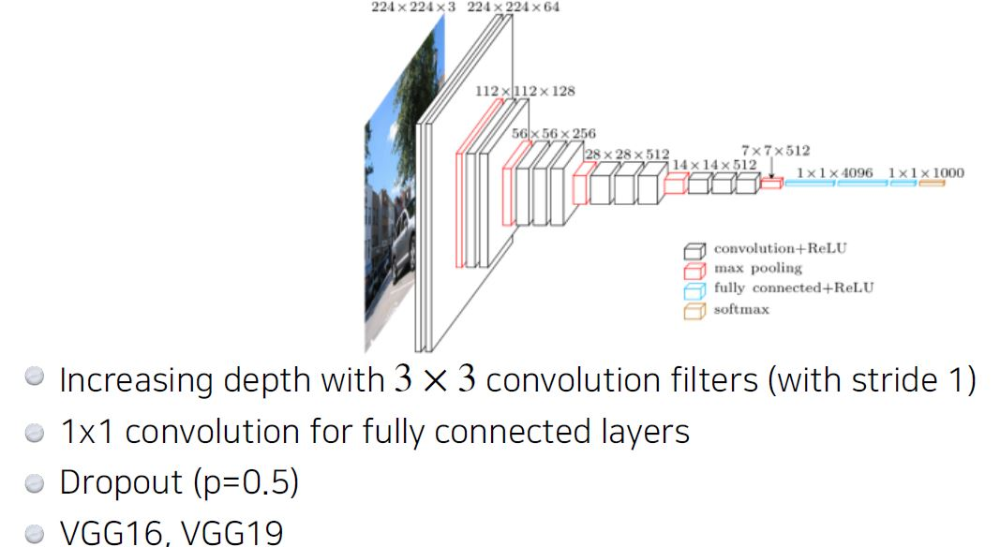
* **filter 크기 3x3 사용한 이유** 
    * 하나의 convolutional feature map을 얻기 위해서 고려할 수 있는 입력의 spatial dimension(Receptive field)
    * filter 사이즈 클 수록 Receptive field 커짐
    
    * 3x3 convolution 2번은 5x5사용한 것과 Receptive field가 같다.
    * 그러나 파라미터 수 계산하면 전자가 더 작다. 
    * 이유 : 레이어 두개 쌓으면 파라미터 셋 두번 쓴거 같지만, 3x3x2는 18, 5x5는 25. 
    * 따라서 kernel spatial dimension(width*height)은 7x7 벗어나지 않고 거의 3x3, 5x5

## GoogLeNet
* one by one convolution이라는 것은 channel dimension reduction 효과
* feature map이 spatial dimension이 아니라 tensor의 depth방향 해당하는 channel 줄임
* 네트워크 똑같이 deep하게 썼는데, `one by one convolution 잘 사용하면 파라미터 수를 줄일 수 있게 된다.` (input/ouput channel수랑 receptive field은 그대로)
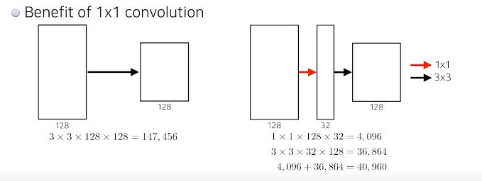

## ResNet
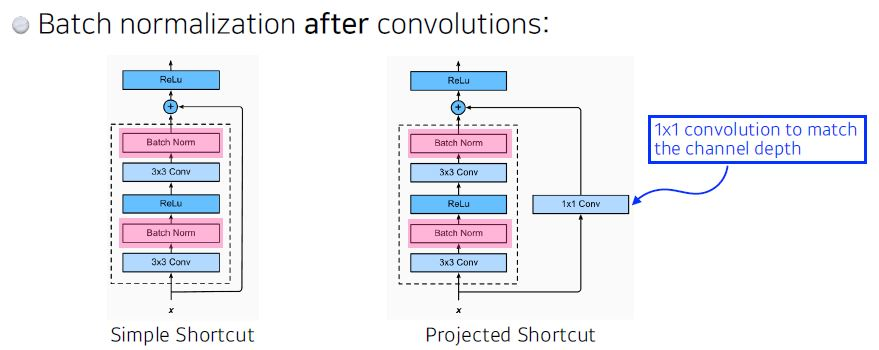
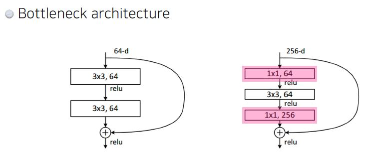

## DenseNet
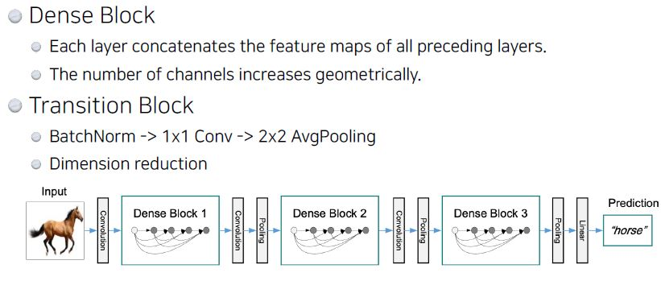

* *억.... 어려워 ㅠㅠ 여기서부터 modern cnn은 CNN 더 공부한 다음에 다시 돌아오기*

# 실습

[1.CNN_최성준 교수님](../notes/jupyter/Day13_CNN_최성준교수님.ipynb)

[2.CNN_최성철 교수님](../notes/jupyter/Day13_CNN_최성철교수님.ipynb)

[3.CNN_강아지 분류](../notes/jupyter/Day13_강아지분류.ipynb)
