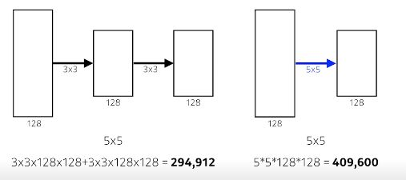

# Day13

[1.convolution](#convolution)

[2.modern](#modern-cnn)

[3.실습](#실습)

# | 회고
오늘은 wsl2를 개인적으로 설치하느라 정리가 미흡합니다. 나중에 업데이트하겠습니다. 이후 시간에는 최성철 교수님께서 강의해주신대로 file tree에 익숙하게 접근할 수 있도록 코드를 뜯어보고, 그리고 최성준 교수님께서 말씀해주신대로 convolution연산에 대해서 더 공부해보겠습니다.

피어세션 때 cnn코드에서 레이어층을 도식화해보는게 어려워서 피어분들께 설명을 부탁드렸습니다. 직접 풀이하신 내용을 공유해주셔서 그 내용을 바탕으로 더 수월하게 공부할 수 있을 것 같습니다. 오늘도 감사한 하루였습니다~ :)

# | 강의

# Convolution

* [RGB]
* 여러 개의 channel을 가진 것을 feature map. 
* feature map의 채널 수는 convolution filter가 여러개가 있다고 볼 수 있는 것
* input channel과 ouput convolution feature map의 channel을 알면 여기에 적용되는 convolution feautre 크기도 알 수 있다.
* stack of convolutions
  
파라미터 수 : (커널 사이즈*convolution할 input channel 수(convolution하는 feature의 dimension))*(ouput channel 수) 

## Convolutional Neural Networks
- CNN은 convolution layer, pooling layer, fully connected layer로 구성되어 있다.
- Convolution and pooling layers : feature extraction
- Fully connected layer : decision making (ex.classification)
- 최근에는 Fully connected layer를 최소화시키는 추세. 파라미터 숫자에 의해서. 
    - 머신러닝에서는 학습할 어떤 모델의 파라미터의 숫자가 늘어날 수록 학습 어렵고 generalization performance가 떨어진다.
    - CNN발전 방향은 같은 모델 만들고 최대한 convolution layer을 deep하게 쌓고 파라미터 숫자를 최대한 줄이는 방향
    - **그래서 항상 주의깊게 볼 것은, NN에서 네트워크의 레이어마다 몇개의 파라미터로 이루어져 있고 전체 파라미터의 숫자가 몇개인지를 확인해야 한다.**
      

## stride 
* 넓게 걷는다.
* convolution filter을 얼마나 dense/sparse하게 찍을지를 말하게 됨
* stride=1 : 커널을 매 픽셀마다 옮겨 찍는다.
* Example in 1D  
  

## padding
* convolution할때 boundary정보가 버려진다.
* 가장자리도 convolution할 수 있도록 값을 덧대주는 역할
* 적절한 크기 zero padding + stride 1이면 input과 ouput의 spacial dimension이 똑같게  만들 수 있음.
    * padding 1 + stride 1 + 3*3 kernel
    * padding 2 + stride 1 + 5*5 kernel
    * padding 3 + stride 1 + 7*7 kernel

## EXAMPLE

* (3*3)*128{input dimension과 자동으로 같게}*64{궁극적으로 원하는 channel수}
* 73,728
* 이처럼 네트워크에 필요한 파라미터 숫자에 대한 **감**을 잡아야 함.

## EXAMPLE - Alexnet

* 빨간 : Convolution layer
* 파랑 : Dense layer (fully connected layer) : input 뉴런 개수 * output뉴런 개수
* 파라미터 숫자가 dense layer로 넘어가면서 천배 이상으로 늘어나게 됨
* convolution operation은 각각의 커널이 이미지의 모든 위치에 대해서 shared됨.
* NN 성능 올리기 위해서는 fully connected layer 이 뒷단을 최대한 줄이려고 함.
    * `one by one convolution` 등의 시도를 통해서 nerual network depth는 깊어지지만 parameter 숫자는 점점 줄어들도록 함
    * one by one의 의미 : 이미지에서 한 픽셀만 본다. 채널 방향을 줄인다. 
    * "dimension reduction" : dimension은 여기서 channel
    

#  Modern CNN
https://cs231n.github.io/convolutional-networks/#conv
## AlexNet

* key ideas
    1. ReLU activation  
        - Preserves properties of linear models
        - Easy to optimize with gradient descent
        - Good generalization
        - Overcome the vanishing gradient problem
    2. GPI implementation(2 GPUs)
    3. Local response normalization, Overlapping pooling
    4. Data augmentation
    5. Dropout
   
## VGGNet

* **filter 크기 3x3 사용한 이유** 
    * 하나의 convolutional feature map을 얻기 위해서 고려할 수 있는 입력의 spatial dimension(Receptive field)
    * filter 사이즈 클 수록 Receptive field 커짐
    
    * 3x3 convolution 2번은 5x5사용한 것과 Receptive field가 같다.
    * 그러나 파라미터 수 계산하면 전자가 더 작다. 
    * 이유 : 레이어 두개 쌓으면 파라미터 셋 두번 쓴거 같지만, 3x3x2는 18, 5x5는 25. 
    * 따라서 kernel spatial dimension(width*height)은 7x7 벗어나지 않고 거의 3x3, 5x5

## GoogLeNet
* one by one convolution이라는 것은 channel dimension reduction 효과
* feature map이 spatial dimension이 아니라 tensor의 depth방향 해당하는 channel 줄임
* 네트워크 똑같이 deep하게 썼는데, `one by one convolution 잘 사용하면 파라미터 수를 줄일 수 있게 된다.` (input/ouput channel수랑 receptive field은 그대로)

*그 외 modern cnn은 더 이해한다음에 다시 정리하기*

# 실습

[실습코드](../notes/jupyter/Day13_CNN_최성준교수님.ipynb)

[실습코드](../notes/jupyter/Day13_CNN_최성철교수님.ipynb)

[실습코드](../notes/jupyter/Day13_강아지분류.ipynb)
