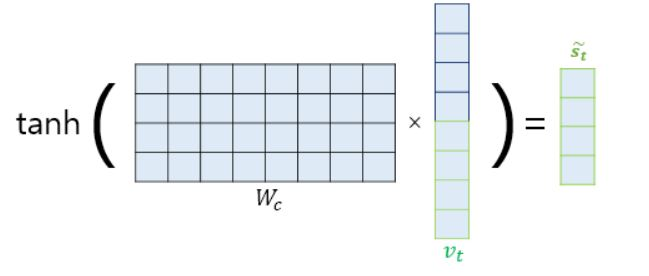

# Day15

# | 회고

**(Day15 파일은 주말 내로 업데이트하겠습니다.)** 오늘 두 강의는 각각 20분정도로 짧았지만, 너무 어려웠습니다. RNN과 CNN에 아직 익숙하지 않은 상태에서 머리에 과부하(?)ㅎㅎ가 걸린 것 같습니다...원래는 강의를 이해하면서 받아적으려고 하는데, 이해되지 않는 부분이 너무 많았습니다. 그래서 이번 강의는 정리하기 보다 "이런게 있구나"하는 정도로 가볍게 접근했습니다. 연휴동안 심도있게 배운 내용들을 복습하고 나서 오늘 강의를 다시 듣고 정리할 예정입니다. 오후 시간에는 개인학습으로 진행을 했습니다. 특히 Attention메커니즘이 잘 이해가 되지 않았어서 유튜브나 인터넷 자료를 참고하면서 다시 공부했습니다. 

그리고 금일 피어세션은 조교님과 함께 진행되었습니다. 공부하는 방식에 대해 조언을 구할 수 있었고 경험하신 프로젝트 설명도 들을 수 있었습니다. 피어분들과 함께 조교님 도움을 많이 받을 수 있을 것 같아서 기쁩니다. ㅎㅎ 연휴때도 열공 모드 잃지 않게 최선을 다해보겠습니다. 오늘도 감사한 하루였습니다. :sparkles:  

# | 개인 학습 (복습)
## RNN 이용한 encoder, decoder 복습
- seq2seq : 번역기에서 대표적으로 사용되는 모델  
    
    - encoder: 입력 문장들의 모든 단어들을 순차적으로 입력받고, 모든 단어 정보들을 압축해 `context vector` 하나를 만든다. 이후 context vector를 decoder로 전달
    - decoder: context vector를 입력받아 번역된 단어를 한개씩 순차 출력  
      
    - encoder와 decoder 아키텍처 내부는 사실상 두개의 RNN 아키텍처
    - 결국 입력 문장을 받는 RNN 셀을 encoder, 출력 문장을 출력하는 RNN셀을 decoder라고 부름
        - `실제로는 성능 문제로 vanilla RNN이 아닌 LSTM셀, GRU셀이 사용됨`
- Encoder, Decoder 자세히
1. Encoder
- 입력 문장은 `단어 토큰화`를 거치고 `토큰 각각은 RNN셀의 각 시점의 입력`이 됨
- encoder RNN셀은 모든 단어 입력받고 `encoder RNN셀의 마지막 시점의 hidden state`를 decoder RNN셀로 넘김 (context vector 넘김)
- context vector은 decoder RNN셀의 첫번째 hidden state로 사용됨
2. Decoder
- TEST과정에서 다음에 올 단어를 예측하고, 그 예측된 단어를 다음 시점의 RNN셀의 입력으로 넣는 행위가 반복됨  
- 실제로 토큰화된 단어들은 embedding vector(word embedding 과정 거침)   
    
- embedding layer 예시   
    
- 예측 과정  
    
    - t시점의 hidden state: t-1시점의 hidden state값과 t시점에서의 입력값이 입력으로 들어감
    - Dense layer (이전 계층 모든 뉴런과 결합된 형태의 layer인 fully-connected layer)
        -  recurrency 구조가 있을 때 timestep fix+시간순으로 풀면 Fully connected layer로 볼 수 있음을 의미하는 듯
    - softmax
        - 디코더 부분에서는 출력 단어로 나올 수 있는 다양한 단어 중 `하나의 단어를 선택해` 예측해야 한다.
        - softmax 사용해 출력 시퀀스의 `각 단어별 확률값`을 반환하고 출력단어를 결정하는 것

## Attention 메커니즘1
- RNN에 기반한 seq2seq(번역기에 주로 사용)의 두가지 문제
    1. 고정된 크기의 벡터에 정보를 압축하려다보니, `정보 손실` 발생
    2. RNN 고질적 문제인 Vanishing Gradient 문제 존재
- 결국 long-term dependency가 떨어진다는 의미 (입력 시퀀스가 길어지면 출력 시퀀스의 정확도가 떨어진다.) 이걸 `보완하고자 나온 기법이 attention`. 그리고 `현재는 attention 스스로가 seq2seq를 대체하는 방법인 Transformer가 사용됨`. 
- 기본 아이디어
    - decoder에서 출력 단어를 예측하는 매 time step마다 
    - encoder 전체 입력 문장을 다시 한번 참고한다.
-  Attention function    
    -  `Attention(Q,K,V)=Attention Value`
    - 주어진 Query에 대해 모든 Key와의 유사도를 각각 구한다.
    - 그리고, 이 유사도를 key와 mapping되어있는 각각의 value에 반영한다.
    - 유사도가 반영된 value를 모두 더해서(=>Attention value) 리턴한다.  
    
- Query, Key, Value
1. Query: 영향을 `받는` 단어 변수
2. Key: 영향을 `주는` 단어 변수
3. Value: 그 영향에 대한 `가중치`
* `Dot-Product` 
    * Query vector가 key vector들과 Dot Product되는 것이
    * 영향을 주고 받는 단어들의 `유사도를 측정`하는 행위
    * Dot-Product Attention 정의  
    

## Attention 메커니즘(과정을 한 단계씩 풀이)
1. `Attention Score` 구하기
- 현재 Decoder 시점 t에서 단어 예측을 위해 Encoder의 모든 hidden state 각각이 Decoder의 hidden state와 얼마나 유사한지 판단하는 score값
- $h_n$ : Encoder's hidden state
- $s_t$ : Decoder's hidden state
- $a_t$ : Attention value
- encoder hidden state와 decoder hidden state Dimension 같다고 가정한 상태

- 원래 Decoder가 t시점에 예측을 위해 필요한 입력값 : t-1의 hidden state, t-1에 나온 출력 단어
    - In Attention mechanism, `Attention Value값`($a_t$)이 추가적으로 필요함 
- `Attention Value 구하기 위한 첫걸음이 Attention Score 구하는 것`
- Dot-product에서는 $s_t$를 transpose하고 $h_i(i=1,2,...,n)$와 내적(dot)해 계산. 따라서 모든 attention score은 scalar임     
    
    - $score(s_t,h_i)=s_i^{T}h_i$
    - $e^t=[s_t^{T}h_1,...s_t^{T}h_n]$ : attention score의 모음값
2. Softmax 함수를 통해 `Attention Distribution` 구하기
- $e^t$에 softmax 적용하면 모든 값을 합하면 1이 되는 확률 분포를 얻음 : `Attention Distribution`
- 이때 각각의 값이 `Attention Weight` (그림에서 직사각형 크기)   
- $\alpha_t=softmax(e^t)$ : `attention distribution`  
    
3. `Attention Value`구하기  
- 각 encoder의 attention weight과 hidden state를 가중합(Weighted Sum)    
    
- $a_t=\sum_{i=1}^N\alpha_i^{t}h_i$ : `attention value` or `context vector`(encoder의 문맥을 포함하고 있다)
    - (주의) seq2seq에서의 context vector와 다른 의미   
    - seq2seq에서는 encoder의 마지막 hidden state 
4. **`Concatenate`
- attention value와 decoder의 t시점의 hidden state 연결
    - $a_t$와 $s_t$와 결합(concatenate)하여 하나의 vector로 만드는 작업 수행
    - 이걸 $v_t$로 정의
    - $v_t$는 $\hat{y}$ 예측 연산의 입력으로 사용하면서 encoder로부터 얻은 정보를 활용해 $\hat{y}$를 더 잘 예측할 수 있게 됨
    
5. 출력층 연산의 입력이 되는 $\tilde{s_t}$ 계산 
- $v_t$를 바로 출력층으로 보내기 전에 신경망 연산 한번 더 추가
- 가중치 행렬과 곱한 후 tanh 함수 통과해 출력층 연산을 위한 새로운 벡터인 $\tilde{s_t}$ 도출
- seq2seq에서는 출력층 입력이 $s_t$였지만 attention mechanism에서는 $\tilde{s_t}$  

- 식 도출 및 $\tilde{s_t}$를 출력층 입력으로 사용   
      
6. 예측 벡터($\hat{y}$) get   
    

## 다양한 종류의 Attention이 있다.
- Attention Score를 구하는 방법은 dot 말고도 scaled dot, general, concat, ... 다양
* *참고 : https://bit.ly/36IP3fE / https://wikidocs.net/22893*

## Transformer
- RNN을 사용하지 않고 encoder, decoder 구조 설계했음에도 성능이 더 우수
- (현재까지 flow)
    - seq2seq : encoder가 입력 sequence 하나의 vector로 압축하는 과정에서 정보 손실
    - Attention : seq2seq 한계 보완하기 위해 사용
    - Transformer : Attention 자체로 encoder, decoder 만듬 (보완용x)
- `Hyper-parameter` (사용자가 모델 설계 시 임의로 변경할 수 있는 값)
    - $d_{model}$ : Transformer의 encoder, decoder에서 정해진 입출력의 크기
        - embedding vector의 Dimension이기도 함
        - 각 층의 encoder와 decoder가 next layer로 값을 보낼때 이 차원을 유지
        - 논문에서는 512로 상정
    - num_layers : encoder+decoder layer가 몇 개 쌓여있는지 의미
        - 논문에서는 각각 6개 쌓음
    - num_heads : Attention을 한번 수행하기보다, 여러 개로 분할해서 병렬로 Attention을 수행하고 결과값을 다시 하나로 합치는 방식 채택. 이때의 병렬 개수를 의미
    - $d_{ff}$ : Transformer 내부에 feed forward nn 존재. 이때의 은닉층 크기. feed forward nn과 출력층의 크기는 $d_{model}$임
- `Transformer`
    - seq2seq 와 다른 점
    1. RNN 사용 안함
    2. encoder+decoder 구조가 존재한다는 점은 같지만 N개 존재할 수 있다는 점은 다르다.
    3. seq2seq는 encoder, decoder 각각 하나의 RNN이 t개의 time-step을 가지는 구조였다면, Transformer은 encoder, decoder 단위가 N개로 구성됨
    - [Example] 6개 쌓여있는 encoders/decoders   
    
    4. encoder`s`,decoder`s`은 조정된 embedding vector를 입력받는다. (Positional Encoding)
- `Positional Encoding`
    - RNN이 NLP에 유용했던 이유도 단어의 위치에 따라서 단어를 순차적으로 입력받아 처리하는 특성이 있었기 때문
    - 그러나 Transformer은 단어 입력을 순차적으로 입력 받는 방식이 아니다. 따라서 위치 정보를 알려줄 필요가 있음. 
    - 따라서 단어 임베딩 벡터에 위치 정보를 더해 모델 입력으로 사용. Positional Encoding   
    
    
    - 위치 정보를 가진 값을 만들기 위해 두가지 함수를 사용(차원의 홀수, 짝수에 따라 sin,cos 함수 사용)
        - (자세한 내용 참고) https://pozalabs.github.io/transformer/     
        
    - 순서 정보가 보존되기 때문에, 같은 단어가 들어가도 위치에 따라서 Transformer 입력으로 들어가는 embedding vector 값이 달라진다.
- 세가지 `Attention`  
    
    - Self Attention: Query, Key, Value가 동일한 경우(==not vector값. vector의 출처. 인코더 / 디코더 등)
    1. Encoder Self-Attention : Query = Key = Value
    2. Masked Decoder Self-Attention : Query = Key = Value
    3. Encoder-Decoder Attention : Query : decoder 벡터 / Key = Value : encoder 벡터  
    
- `Encoder`
    - 하나의 encoder 층은 크게 총 2개의 sublayer로 나뉘어짐
    1. self attention -> multi head self attention은 self attention 병렬적으로 사용했다는 의미 
    2. feed forward nn (==position-wise FFNN)

# | 강의 
# Generative Models
https://deepgenerativemodels.github.io/

* 업데이트 예정 * 