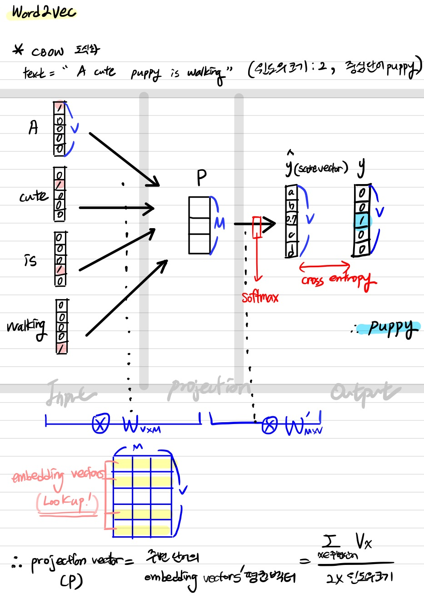
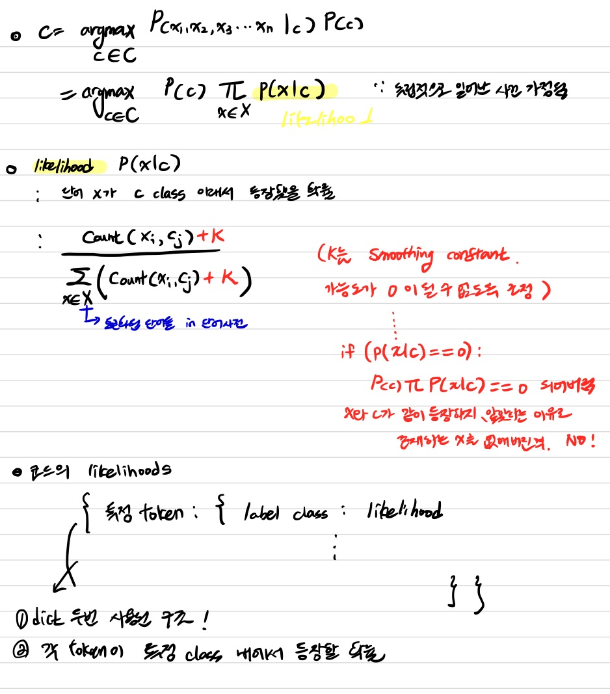

# Day16

[1.개인학습](#-개인학습)

[2. NLP info](#info)

[3. trends of nlp](#trends-of-nlp)

[4. word embedding - word2vec & Glove](#word-embedding)

[5. 실습 ](#word2vec-실습)

# | 회고

연휴가 너무 빠르게 지나갔습니다.... 다시 열공모드로 진입하겠습니다.ㅎㅎ 오늘 피어세션은 일주일에 한번 예정된 알고리즘 풀이를 진행했습니다. NLP 학습 관련해서는 강의때 혼동되었던 부분이나 몰랐던 개념들을 추가로 공부했습니다. 내일도 열심히 달려보겠습니다 ~~

# | 개인학습

1. CBOW 도식화 
- 강의 자료는 predicted W'WX 구조로 predicted Y(score vector)연산. 내가 도식화한 부분은 XWW' 구조   


2. 혼동되었던 점   
`nn.Embedding()에 one-hot vector가 input으로 들어가지 않아서 의문스러웠음.`  
- 파이토치는 단어 -> 정수 index로만 바꾼 `단어 사전을 그대로 embedding layer 입력으로 사용해도` embedding vector를 return (softmax는 마지막에 안씌운 상태로 결과값 도출됨)
- 
    - example
    ```python
    tensor([[-0.1778, -1.9974, -1.2478],
            [ 0.0000,  0.0000,  0.0000],
            [ 1.0921,  0.0416, -0.7896],
            [ 0.0960, -0.6029,  0.3721],
            [ 0.2780, -0.4300, -1.9770],
            [ 0.0727,  0.5782, -3.2617],
            [-0.0173, -0.7092,  0.9121],
            [-0.4817, -1.1222,  2.2774]], requires_grad=True)
    ```
- (참고) https://wikidocs.net/64904
- 나이브 베이즈 분류기 만들때는 label 예측까지 끝낸 상태였고, word2vec 실습때는 embedding layer 학습시키는 것에 초점을 두었음. 따라서 (embedding+평균 벡터) 만드는 과정은 위 그림에서 W, Linear층을 거치게 하는 것은 W'을 거치는 것이라고 볼 수 있음!

1. likelihood
-  데이터를 관찰하면 `데이터가 추출되었을 것으로 생각되는 분포의 특성`을 추정할 수 있다. (파란색 곡선보다 주황색 곡선에서 데이터를 얻을 가능성이 더 큼)            
   
- likelihood는 "지금 얻은 데이터가 특정 분포에서 나왔을 가능도"를 의미
- 강의에서는 나이브 베이즈 classifier 쓸 때, lableling class인 C라는 조건 하에 단어 X가 등장할 확률을 의미 

4. word2vec
- CBOW or Skip-Gram 방식 있음
- CBOW는 주변에 있는 단어들을 가지고, 중간에 있는 단어들을 예측하는 방법. 반대로, Skip-Gram은 중간에 있는 단어로 주변 단어들을 예측하는 방법
- 대체적으로 Word2Vec를 사용한다고 하면 SGNS(Skip-Gram with Negative Sampling)을 사용
- Word2Vec이 모든 단어 집합에 대해서 소프트맥스 함수를 수행하고, 역전파를 수행하므로 주변 단어와 상관 없는 모든 단어까지의 워드 임베딩 조정 작업을 수행
- 단어 집합의 크기가 수백만에 달한다면 이 작업은 굉장히 무거운 작업
- 전체 단어 집합이 아니라 일부 단어 집합에 대해서만 고려하면 안 될까?
- Word2Vec은 `주변 단어들을 긍정(positive)`으로 두고 랜덤으로 `샘플링 된 단어들을 부정(negative)`으로 둔 다음에 `이진 분류` 문제를 수행
    - 주변 단어 + 주변 단어가 아닌 단어들 일부 샘플링
    - 즉, 전체 단어 집합보다 훨씬 작은 단어 집합을 만들어놓고 마지막 단계를 이진 분류 문제로 바꿔버리는 것
    - 기존의 다중 클래스 분류 문제를 이진 분류 문제로 바꾸면서도 연산량에 있어서 훨씬 효율적
- word embedding 자세히
    - 단어를 밀집 벡터(dense vector)의 형태로 표현하는 방법
    - 분산 표현을 이용하여 단어의 유사도를 벡터화
    - 분포 가설 기반
        -  '비슷한 위치에서 등장하는 단어들은 비슷한 의미를 가진다'라는 가정
    - 희소 표현이 고차원에 각 차원이 분리된 표현 방법이었다면, 분산 표현은 저차원에 단어의 의미를 여러 차원에다가 분산하여 표현. 단어 간 유사도 계산 가능
    - 학습 방법 중 NNLM,RNNLM 등이 있지만 word2vec 많이 쓰임

5. Glove
- LSA는 카운트 기반으로 코퍼스의 전체적인 통계 정보를 고려하기는 하지만 왕:남자 = 여왕:? (정답은 여자)와 같은 단어 의미의 유추 작업(Analogy task)에는 성능이 떨어진다. 
- Word2Vec는 예측 기반으로 단어 간 유추 작업에는 LSA보다 뛰어나지만, 임베딩 벡터가 윈도우 크기 내에서만 
주변 단어를 고려하기 때문에 코퍼스의 전체적인 통계 정보를 반영하지 못한다. 
- GloVe는 이러한 기존 방법론들의 
각각의 한계를 지적하며, LSA의 메커니즘이었던 카운트 기반의 방법과 Word2Vec의 메커니즘이었던 예측 기반의 방법론 두 가지를 모두 사용
# | 강의

# INFO
1. NLP Processing (본 강의에서 다루는 내용)
    1. Low-level parsing
        - Tokenization, stemming
    2. Word and phrase level
        - Named Entity Recognition(NER)
        - parf of speech(POS) taggins
        - noun-phrase chunking
        - dependency parsing
        - coreference resolution
    3. Sentence level
        - sentimental analysis, machine translation
    4. Multi-sentence and paragraph level
        - Entailment prediction, QA, dialog systems, summarization

2. Text mining
- Extract useful info and insights from text and document data
- Document clustering (ex.topic modeling)
- high related to computational social science

3. Informational retrieval
- high related to computational social science

# Trends of NLP
1. word2vec or glove
- text를 단어/형태소 단위로 분리하고 벡터 공간의 한 점으로 표현 (word embedding)
2. LSTMs and GRUs
- word들은 순서 정보를 포함하므로 sequential model 필요
3. Attention modules and Transformer models
- RNN -> self attention으로 대체하게 한 transformer. NLP를 위한 딥러닝 모델들은 대부분 Transformer로 구현됨
4. self-supervised training
- self attention 모듈을 쌓아나고 대규모 데이터 기반으로 자가 지도 학습함. 큰 구조의 변화없이도 전이 학습으로 적용했을때 성능 좋음. 자가 지도 학습은 일부 단어를 가려놓고 앞뒤 문맥을 보고 그 단어 맞추게 하는 등의 작업. 언어의 문법/ 의미론적인 부분을 학습하게 됨.  
- ex) BERT, GPT-3 
- GPU, 데이터 확보가 중요한만큼 자연어처리 기술 발전을 주도하는 것은 자본력과 데이터가 뒷받침되는 소수의 기업임

# Word Embedding
- 단어들을 특정 차원으로 이뤄진 공간상의 한 점으로 표현해주는 기술
- dimension을 정의해서 주면(하이퍼파라미터), 학습 완료 후 각각의 단어에 대한 벡터 표현형을 출력함
- 기본 아이디어 : 비슷한 의미를 가진 단어는 비슷한 위치에 존재한다. 
## word2vec
    - 한 중심단어는 주변의 단어들을 통해 의미를 알 수 있다는 가정
    - 주변 단어들의 확률 분포를 예측함. 중심 단어를 넣었을때(조건부확률 이용) 높은 확률 가진 단어와 유사    
    - sliding window : 한 단어 중심으로 window 크기 만큼 주변 단어를 선택한다.   
    
    - 무한대로 나올 때 softmax로 취하면 y값과 같아짐. (jy)lookup하는 과정이 존재하므로 W,W' 간의 내적에 의해서라면 윈도우 안에 있는 단어간 유사도가 커지도록 학습되고, 윈도우 밖에 있는 단어들과는 작도록 파라메터들이 학습되는듯  
    - transposed W(입력 단어 버전의 word embedding), W'(출력 단어 버전의 word embedding) 가중치 행렬 학습 한 이후로는 다음과 같이 된다.         
       
    - (ex) juice와 drink는 유사한 벡터 표현형을 가지게 됨. 둘 간의 내적값이 최대한 커짐(학습 목표)
    - (jy) 결국 W'를 

## Glove
1. loss func(목적 함수) 다음과 같이 달라짐
  
2. word2vec에 비해 중복 계산 줄여줌
3. Co-occurrence 가 있는 두 단어의 단어 벡터를 이용하여 co-occurrence 값을 예측하는 regression 문제를 푼다.
- 자세히 : https://lovit.github.io/nlp/representation/2018/09/05/glove/


# 나이브 베이즈 분류기 실습   
[Day16_naive_bayes](../notes/jupyter/Day16_naive_bayes.ipynb)

* 살짝 필기 


# word2vec 실습   
[Day16_word2vec](../notes/jupyter/Day16_word2vec.ipynb)   
