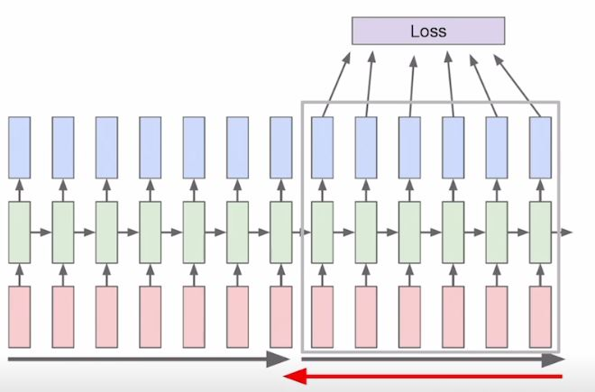

# Day17

[1. RNN Intro](#rnn-intro)

[2. Type of RNN](#type-of-rnn)

[3. character-level-language-model](#character-level-language-model)

[4. rnn 한계](#rnn-한계)

[5. LSTM & GRU](#lstm-gru)

[6. 실습](#실습)

# | 회고 
주재걸 교수님 강의를 들으면서, 이전 수업때는 어려웠던 RNN, gate 중심의 LSTM, LSTM와 GRU와의 차이에 대해서 명확히 알 수 있었습니다. 힘들고 어려워도 열심히 강의해주시는 만큼 잘 따라가야겠습니다! 오늘 피어세션 때도 느꼈지만, 힘든 상황에서 피어분들과 함께 고통을 나누고(?) 하는 과정이 정말 큰 위로가 되는 것 같습니다. ㅎㅎ 오늘도 감사한 하루였습니다. 내일 또 달립니다!!!!

# | 강의
# RNN Intro
    
- predicted y_t는 매 timestep마다 나오거나(품사 예측 등), 맨 마지막 문맥까지 닿아서 정의하는 방식(긍정/부정 분류 등)이 있다. (type of rnn에 자세히 기술됨)
- RNN은 단어간 순서를 가진 문장을 표현하기 위해 자주 사용됨
- RNN 구조를 활용해 다양한 NLP 문제를 정의하고 학습하는 방법을 알아야
    - RNN을 이용한 character-level의 language model
- 단, RNN을 이용한 Language Model에서는 초반 time step의 정보를 전달하기 어려운 점, gradient vanishing/exploding이 발생하는 문제가 존재한다. (해결법에 대해서 LSTM,GRU 마지막 부분 참고!)    
- 매 timestep에서 파라메터 W(Fully connecte layer상에서 weight)가 공유되는 것이 가장 큰 특징   
          
        
  
 

# type of RNN
  
1. one to one : 시퀀스 데이터가 아닌 일반적인 데이터 입력/출력 구조 
2. one to many : 입력은 하나의 timestep, 출력은 여러 timestep (ex.image captioning)
- 단, RNN구조에서 매 timestep에서 입력 들어가야 하므로, zero vector로 나머지 채워넣음
3. many to one
- sequence of text (각 단어를 word embedding형태로 입력받아서) -> 마지막 timestep에서 Positive/Negative 분류하는 등. 감정 분석이 예시로 될 수 있음
- input size에 따라서 hidden layer부분도 변경됨
4. many to many
- machine transformation 등
- 'i go home' => '나는 집에 간다.'
- 문장 다 읽은 후부터 예측 값을 생성한다. 
5. many to many
- 4번과 비슷하지만, 입력문장 다 읽고 처리하는게 아니라 입력 될때마다 처리
- delay를 용인하지 않음. (ex) 단어별로 품사 태깅하거나 video classification에서 이미지 각 timestep마다 입력될 때 각 scene이 어떤 scene인지 맞추는 구조 등 

 

# Character-level Language Model  
   
- h0은 default로 zero vector로 줌   
- W_hh, W_xh 곱해진 것 위에 필기한 맥락      

- logit의 의미
    - (참고) https://chacha95.github.io/2019-04-04-logit/
    - output layer은 사전 크기와 동일. 위 output vector을 다중 분류 위해 softmax 통과시켜야 하므로 softmax함수 이용할 때 입력으로 들어가는 logit역할. 
- l이 두번 쓰이는데, 한번은 l->l, l->o를 예측할 수 있었음. RNN이 이런 task를 수행할 수 있었던 배경은 현재의 입력뿐 아니라 h_(t-1)까지 고려했기 때문이었음 
- long sequence 당연히 가능   

- RNN으로 논문/프로그래밍 코드도 작성할 수 있음. 

### BPTT
- Backpropagation through time

- Character-level Language Model 학습 과정 살펴보자
- 각 timestep에 대해서 예측값과 실제 값의 loss를 통해서 계속 학습해가는 구조
- W_hh,W_hy,W_xh가 Backpropagation에 의해 학습된다는 의미
- character의 전체 시퀀스가 수백만인데 한번에 처리해야 하는 길이가 길고, 그 output 다 계산해서 각각 loss 계산하면서 학습하기는 어려움. 
    - 따라서 Truncation해서 진행
    - 한번에 학습할 수 있는 갯수를 한정하는 것
    - 
- HOW RNN works?
    - RNN에서 필요로하는 정보를 저장하는 공간은 매 timestep마다 업데이트되는 h_t라고 볼 수 있다. 현재까지는 2번의 space까지 학습헀다 등의 의미가 h_t에 담기면서 오게 됨
    - 아래 그림을 보면, 현재 "이 열렸다 닫혔다를 RNN이 기억하고 있음.  
    
    

 

# RNN 한계
- 실질적으로 바닐라 RNN을 사용하지는 않음
- orginal RNN은 동일한 matrix(W), X를 계속 곱하는 과정
- W_hh가 반복적으로 곱해진다는 의미는 backpropagation 과정에서 공비가 1보다 클때는 `exploding, `공비가 1보다 작을때는 `vanishing`하는 문제가 발생할 수 있다는 의미임
 
- (backpropagation진행될 때) h_t 미분하는 과정에서 (tanh 접선의 기울기*내부함수 미분값)이 반복되어 곱해지는데, 3이라는 W_hh가 계속 timestep 거슬러 올라갈 수록 거듭제곱되는 것(exploding) (1보다 작으면 반대 상황 (vanishing))
- `시퀀스 길이 길어지면 당연하게 모델 전체가 잘 학습되지 않음.`

 

# LSTM, GRU
- RNN을 개선한 알고리즘으로 등장 `(gradient flow 개선, long term dependency 완화)`
## LSTM (Long-short Term Memory)

- RNN이 가진 hidden state vector => cell state vector로 바꾸면서 long term dependency 완화
- 각 timestep에서 계산하는 두개의 중심 상태
    - gate vector들이 c,h 벡터 만드는 중간 과정들을 도맡음   
    - 
    - (ex) f(forget gate) : 이전 timestep에서의 벡터값과 0.x 곱해서 특정 %값만 취할 수 있도록 함
    - c_t : 기억해야 하는 모든 정보를 가짐
    - h_t : cell state vector을 한번 더 가공해서 다음 층에 노출할 정보만 filtering해둠. 이후 output layer의 입력으로 들어감   
    - 

## GRU   

     
- LSTM 모델 구조 경량화 : 적은 메모리 요구량, 빠른 계산 시간이 가능하도록 만듬
- LSTM의 cell,hidden state vector를 hidden state vector로 일원화
- cell state 없는 만큼, h_t가 cell state vector역할과 비슷한 역할을 함
- RNN/LSTM/GRU 기반의 Language Model에서 초반 time step의 정보를 전달하기 어려운 점을 완화할 수 있는 방법? 

## LSTM,GRU backpropagation 
- LSTM,GRU backpropagation 과정을 보면 cell state vector update되는 과정이 original RNN에서 W_hh계속 곱하는 과정이 아니라, forgaet gate곱한 값을 필요한 값을 `더해주는 과정`으로 gradient vanishing/exploding 문제를 해결할 수 있었음. 멀리있는 time step까지 gradient를 전해줄 수 있다. `(long-dependency 문제 해결)`

 

# 실습

[Day17_fancy_rnn](../notes/jupyter/Day17_fancy_rnn.ipynb)

[Day17_nmt_preprocessing](../notes/jupyter/Day17_nmt_preprocessing.ipynb)