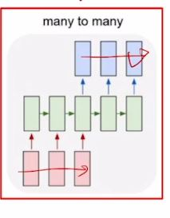

# Day18

[1. sequence-to-sequence](#sequence-to-sequence)

[2. attention-module](#attention-module)

[3. beam-search](#beam-search)

[4. blue-score](#blue-score)

# | 회고

회고를 마치고 바로 과제를 하러 달려가겠습니다...ㅎㅎ 오늘 교수님이 강의해주시는 내용이 너무 유익해서 강의를 반복해 들었습니다. 연산 과정이나 필요한 문장 예시를 하나 하나 알려주시는 모습에  감동을 받았고... 어려운 내용들을 덕분에 따라갈 수 있었습니다! 조교님과 함께 진행된 피어세션에서는 논문을 읽을 때 Abstract, Conclusion, Future work, Figure 중심으로 보면 좋다는 팁을 얻을 수 있었고, 특정 모델이 등장한 맥락과 장단점 그리고 다른 모델과 대비되는 특성들을 잘 잡으며 공부하면 좋다는 조언도 얻을 수 있었습니다. 그외로도 과제때 궁금했던 내용을 여쭤보면서 궁금함을 해결할 수 있었습니다. 너무 감사한 시간이었습니다. ㅎㅎ 그리고 내일 피어세션 전까지 batch normalization 논문을 읽어가야 하는데..... 몇시부터 읽을 수 있을지...... 얼른 과제부터 제출하고 읽어봐야 할 것 같습니다. XD

# sequence to sequence
- many to many RNN 모델에 속함  

- encoder, decoder 부분에서 각각 RNN모델이 쓰임 (실제론 LSTM이나 GRU)
- 파라메터 공유도 encoder, decoder 각각에서 이루어짐
-      
- [sos] : start token, [eos]-end token
- encoder에서 매 timestep마다 hidden state vector 생성할 때 dimension이 고정되어야 함.
- thought vector은 decoder 입력으로 들어가는 h0 vector. 이때 encoder에서 고정한 dimension과 같아야. hidden state를 보통 더 작은 차원을 가지도록 하니까 압축된 결과 들어있을 것
- `LSTM에서 long-term dependency 완화했다고 해도, encoder내부 과정 거칠수록 정보 소실 가능성 커짐` (특히 앞쪽에 나타난 단어 정보들)
- 따라서 차선책으로, 문장의 초반 정보가 잘 저장되어서 decoder에 들어갔을 때 초반 잘 생성되도록 'home go I' 등으로 문장 뒤집음
- 다른 방법으로는, Encoder 내부의 hidden vector들을 사용하자는 아이디어 도입. 
- 이게 Attention 메커니즘. Are -> (h1) -> you -> (h2) -> free -> (h3)... 이렇게 이뤄질 때 hidden vector인 hx를 전체적으로 Decoder에 제공. Decoder에서는 각 timestep에서 그때 그때 필요한 encoder hidden state를 가져가서 예측 
- 

# Attention Module

- Decoder hidden state vector가 Encoder hidden state vector 각각과 **내적의 연산**(아래에서 더 확장된 상태의 내적 정의할 것임) 수행. 따라서, 그 결과로 나온 Attention scores는 두 hidden vector간의 `유사도`. 이 값들을 모은 vector은 logit역할. 즉 softmax를 취해 Encoder hidden state 각각에 대응하는 확률값이 계산됨. 이 확률값은 `Encoder hidden state vector의 가중치`로서 사용됨. 결국 가중 평균 구해서 하나의 Encoder vector인 Attention output(==context vector)을 도출함
- 
- 따라서, Attention module에서는
    - Encoder hidden state vector 세트와 Decoder hidden state vector하나가 `입력`
    - Attention scores, Attention distribution 구하는게 `Attention module`
    - Attention output이 `출력`이 됨
- context vector와 Decoder hidden state vector하나를 concat해서 특정 timestep에서의 다음 등장할 단어 예측
- 
- 
- Decoder의 t시점에서의 hidden state vector은 예측값을 도출하기 위한 입력으로 쓰임과 동시에, attention distribution을 결정하는 역할을 한다. 두 역할을 하도록 학습이 진행된다는 의미.
- 
- Teacher forcing 과정이 존재. decoder에서 매 timestep마다 입력으로 단어를 넣을 때, 잘못된 예측 결과를 넣으면 전체 예측에 문제가 생긴다. 따라서 timestep마다 올바른 정보를 입력으로 넣어주는 교사 학습 방식으로 진행함. 
- 예측된 결과를 timestep마다 입력으로 넣어주는 방식은 teacher forcing이 아닌 상태. 오히려 teacher forcing이 실제 test과정과는 괴리가 있을 수 있으므로 학습 전반부에는 교사 학습으로 예측하다가, 후반부에는 teacher forcing사용하지 않고 학습을 진행하는 방식도 존재

## 확장된 의미의 내적 

- Attention scores 구할 떄 취하는 확장된 상태의 내적

## Attention is Great

1. Attention모듈은 기존의 seq2seq 모듈에 추가되면서 NMT 분야에서 성능을 끌어올려 줬음.
    - 입력 시퀀스 어떤 정보를 집중(attention)할지를 결정하면서 번역 수행했기 때문
2. 또한, bottleneck problem solve
    - encoder의 마지막 hidden state vector만을 사용해 번역 수행했어야 하는 기존 모델 보완
3. long-term dependency 해결
    - Attention사용하면서 predicted y-> 특정 timestep의 encoder hidden state까지의 short path를 만들어서 gradient를 변질없이 보존할 수 있음(BP과정에서 어떤 timestep도 거치지 않고 원하는 hidden state vector까지 도달가능하므로)
4. 해석 가능성 제공
    - decoder가 각 단어를 예측할 때 encoder상의 어떤 단어에 집중했는지 알 수 있음
    - 언제 어떤 단어를 봐야할지에 대한 alignment를 NN이 스스로 배우는 현상을 갖게 됨

  
# Beam search

- 문장을 decoding 하는 데에 사용하는 대표적인 알고리즘
- seq2seq with attention중 자연어 생성 모델에서 더 좋은 품질의 생성 결과를 얻을 수 있도록 하는 기법
- seq2seq with attention에서는 바로 다음 단어만을 예측함. 매 timestep마다 가장 높은 확률값을 가진 단어를 채택해서 예측하므로 `greedy decoding`임. 근시안적으로 현재 timestep에서 가장 좋은 단어를 선택하는 접근법. 그러나 선택이 잘못되었어도 뒤로 돌아갈 수 없음(has no way to undo decisions!)
- 이 문제를 `해결하기 위해 나온 것이 Beam Search`
- (정리) 언어 모델이 문장을 generation할 때에는 확률값에 기반한 다양한 경우의 수가 존재. 모든 경우의 수를 고려하는 것은 비효율적이며 너무 작은 확률값까지 고려한다면 생성된 문장의 quality가 떨어질 수 있다. 즉 가장 높은 확률값을 고려하는 방법 역시 모델이 단순한 generation을 하도록 하게 만드는 단점이 있을 수 있다. 이러한 문제의 대안으로 제안된 알고리즘

- Core idea
    - Beam search 등장배경
        - 
    - decoder의 매 timestep마다 단 하나의 candidate을 고려하는 것도 아니고, 이전까지 가능했던 모든 $V^T$개 만큼의 candidates을 고려하는 것도 아님.
    - 우리가 정해놓은 k개의 경우의 수를 time step들에도 유지하고, decoding거쳐 나온 k개의 candidate 중에서 가장 확률 높은 것을 택하는 방식 
    - k개의 경우의 수에 해당하는 decoding의 output을 `hypothesis`라고 부름
    - k는 Beam search에서의 `Beam size`(일반적으로는 5~10으로 지정)    
      
        - 최대화하고자 하는 값은 joint prob $P_{LM}(y_1,...,y_t|x)$  
        - 단어를 하나씩 생성하면서 그때 확률값을 곱하는 형식
        - log도입하면 확률값들을 log형태로 `더하는 형식`이 된다. 
        - log는 단조증가 함수이기 떄문에, 확률값 가장 큰 경우가 log취한 이후에도 유지됨
        - `score값이 가장 높은 k개의 candidate을 고려하고 추적하는 것이 Beam Search의 핵심 아이디어`
        - 기하급수적으로 증가하는 모든 경우의 수를 다 고려한 최선의 방식은 아니지만, 효율적으로 계산할 수 있음   

# BLUE score

## Info
- 자연어 생성 모델에서, 생성 모델의 품질(결과 정확도)을 평가하는 척도
- 번역 task에서 번역된 문장을 평가하는 대표적인 metric
- 자연어는 컴퓨터가 이해할 수 있는 방식으로 변환되어 모델의 입력 및 출력으로 활용되기 때문에 적절한 metric을 이용해 모델을 평가해야 한다. 다양한 자연어처리 관련 metric이 있지만, 그중에서도 번역 task에서 가장 대표적인 것이 BLEU score
- 강의 끝나고 번역에 있어서 BLEU score가 precision을 고려하는 이유에 대해서 정리해보자

## Precision and Recall

- test data에 대해서 분류 정확도나 y와 predicted y간 loss 계산할 수 있는데, 생성된 전체 문장에 대해서 계산하면 안됨. 특정 단어 단위로 보면서 reference 단어 나왔는지(단어를 하나 빼먹었거나, 많이 생성하지는 않았는지)를 봐야
- 고정된 위치에서 그 단어가 나오는지 평가해야
- 이를 위해 두가지 평가 방법이 존재
1. precision(정밀도)
: 예측된 결과가 노출되었을 때 실질적으로 느끼는 정확도. 특정 키워드로 검색했을 때의 정확도 등을 평가할 때 사용. 검색 결과로 나온 문서들이 의도에 맞게 나왔을 경우에는 정밀도 높은 것
2. recall(재현율)
: 검색 시스템에서 키워드로 검색했을 때, 키워드와 관련된 문서들 중에서 7개만 나왔다고 하면, 결과로 나와야 하는 3개 문서들은 노출되지 않았음. 모른채 넘어갈 수 있지만 거기에 중요한 정보가 있을 수 있음. 원하는 의도에 부합하는 총 문서의 개수 중에서 하나 하나 빠짐없이 사용자에게 노출시켰는가를 알려줌. 재현해야 하는 대상들을 잘 소환했는가를 의미   

3. F-measure
- precision과 recall라는 평가 기준 종합
- `조화 평균`으로 도출
    - 산술평균>=기하평균>=조화평균
    - 조화평균은 더 작은 값에 높은 가중치 부여    
    

- `한계`
    - Precision과 Recall 개념 쓰면 "no penalty for reordering"이란 한계가 있음
    - 즉, reference단어가 모두 등장해서 Precision, Recall기준으로 100%정확도 보이지만, 순서가 뒤죽박죽인 엉터리 문장도 정확하다고 평가함. 
    
    - BLUE SCORE가 등장한 배경

## BLUE SCORE

- 개별 단어 레벨에서 봤을 때, 얼마나 공통적으로 문장과 겹치는 단어가 나왔느냐를 계산해줌. 
- 겹치는 단어 뿐만 아니라 연속된 N개의 단어(`N-gram`) 봤을 때 어떤 문구가 ground truth와 얼마나 겹치는가를 평가에 반영해줌
- recall은 무시하고 precision만 반영
    - (ex) 'i love this movie very much' -> '나는 이 영화를 많이 사랑한다.'라고 하면 "정말"이 생략되어 있음
    - 그럼에도, 좋은 번역 결과였다.
    - 따라서, 빠짐없이 고려했냐의 요소보다는 번역 결과에 대해 실질적으로 느끼는 요소를 보려함
- BLEU
    - unigram, bigram, trigram, fourgram 경우에 대해 precision계산한 후 `기하 평균` 낸 값 
        - 더 작은 값에 많은 가중치 부여하는 형태로 평균값 계산하겠다.
    - `Add brevity penalty` (for too short translations) 
        - ground truth보다 문장 길이가 짧아졌을 때의 penalty. precision평균낸 값 낮춰주겠다.
        - brevity penalty : recall의 최대값을 의미(?- 이부분 다시 보기)   
        
    

