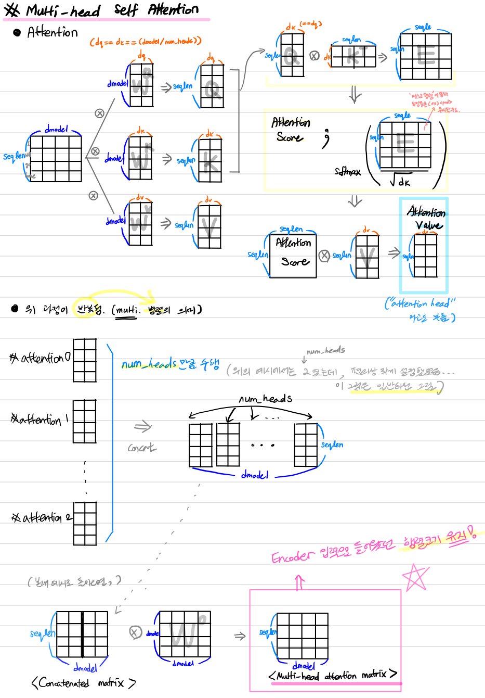
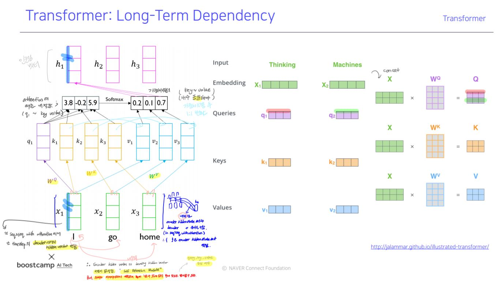
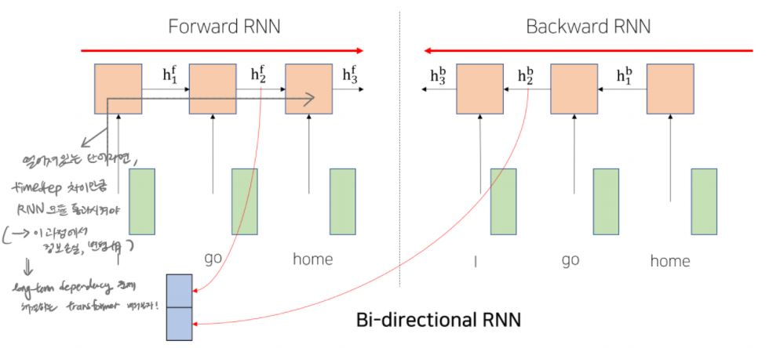
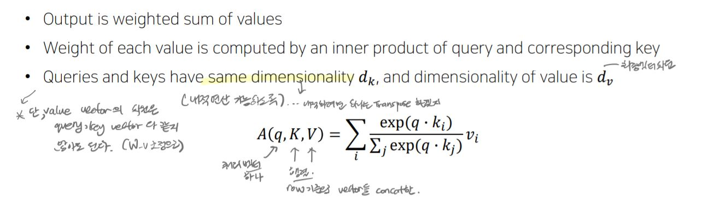
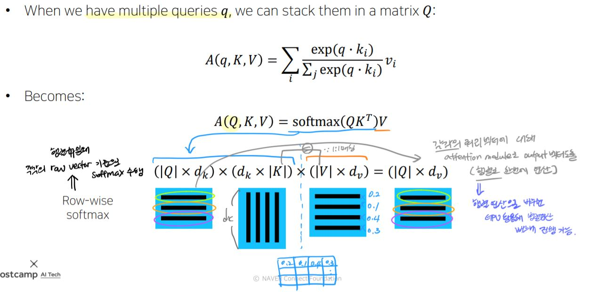
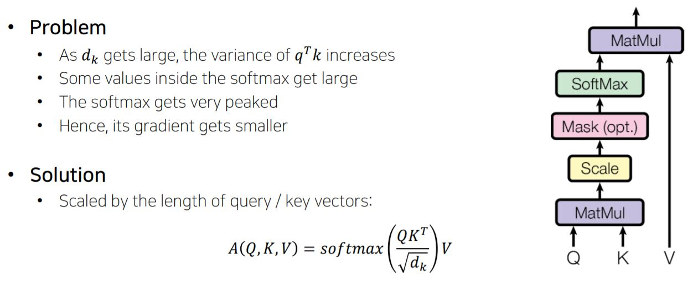
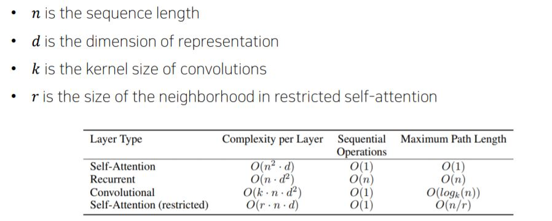

# Day19
[1. transformer intro](#transformer-intro)

[2. transformer-Multi-Head Attention](#transformer)

# | 회고
오늘은 공부하다가 막힌 부분이 있어서, 강의를 아직도 다 못들었습니다. 학습 정리도 이제야 올리네요 ㅠㅠ Transformer에서 Multi-head attention 부분을 하나 하나 그려보고 나서야 다음 진도를 나갈 수 있게 되었습니다. 마저 듣고 강의록도 업데이트 하겠습니다!

# | 개인학습

# | 강의
# Transformer Intro

- LSTM이나 GRU 기반의 seq2seq모델의 성능을 개선한 모델
- "Attention is all you need" - attention 모듈을 add 모듈이 아니라, seq를 입출력으로 처리할 떄 RNN 덜어내고 attention만을 사용하겠다.

- 
- [EX] 'I'에 해당되는 벡터는 decoder의 hidden state vector이자, encoder의 hidden state vectors 중 하나였음. 그런데, self attention하다보면, 자신과의 유사도가 높게 나와 현재 정보를 그대로 넘기는 문제가 생길 수 있음. 따라서, 모델 확장이 필요 => `query, key, value 나옴`
- 주어진 vector 중 `어떤 vector을 가져올지 선별`해야. 
- 선별 기준이 되는 vector : `query vector` (ex에서는 'I') 
- query vector와 내적이 되는 재료 vector들 : `key vector`
- query vector를 통해서 key vector들 중 어느 벡터가 높은 유사도 가지고 있는지 선별하게 됨
- query vector와 key vector 유사도 구하고 softmax 취해 얻은 가중치를 실제 적용한 재료 벡터 : `value vector`
- 따라서, 한 시퀀스를 인코딩하는 과정에서 각 벡터들이 query, key, value 3가지 역할을 모두 수행.
- 즉, self attention module은 동일한 벡터세트로 출발해도 역할에 따라 벡터가 서로 다른 형태로 변환되도록 도와줌. (W_q, W_k, W_v 각각 독립적으로 적용)
- (정리) encoding vector구할 때 현재 입력 벡터가 self attention시 자신과의 유사도가 높게 나오는 문제 있었음. 현재 정보 그대로 넘기기 때문에 문제. 해당 문제 어떻게 해결?
    - **query, key, value 벡터들 생성후 attention -> softamx 로 얻은 최종 가중치 벡터를 통해서라면, 자신과의 유사도가 다른 단어와의 유사도보다 낮을 수 있음.**
    - value vector에 대한 가중 평균으로서 encoding vector 생성
    - h1,h2,h3 등등 encoding 각 timestep에 맞는 encoding vector 만들 때 모든 입력 단어를 고려했음
    - timestep의 gap이 크더라도(멀리있는 단어였음에도) query vector에 의한 내적값(유사도)가 높았다면 멀리 있는 단어를 가져올 수 있음.
    - 기존에 RNN이 가졌던 멀리있는 단어를 가져오려면 RNN 모듈을 timestep 차이만큼을 반복해 통과해야 한다는 문제를 개선할 수 있었음

    - RNN 구조였다면,
        - 멀리있는 timestep에서의 정보를 배달하기에는 정보 손실/변질 발생했음
        (long term dependency, vanishing/exploding gradient)
        - Bi-Directional RNNs
            - Forward RNN
            - Backward RNN
            - encoding vector가 왼쪽,오른쪽 정보 모두 포함할 수 있도록 병렬적으로 처리
                - 두 vector를 concat한다는 의미
            - 
            - 이 결과 벡터를 만드는 방식을 Transformer에서 대체할 수 있음

## Scaled Dot Product Attention
- softmax(QK^T)에 d_k로 scale하는 이유?
    - query vector, key vector는 가우시안 분포(평균0, 표준편차1) 따른다고 가정됨
    - QK^T 평균은 0이지만, 분산은 d_k가 된다.
    - 분산은, 차원이 커질수록 커지게 되는데 그 결과를 softmax 취하면 편향이 심해져 gradient vanishing 현상을 일으킨다. 따라서, d_k로 scale해 표준편차 1로 맞춰주는 것. 이를 통해 안정적인 gradient 가지도록 도와준다.
- 
- 
- 

# Transformer : 
## 1. Multi-Head Attention
- self attention 모듈을 더 유연하게 확장함
- 동일한 query,key,vector에 대해서 여러 버전의 attention을 수행
- multi head attention 필요한 이유
    - 동일한 시퀀스 주어졌을 때, 특정한 쿼리 단어에 대해서 서로 다른 기준으로 여러 정보를 뽑아야 할 때가 있을 수 있다.
    - 예를 들어, i went to the school, i took the rest, i go swim => i라는 주체를 중심으로 went, took,go라는 행동 정보 뽑아야 할 수 도 있고, 행동 대상을 뽑을 수도 있다.
    - 각각의 head가 이런 정보를 상호보완적으로 뽑는 역할을 하게 된다.
- 계산량, 메모리 요구량 측면에서 특성 살펴보자 (RNN기반의 seq2seq와 비교해보자)

### RNN vs self attention 
- self attention의 경우 query*key까지의 step 예시
- [complexity per Layer]
- -n은 시퀀스 길이, d는 하이퍼파라미터(hidden state vector의 길이)
- 즉 n은 조정못하지만 d는 조정할 수 있다.
- n^2으로 시퀀스 길이 길어지면 self attention에서는 제곱승 
- 따라서 self attention에는 RNN보다 더 많은 메모리가 필요하다.
- [Sequential Operations]
- self attention은 시퀀스 길이 길어도 GPU 코어수가 받쳐준다면 동시 작업 가능
- 그러나 RNN의 경우는 h_t 계산하기 위해서는 h_{t-1}까지의 연산이 처리되었어야 했기 때문에, 절대로 병렬화가 불가
- [Maximum Path Length]
- RNN의 path length는 특정 시점 t1에서 t2까지의 차이만큼 RNN 레이어 거쳐가야
- self attention의 경우 가장 끝에 위치한 timestep 많이 차이나는 단어도 인접 단어같이 취급함

## 2. 
(업데이트 예정)

# 실습&과제
(업데이트 예정)
