# Day20

[1. 들어가기 전](#용어-정리)

[2. GPT & BERT](#recent-trends)

[3. masked-language-model](#masked-language-model)

[4. BERT Summary](#bert-summary)

[5. Light-weight Models](#light-weight-models)

[6. 실습 & 과제](#실습과제)

# 용어 정리

1. Pre training
- 선행학습/사전훈련/전처리과정
- Multi Layered Perceptron (MLP)에서 Weight와 Bias를 잘 초기화 시키는 방법
- Pre-training을 통해서 효과적으로 layer를 쌓아서 여러개의 hidden layer도 효율적으로 훈련 할 수 있다
- unsupervised learning이 가능하기 때문에 레이블 되지 않은 큰 데이터를 넣어 훈련 시킬 수 있다는 점을 장점으로 들 수 있다. 
- 또한 Drop-out, Mini-batch 방식을 사용하여 Pre-traning을 생략하기도 한다. 

2. Fine Tuning
- 기존에 학습되어져 있는 모델을 기반으로 아키텍쳐를 새로운 목적에 맞게 변형하고 이미 학습된 모델 Weights로 부터 학습을 업데이트하는 방법
- 모델의 파라미터를 미세하게 조정하는 행위
(특히 딥러닝에서는 이미 존재하는 모델에 추가 데이터를 투입하여 파라미터를 업데이트하는 것을 말한다.)
- 파인튜닝은 `정교한` `파라미터` `튜닝`
- 파인튜닝을 했다고 말하려면 기존에 학습이 된 레이어에 새로운 데이터를 추가로 학습시켜 파라미터를 업데이트 해야 한다. 정교하게
- 정교하지 않은, 즉 완전히 랜덤한 초기 파라미터를 쓴다거나 가장 아래쪽의 레이어(일반적인 피쳐를 학습한 덜추상화된 레이어) 의 파라미터를 학습해버리면 오버피팅이 일어나거나 전체 파라미터가 망가지는 문제가 생기기 때문

# Recent Trends
- `GPT-1 & BERT`
- GPT-1과 BERT는 Transfer Learning, Self-supervised Learning, Transformer를 사용했다는 점이 공통점. 대용량의 text를 학습한 모델을 target task에 적용해 거의 모든 기존 자연어처리 task를 압도하는 성능을 보여줬음
- Transformer는 self-attention block을 대략 6개정도만 쌓았다면, 최근 모델의 동향은 12개, 24개 등 deep하게 쌓아 self-supervised learning framework으로 학습한 뒤 다양한 NLP tasks에 transfer learning형태로 fine tunung한 형태에서 좋은 성능 내고 있음.
- self attention model은 추천시스템, 신약개발, 영상처리 분야까지도 폭넓게 활용될 수 있음
- 그러나 자연어 생성에 있어서는, greedy decoding framework에서 벗어나지 못하는 한계도 가지고 있음

# GPT-1
- pre-traning model의 시초격
- OPENAI에서 나온 모델, 최근에는 GPT-3까지 이어지는 모델통해 자연어 생성 부문에서 좋은 결과를 도출
- `다양한 special tokens`를 제공해서 simple task -> 다양한 NLP tasks를 동시에 처리할 수 있는 통합된 모델 제공
- GPT1 모델 구조 
    -  Test&Position Embeding + self attention model 12개 쌓은 구조
    -  Language Modeling이라는 task로서 문장에 있는 일부 단어를 맞추도록 pre-training 수행
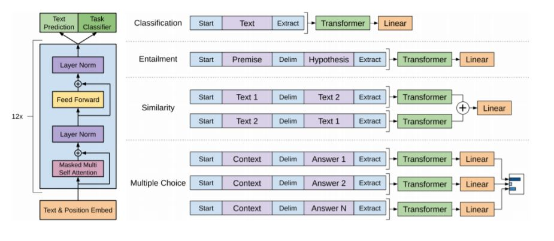

# BERT
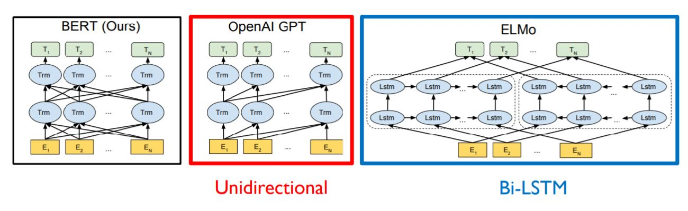
- GPT와 마찬가지로 Language Modeling이라는 task로서 문장에 있는 일부 단어를 맞추도록 pre-training 수행
- ELMo : LSTM 기반의 encoder로 pre-training
- 이후 Transformer로 LSTM을 대체한 모델이 등장, 높은 성능을 내고 있음

# Masked Language Model
### Motivation
    - 기존에 Language model은 left context or right context만 사용
    - 하지만 실제로 언어를 이해하기 위해서는 bi-directional 관점이 필요하다.
### `Masked` Language Model(MLM)
- Mask some percentage of the input tokens at random, and then `predict those masked tokens`.
    - 몇 % 단어를 Mask 단어로 치환할 것인가? (하이퍼파라미터)
    - Too little masking -> Too expensive to train
    - Too much masking -> Not enough to capture context
    - `BERT에서는 k=15%가 적절하다고 상정` 
        - 그러나 15%해당하는 단어들을 100%로 masking 처리하는 것은 부작용 생길 수 있다.
        - pre-training 당시에는 주어진 단어의 15%가 masking 단어로 치환된 상태가 모델에게 익숙
        - 그러나 주제 분류 task를 수행하거나 할 때 mask토큰은 존재하지 않게 됨
        - 이 경우는 pre-training 당시에 `주어진 입력데이터의 패턴이 실제 main task수행할 때의 입력과는 다른 특성을 보일 수 있음. 학습 방해 요인이 됨`.
        - [대안]
        - 100% 중 
        - 80%를 mask token으로,
        - 10%를 random word로,
        - 10%를 원래 단어 그대로 남긴다.
### Next Sentence Prediction
- 단어가 아닌 문장 레벨에서의 task에 대응하기 위한 pre-traning 기법
- [CLS]-문장 앞에 classification 토큰 추가(GPT에서 문장 마지막에 등장하는 Extract 토큰 역할)
- [SEP]-한 문장씩 끝났음을 알려주는 토큰
- [MASK]-Mask단어로의 치환(예측해야 할 토큰)
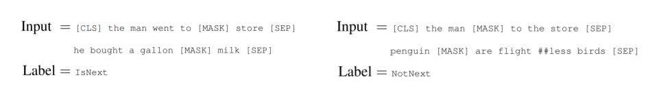

# BERT Summary
1. Model Architecture
    - BERT BASE : L=12(self attention block 쌓은 개수), H=768(self attention에서의 d_moedl), A=12
    - BERT LARGE : L=24, H=1024, A=16
2. Input Representation
    - Wordpiece embeddings (30,000 Wordpiece) -> word를 더 잘게 쪼갠 subword embedding
    - Learned positional embedding
    - [CLS] Classifiation embedding
    - [SEP] Packed sentence embedding
    - Segment Embedding -> sentence level position 반영
    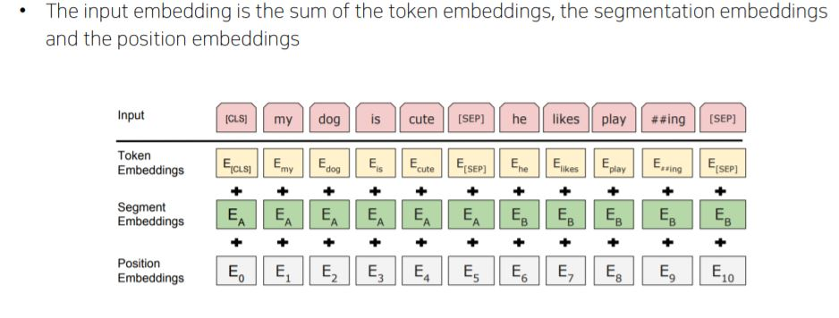

# BERT vs GPT-1
- GPT 모델은 주어진 시퀀스 인코딩 시 다음 단어 예측하는 task 수행해야
- 특정 time step에사 다음에 해당하는 단어를 cheat하면 안된다.
- sequence encoding을 하기 위한 attention block은 transformer에서 decoder부분에서 사용되던 Masked self attention 사용하게 됨   
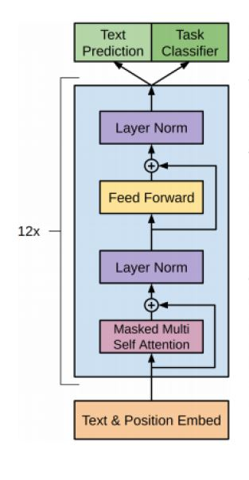
- 그러나 BERT는 전체 주어진 모든 단어 접근할 수 있음. transformer에서 encoder 부분에서 사용하던 attention module을 사용하게 됨
- [Summary]
    1. Training data size
    - GPT is trained on BookCorpus(800M words); BERT is trained on the BookCorpus and Wikipedia(2,500M words)
    2. Training special tokens during training
    - BERT learns [SEP],[CLS] and sentence A/B embedding during pre-training 
    3. Batch size
    - BERT - 128,000 words; GPT-32,000words 
    - 많은 데이터 써서 좋지만 메모리는 batch size 비례해 증가
    4. Task-specific fine-tuning
    - GPT uses the same learning rate of 5e-5 for all fine tunning experiments; BERT chooses a task-specific fine tuning learning rate

# Bert fine tuning process
- 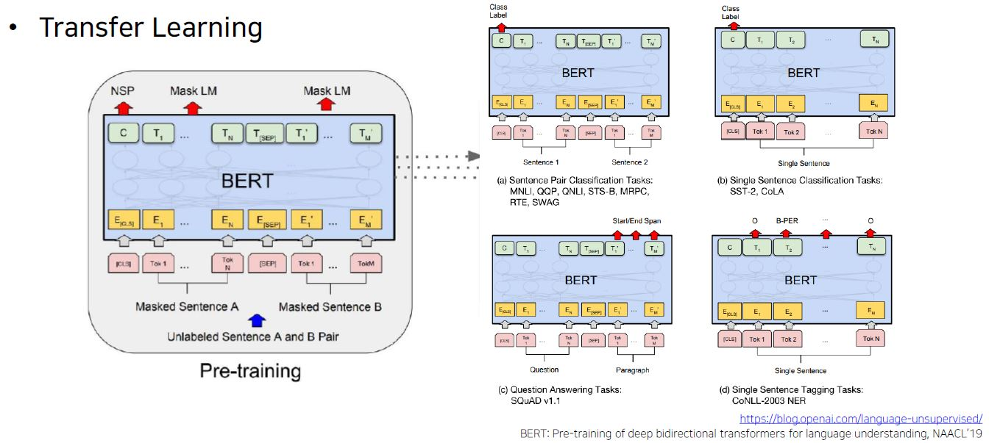
- GLUE Benchmark Results
    - GLUE 데이터 : 벤치마킹 dataset
    - 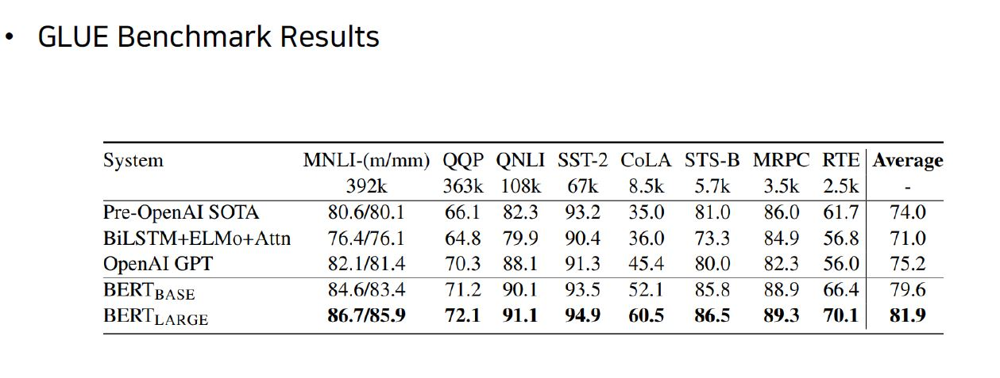
    - 높은 성능
- Machine Reading Comprehension(MRC), Question Answering
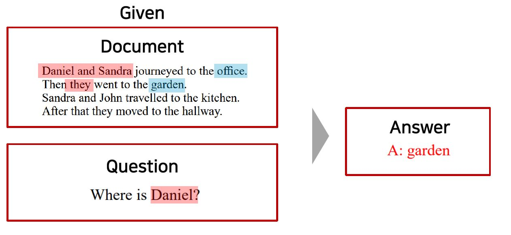
- 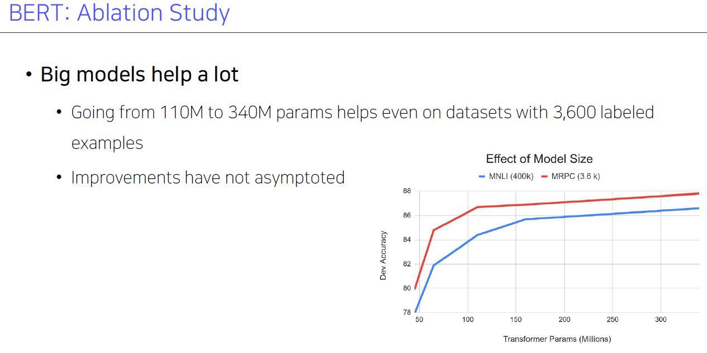
  

# Advanced Self-supervised Pre-training Models
- GPT-1과 BERT 이후 pre-training task, 학습 데이터, self-attention, parameter 수 등에 있어서 여러가지 개선된 모델들이 등장
- GPT 시리즈가 2와 3로 이어지면서 일부 데이터셋/task에 대해서는 사람보다 더 뛰어난 작문 능력을 보여주기도
- 이로 인해, model size 만능론이 등장하며 resource가 부족한 많은 연구자들이 회의감을 느끼기도 했음
- 따라서 연구 방향으로 transformer의 parameter를 조금 더 효율적으로 활용하고 더 나은 architecture/pre-training task를 찾고자 하는 ALBERT와 ELECTRA에 대해서 알아본다.
- 두 모델 모두 풍부한 실험과 명확한 motivation으로 많은 연구자들의 관심을 받은 논문

# GPT3
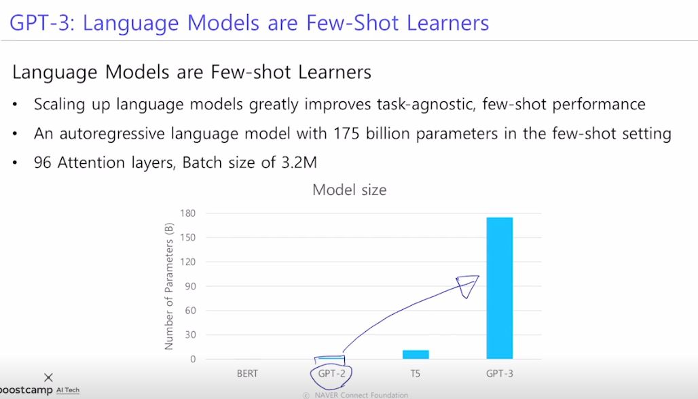
- GPT2에 transformer self attention blokc을 더 많이 쌓은 구조
- 많은 데이터, 큰 배치 사이즈로 학습 진행해 성능도 올라간 모델    
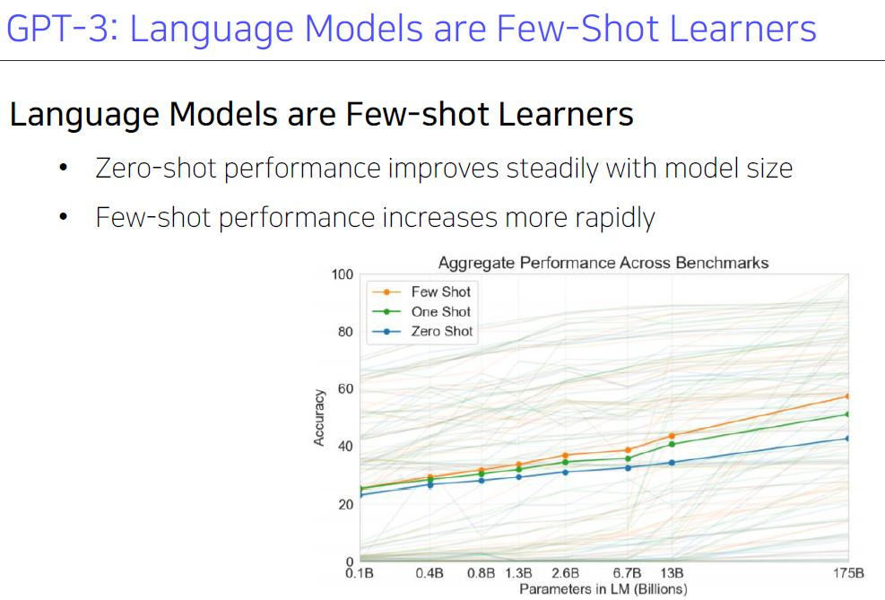
- GPT-2의 zero-shot setting의 가능성을 놀랍게 끌어올려줌
- 별도의 fine tuning 과정 없이 GPT-3 모델 그대로 사용. 시퀀스 내에서 패턴 빠르게 학습
- 모델 사이즈 키울 수록 zero shot, one shot, few shot 성능이 빠르게 올라간다. 큰 모델 사용할 수록 학습 적응력이 높다.

# ALBERT
- A lite BERT for self-supervised learning of language representations
- 기존에 NLP models은 Larger models였음
    - memory limitation, training spped에 대한 한계 존재
- 해결책
    - Factorized Embedding Parameterization 
        - embedding layer dimension을 축소하는 기법 제시     
        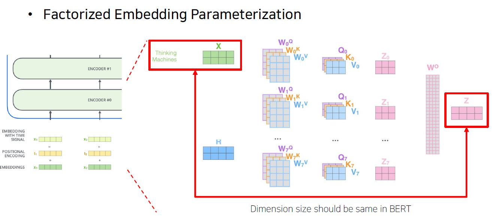
        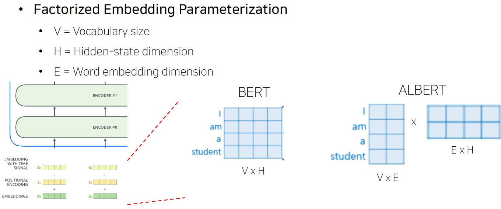
    - Cross-Layer Parameter Sharing
        - 바로 self attention 블록을 쌓아가는 구조라면, Wq,Wk,Wv,W0이 계속 생성되어야 하는 구조. 
        - 이 선형 변환 matrix를 sharing해보자는 경량화 접근법. 이걸로 기존의 BERT 모델(아래 not shared model) 개선. 학습에 필요한 파라미터수 줄이면서 성능은 크게 나빠지지 않았음.
        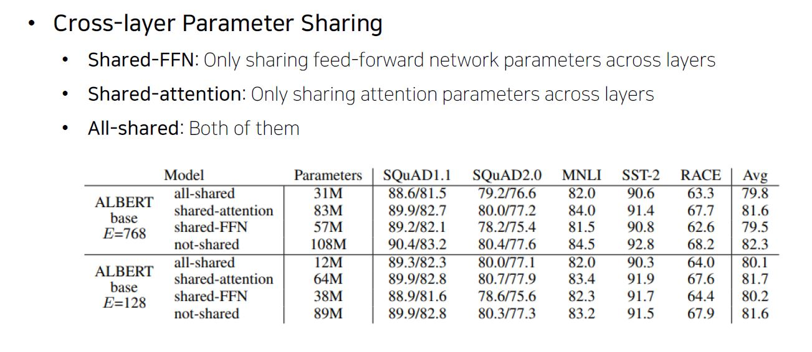
    - (For performance) sentence order prediction 추가
        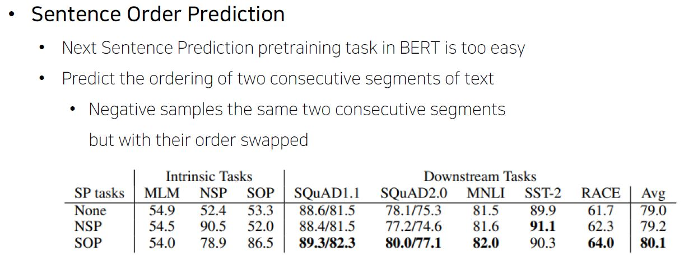
        - Next sentence prediction은 실효성이 없다는 문제가 지적됨
        - Albert에서는 pre training과정에서 본 task의 실효성 높이려
        - Negative samples the same two consecutive segments but with their order swapped
        - 인접 문장 사용하되, 정방향 & 역방향으로 순서간의 overlap을 파악하도록 pre-training 제안
    - 성능
    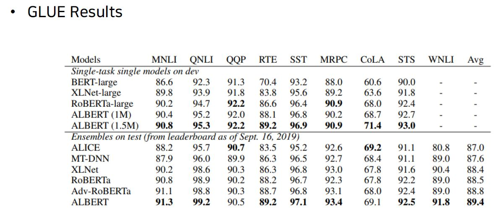

# ELECTRA
- 기존의 GPT와 BERT와는 다르게 pre training함    
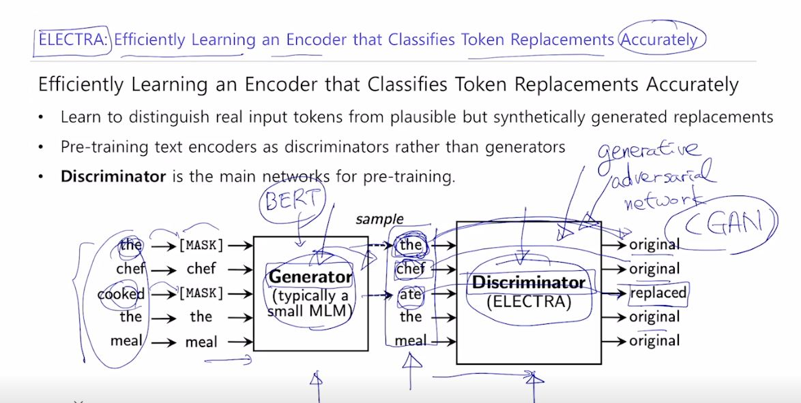
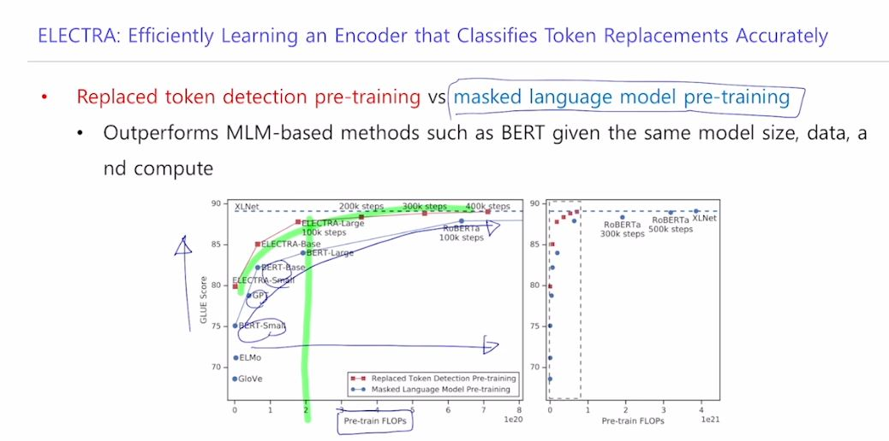

# Light-weight Models
- 경량화? 
    - 적은 레이어나 파라미터 수를 가진 모델로 확장시켜보자
    - 성능을 최대한 유지하면서도, 모델 크기와 계산 속도 
- DistillBERT(NeurlPS 2019 Workshop)
    - transformer 모델의 구현체를 라이브러리 형태로 제공
    - Hugging face 회사에서 제공
    - A triple loss, which is a distilation loss over the soft target probabilities of the `teacher model` leveraging the full teacher distribution
- TinyBERT (Findings of EMNLP 2020)   
    - Two-stage learning framework which performs Transformer distilation at both the pre-training and task-specific learning stages   
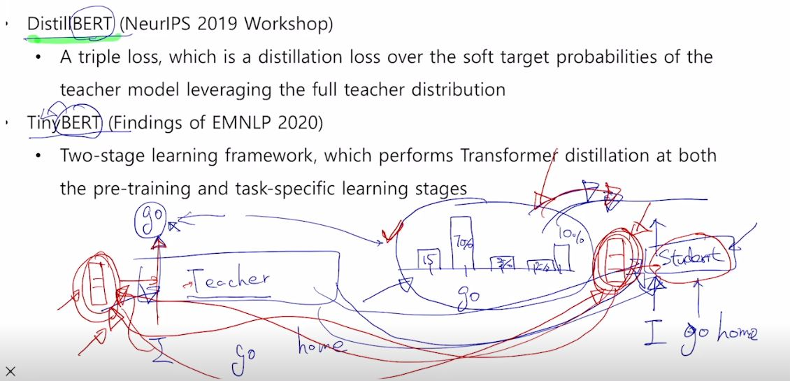

- *추가 자료조사가 필요한 내용. 정리된 사례 보기*
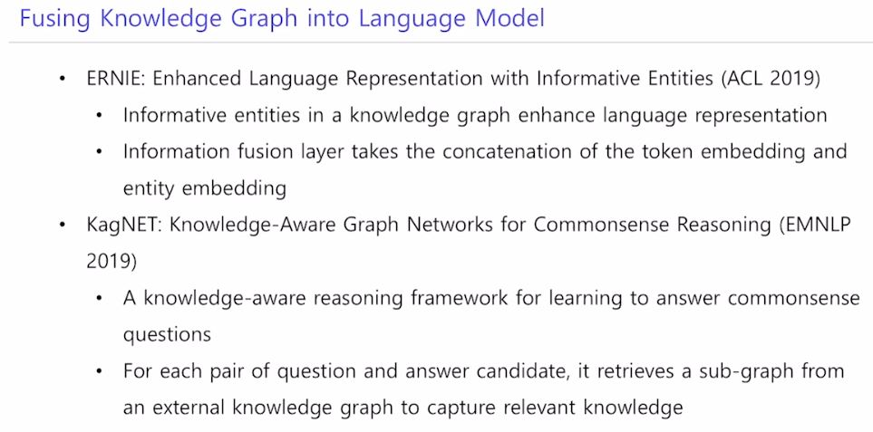

# 실습&과제

[Day20_transformers1](../notes/jupyter/Day20_transformers1.ipynb)

[Day20_transformers2](../notes/jupyter/Day20_transformers2.ipynb)

# 마스터세션

## 인상적이었던 내용
- 여러 모델에 대한 흐름 아는 것도 좋지만, 중요한 부분은 깊게 파고 들어야 경쟁력이 있을 것
- 지식을 들어본 수준에 그치는 사람들은 이미 너무 많음
- 메타인지 : 본인이 무엇을 안다, 무엇을 모른다라는 걸 구별해낼 수 있는 인지 능력. 만약에 공부하다가 모듈 실제 동작과정을 잘 몰라도, **입력/목적/출력/모델이쓰이는니즈** 이런 것들은 정확히 알고 있어야 한다. 필요하면 디테일하게 flow딴다는 의미
- 모델 잘 가져다가 쓰는 것도 중요하지만, 피상적이기 보다 남들보다 깊은 인사이트가 있어야 한다. 
