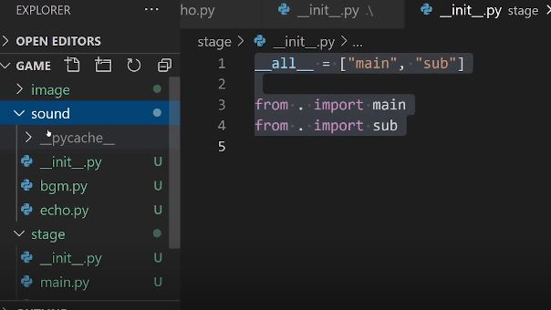
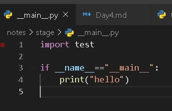
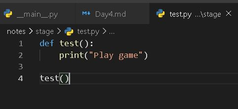

# Day4

[1.OOP](#OOP)

[2.모듈과 패키지](#Module)


# | 회고
강의에서 새로운 내용들을 많이 배웠습니다. 특히, 맨글링과 데코레이터는 잘 사용해보지 못했어서 실습하면서 "이런게 있다니!" 깨달으면서 감탄했습니다. 특히 자바에서 getter setter로 객체를 보호한다는 것이 파이썬에서는 어떻게 표현될 수 있는지 알 수 있었습니다. 강의를 들으면서 그동안 배우지 못한 내용을 배울 때면, 정말 재밌는 것 같습니다. 항상 기본 개념들을 충실히 배우고 싶었는데 부스트캠프에서 제 바람을 이루네요! :happy:  

피어세션은 참 유익한 시간인 것 같습니다. 물론 어색한 순간들도 있지만... 서로의 코드를 보면서 토론하고, 그리고 궁금한 개념들을 함께 찾아서 자료를 공유할 수도 있으니까요. 모르는 부분들을 질문하는 것이 익숙하고 쑥스럽기도 하지만, 피어 세션때만큼은 제가 모르는 부분들 창피해하지 않고 물어보려고 합니다. 그만큼 얻어가는게 많아서 기쁩니다 ㅎㅎ 앞으로도 열심히 참여하면서 성장하겠습니다!

# OOP

* 파이썬은 객체 지향 언어
* Object-Orientied Programming
* 만들어 놓은 코드를 재사용하고 싶다! - "객체"로 대표됨
* 그렇다면 객체 지향 언어는 무엇인가? - 클래스와 객체를 이해하자
* `주체, 행동, 데이터`를 중심으로 프로그램 작성 후 연결 - 모든 언어의 기본적인 이해의 틀이 됨
* 클래스 : 어떤 객체의 **설계도**. 실제 구현체는 `instance`
    * **네이밍 룰 : CamelCase!** (본래는 snake-case가 base이지만)
* 객체 : `속성(Attribute)`와 `행동(Action)`을 가짐
* OOP는 이러한 객체의 개념을 프로그램으로 표현. 속성은 `변수(variable)`, 행동은 `함수(method)`로 표현됨.
* 사실, int/list와 같은 데이터 타입도 다 객체

## 파이썬에서 __의 의미

__는 특수한 예약 함수나 변수 그리고 함수명 변경(맨글링)으로 사용
(ex) __main__,__add__,__str__,__eq__

```python
class SoccerPlayer:
    def __init__(self, name:str, position:str, back_number:int): #+type hint
        self.name=name
        self.position=position
        self.back_number=back_number

    def __str__(self):
        return "Hello, My name is %s, back number is %d"%(self.name,self.back_number)

    def __add__(self,other):
        return self.name+other.name

a=SoccerPlayer("a","FW",7)
b=SoccerPlayer("b","WF",13)
print(a) # __str__ 안하면 주소로 확인 <__main__.SoccerPlayer object at 0x0080ED30>
print(b)
```

## self?
생성된 인스턴스 자신. 클래스 내부에선 self지만 인스턴스 만들면 a,b 객체라고 보면 됨

## 상속
부모 클래스로부터 속성과 메서드를 물려받은 자식 클래스를 생성하는 것
```python
class Person:
    def __init__(self,name,age,gender):
        self.name=name
        self.age=age
        self.gender=gender
    
    def about_me(self):
        print(f"이름은 {self.name}, 나이는 {self.age}, 성은 {self.gender}")

    def __str__(self):
        return(f"이름은 {self.name}, 나이는 {self.age}, 성은 {self.gender}")
 
 
class Employee(Person):
    def __init__(self,name,age,gender,salary):
        super().__init__(name,age,gender) #부모 객체 사용
        self.salary=salary #새로운 속상 추가

    def do_work(self): #새로운 메서드 추가
        print("열심히 일하는 중")

    def about_me(self):
        super().about_me()
        print(f"추가로 제 급여는 {self.salary}입니다.")


person=Person("jane",26,"Fe")
employee=Employee("jane",26,"Fe",salary=10000000)
employee.about_me()
```

## 다형성
* 같은 이름 메소드의 내부 로직을 다르게 작성
* 동적 타이핑 특성으로 파이썬에서는 같은 부모 클래스의 상속에서 주로 발생
* OOP에서 중요
```python
#Polymorphism code

class Animal:
    def __init__(self,name):
        self.name=name
    
    def talk(self): # 이 메서드 쓰지 않으면 오류 발생시킴
        raise NotImplementedError("Subclass must implement abstract method")

class Cat(Animal):
    def talk(self):
        return "Meow!"

class Dog(Animal):
    def talk(self):
        return "Woof!"

animals=[
    Cat('A'),
    Cat('B'),
    Dog('C')
]

# animal이 talk해야 하지만, 각각 다르게 talk할 수 있음
for animal in animals:
    print(animal.name+': '+animal.talk())
```

## Encapsulation - Visibility 조절 
### Visibility

* 객체의 정보를 볼 수 있는 레벨을 조절하는 것
* **누구나 객체 안에 모든 변수를 볼 필요가 없음!** 
    * 심지어 객체를 사용하는 사용자가 임의로 정보 수정할 수 있으므로 막아야
    * 소스의 보호

### Encapsulation
* 캡슐화 또는 정보 은닉
* 클래스 설계 시, 클래스 간 간섭/정보공유 최소화
* 캡슐 던지듯, 인터페이스만 알면 정보를 쓸 수 있다.

## Example1 - 타객체가 내부 정보에 접근 못하도록
```python
class Product:
    pass

class Inventory:
    def __init__(self):
        self.__items=[] # private 변수로 선언. 타객체가 접근 못함

    def add_new_item(self,product):
        if type(product)==Product:
            self.__items.append(product)
            print("new item added")
        else:
            raise ValueError("Invalid Item")
    
    def get_number_of_items(self):
        return len(self.__items)

I=Inventory()
I.add_new_item(Product())
I.add_new_item(Product())
I.__items.append("a") # 접근 못하므로 append할 수 없다.
# 외부에서 items에 접근 가능하다면 Product외의 다른 클래스들도 삽입될 수 있음.
# 즉, __이 없는 그냥 items였으면 items에 append됨
```

## Example2 - 특정 객체를 허용함
```python
    ...


    @property
    def items(self):
        return self.__items

I=Inventory()
I.add_new_item(Product())

items=I.items # @property: 외부에서는 접근이 안되는데 내부에서는 숨겨진 변수 반환해줌. 함수명을 변수명처럼 호출
items.append("a") 
```

## decorator
1. first-class objects
    * 일등 함수 또는 일급 객체
    * 파이썬 함수는 일급 함수
    * 변수나 데이터 구조에 **할당이 가능한 객체**
    * 함수를 **파라메터**로 전달이 가능(ex, map(f,..)) + **리턴값**으로 사용
    ```python
    def square(x):
        return x*x

    def cube(x):
        return x*x*x

    def formula(method,argument_list):
        return [method(value) for value in argument_list]

    print(formula(square,[1,2,3]))
    print(formula(cube,[1,2,3]))
    ```
2. Inner Function
    ```python
    def print_msg(msg):
        def printer():
            print(msg)
        printer()

    print_msg("Hello, Python")
    ```

    * closures: inner function을 return`값`으로 반환 - 일급객체 지원하므로
    ```python
    def print_msg(msg):
        def printer():
            print(msg)
        return printer

    a=print_msg("Hello, Python")
    a()
    ```
3. decorator function
복잡한 클로저 함수를 간단하게 만들어 준다.
- example1
```python
def star(func):
    def inner(*args,**kwargs):
        print("*"*30)
        func(*args,**kwargs)
        print("*"*30)
    return inner

def percent(func):
    def inner(*args,**kwargs):
        print("%"*30)
        func(*args,**kwargs)
        print("%"*30)
    return inner

@star
@percent
def printer(msg):
    print(msg)
printer("Hello")
```
-example2
```python
def generate_power(exponent):
    def wrapper(f):
        def inner(*args):
            result=f(*args)
            return exponent**result
        return inner
    return wrapper


@generate_power(2)
def raise_two(n):
    return n**2


print(raise_two(7))
```


# Module

* 프로그램에서는 작은 프로그램 조각들. 모듈 모아서 하나의 큰 프로그램을 개발한다.
* 프로그램 모듈화하면 다른 프로그램이 사용하기 쉬움
    * ex)카카오 게임을 위한 카카오톡 접속 모듈
* 잘 모듈화시킬 수록 다른 사람이 쓰기 쉽다. 
* .py를 의미. 같은 폴더에 .py있으면 import하면 됨
* - [x] __pycache__ : 컴파일된 파일. 코드를 쉽게 로딩할 수 있도록 파이썬이라는 프로그램이 기계어로 번역해준다. pycache보이면 메모리 로딩할 때 빠르게 로딩할 수 있도록 컴파일 시켜줬구나 로 이해하면 됨.
* - [x] if __name__=="__main__": 쓰는 이유
    * 만약, 쓰지 않으면 해당 py파일에 있는 모든 코드들이 로딩된다.


# Package

* 모듈이 모여서 패키지 / 프로그램이 된다. 오픈소스도 패키지 상태
* __init__.py를 폴더별로 구성함(구성안해도 패키지로 인식할 수는 있음)
    1. 모듈 사용
        ```python
        __all__=["dummy","stage"] # 폴더명

        from . import dummy
        from . import stage
        ```

    2. __main__.py 만들고 패키지 자체를 실행할 수 있음.
       
       
       


# 오픈소스 라이브러리
* 내 PC에 패캐지를 설치하게 된다면?
* 충돌이 날 때도 있어서 프로젝트 목적에 따라 가상 환경 설정한다.
* 대표도구
    * virtualenv+pip (pip에는 C로 컴파일된 코드가 안들어가 있을 수 있다.)
    * conda - window에서 장점
    `conda create -n {vir_name} python=3.{x}`
    `conda activate {vir_name}`
    `conda deactivate`
    `conda install {패키지}`

    - [x] tqdm 패키지 : loop돌때 시간 어느 정도 걸리고 남았는지 알 수 있다. 