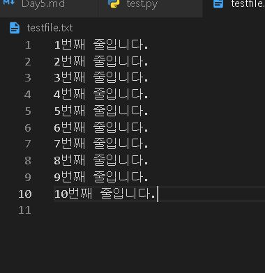
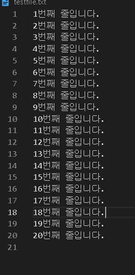
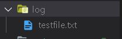
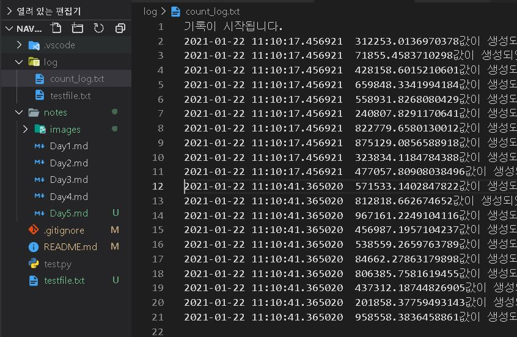
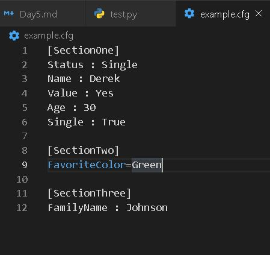

# Day5

[1.Exception](#Exception)

[2.File-Handling](#File-Handling)

[3.log관리](#Log-파일-생성하기)

[4.Data handling](#Data-handling)


# | 회고
강의를 듣다보니까 로그를 관리하는 프로그램을 하나 만들고 싶어졌습니다. 교수님께서 추천하신 풀스택 강의를 한번 듣고 구현해보고자 합니다. 피어세션 때는 코드 리뷰를 하였는데, 활용된 여러 정규식 패턴을 보면서 제가 사용하지 않은 패턴들도 배울 수 있었습니다.

다음 주부터는, AI에 필요한 수리적 지식을 배우게 되는데 기대되기도 하고 두렵기도 합니다. 그렇지만 혼자서 공부한다면 막막했을 내용들을 부스트캠프에서 배우게 되면, 재미있고 명쾌하게 공부할 것 같습니다. 다음 주도 화이팅하겠습니다. ㅎㅎ :medal_sports:

# Exception
1. 예상 가능한 예외
    1. 발생 여부를 사전에 인지할 수 있는 예외
    2. 사용자의 잘못된 입력, 파일 호출 시 파일 없음
    3. 개발자가 반드시 명시적으로 정의해야 함

2. 예상이 불가능한 예외
    1. 인터프리터 과정에서 발생하는 예외
    2. 리스트 범위를 넘어가는 값 호출, 정수 0으로 나눔
    3. 수행 불가 시 인터프리터가 자동 호출

- [x] Exception Handling 필요
    - 없는 파일 호출 시, 파일 없음 알림
    - 게임 이상 종료 시, 게임 정보 저장

# Exception handling
* try-except : 에러 시 시스템 종료 막아줌. finally 추가 시 반드시 그 스코프 처리하게 됨
    ```python
    a=[1,2,3]
    for i in range(10):
        try:
            print(10/i)
            print(a[i])
        except ZeroDivisionError:
            print("cannot divide by zero")
        except IndexError as e:
            print(e)
    ```
    단, Exception 전체를 잡는 것은 바람직하지 않다. 어디서 발생했는지 알 수 없기 때문.
    ```python
    except Exception as e:
        print(e)
    ```
* raise
    * 필요에 따라 강제로 exception 발생
    `raise <Exception Type> (예외정보)`
    ```python
    while True:
        value=input("변환할 정수값을 입력하세요")
        for digit in value:
            if digit not in "0123456789":
                raise ValueError("숫자값을 입력하지 않았습니다")
        print("출력 :",int(value))
    ```
* assert 
    * false 시 AssertionError 나오면서 종료
    ```python
    def get_binary_number(decimal_number : int):
        assert isinstance(decimal_number,int)
        return bin(decimal_number)
        
    print(get_binary_number(10.0))
    ```

# File Handling
* 기본 파일 종류 : **text파일, binary파일**로 나뉨
1. Binary 파일
    1. 컴퓨터만 이해할 수 있는 형태인 `이진` 형식으로 저장된 파일
    2. 일반적으로 메모장으로 열면 내용이 깨짐
    3. 엑셀 파일, 워드 파일 등등
2. Text 파일
    1. 인간도 이해할 수 있는 형태인 `문자열` 형식을 저장된 파일
    2. 메모장으로 열면 내용 확인 가능
    3. 메모장에 저장된 파일, HTML파일, 파이썬 코드 파일 등
* 컴퓨터는 text파일을 처리하기 위해 binary파일로 변환시킴(pyc파일 등)
* 모든 text파일도 실제는 binary파일
    * ASCII\Unicode 문자열 집합으로 저장되어 사람이 읽을 수 있다.

## Python File I\O
1. READ
```python
f=open("testfile.txt","r") # 상대 경로. f는 파일이 있는 주소 갖게됨
contents=f.read()
print(contents)
f.close()
```
* with 구문과 함께도 가능 - 교수님은 f 선호
```python
with open("testfile.txt","r") as myfile:
    contenxt=myfile.read()
    print(type(contents),contents)
```
```python
with open("testfile.txt","r") as myfile:
    contents=myfile.readlines() # \n 기준으로 나누어 파일 전체를 리스트로 반환
    print(type(contents))
    print(contents[0])
```
* readlines 코드는 파일 내용을 다 메모리에 올린 상태. 그러지 않고 메모리에 실행 시 마다 한 줄씩 올리고 싶으면 이렇게 처리(용량 매우 큰 파일 읽기 등)
```python
with open("testfile.txt","r") as myfile:
    i=0
    while True:
        line=myfile.readline()
        if not line:
            break
        print(str(i)+"==="+line.replace("\n",""))
        i+=1
```

2. WRITE

```python
f=open("testfile.txt","w",encoding="utf8")
for i in range(1,11):
    data="%d번째 줄입니다.\n"%i
    f.write(data)
f.close()
```


* mode="a" : append일 경우 - 덮어쓰기 ("W"는 새롭게 작성)
```python
with open("testfile.txt","a",encoding="utf8") as f:
    for i in range(11,21):
        data="%d번째 줄입니다.\n"%i
        f.write(data)
```


## Directory
* OS모듈로 Directory 만들기
```python
import os
os.mkdir("log")

try:
    os.mkdir("log")
except FileExistsError as e:
    print("Already created")
```

* 확인
디렉토리 `print(os.path.exists("log"))`

파일 `print(os.path.isfile("testfile.txt"))`

* 파일 옮기기 - shutil
```python
import os
import shutil

source="testfile.txt"
dest=os.path.join("log","testfile.txt") # log폴더 아래 넣어라
shutil.copy(source,dest)
```

- [x] 주의할 점 : os에서 폴더 구분하는 separator가 서로 다름. join 권장하는 이유

* **최근에는 pathlib 모듈 사용해 path를 객체로 다룸**
```python
import pathlib

cwd=pathlib.Path.cwd() # 현재 디렉토리 정보
print(cwd)
print(cwd.parent)
print(list(cwd.parent.parents))
```

# Log 파일 생성하기

```python
import os

if not os.path.isdir("log"):
    os.mkdir("log")

if not os.path.exists("log/count_log.txt"):
    f=open("log/count_log.txt","w",encoding="utf8")
    f.write("기록이 시작됩니다.\n")
    f.close()

with open("log/count_log.txt","a",encoding="utf8") as f:
    import random,datetime
    for i in range(1,11):
        stamp=str(datetime.datetime.now())
        value=random.random()*1000000
        log_line=stamp+"\t"+str(value)+"값이 생성되었습니다."+"\n"
        f.write(log_line)
```




# Pickle
* 파이썬 객체를 영속화(persistence)하는 built-in 객체
    * 객체는 메모리에 있어야 함. 그러나 인터프리터 끝나면 사라짐. 따라서 **파이썬에서 사용하는 객체를 저장**해놓음
* 데이터, object 등 실행 중 정보를 저장 : 불러와서 사용
* 저장해야 하는 정보, 계산 결과 등 활용이 많음
* 파이썬에 특화된 바이너리 파일
```python
import pickle

# 쓰고 저장
f=open("list.pickle","wb")
test=[1,2,3,4,5]
pickle.dump(test,f)
f.close()

del test

# 읽기 - test 객체 삭제해도 pickle에는 저장되어 있음
f=open("list.pickle","rb")
test_pickle=pickle.load(f)
print(test_pickle)
f.close()
```

```python
import pickle

class Multiply:
    def __init__(self,multiplier):
        self.multiplier=multiplier
    
    def multiply(self,number):
        return number*self.multiplier

multiply=Multiply(5)
print(multiply.multiply(10))

f=open("multiply_object.pickle","wb")
pickle.dump(multiply,f)
f.close()

del multiply

f=open("multiply_object.pickle","rb")
multiply_pickle=pickle.load(f)
print(multiply_pickle.multiply(10))
```


# Logging Handling

## 로그 남기기
* 프로그램이 실행되는 동안 일어나는 정보 기록 남기기
* 유저의 접근, 프로그램 exception, 특정 함수 사용
* 콘솔 화면에 출력,파일에 남기기,DB에 남기기 등
* 기록된 로그 분석해 의미있는 결과 도출할 수 있음
* 실행시점에서 남겨야 하는 기록, 개발시점에서 남겨야 하는 기록 나눠서 저장
- [x] print vs logging
    * 기록을 print로 남기는 것도 가능함
    * 그러나 콘솔창에만 남기는 기록은 분석시 사용 불가
    * 때로는 개발/운영 별로 기록 남길 필요 있음
    * 모듈 별로 별도의 로깅을 남길 필요도 있음
    * 이러한 기능을 체계적으로 지원하는 모듈이 필요
    * DEBUG -> INFO -> WARNING/ERROR/CRITICAL
       (개발)   (운영)   (사용자)

1. python 기본 log 관리 모듈
```python
import logging

logging.debug("틀렸잖아!")
logging.info("확인해")
logging.warning("조심해!")
logging.error("에러났어!")
logging.critical("망했다..") # 프로그램 아예 종료되었을 때
```
2. 로그 관리시 가장 기본이 되는 설정 정보
    **<Logging Level>**
    1. debug : 개발시 처리 기록을 남겨야 하는 로그 정보를 남김
    2. info : 처리가 진행되는 동안의 정보를 알림
    3. warning : 사용자가 잘못 입력한 정보나 처리는 가능하나, 원래 개발시 의도치 않은 정보가 들어왔을 때 알림
    4. error : 잘못된 처리로 인해 에러가 났으나, 프로그램은 동작할 수 있음 알림
    5. critical : 잘못된 처리로 데이터 손실이나 더 이상 프로그램이 동작할 수 없음을 알림

    * EXAMPLE
    ```python
    import logging

    logging.debug("틀렸잖아!")
    logging.info("확인해")
    logging.warning("조심해!")
    logging.error("에러났어!")
    logging.critical("망했다..")
    ```
    warning부터 출력됨. 기본 로깅 레벨이 warning이었기 때문이다. 필요에 따라 설정 변경해야!
    ```python
    import logging

    if __name__=="__main__":
        logger=logging.getLogger("main")
        logging.basicConfig(level=logging.DEBUG)
        #logger.setLevel(logging.INFO) # 지정도 가능

        logger.debug("틀렸잖아!")
        logger.info("확인해")
        logger.warning("조심해!")
        logger.error("에러났어!")
        logger.critical("망했다..")
    ```

    logger output등록 할 수도 있다.
    ```python
    import logging

    if __name__=="__main__":
        logger=logging.getLogger("main")
        logging.basicConfig(level=logging.DEBUG)

        steam_handler=logging.FileHandler(
            "my.log","w", encoding="utf8"
        )
        logger.addHandler(steam_handler)

        logger.debug("틀렸잖아!")
        logger.info("확인해")
        logger.warning("조심해!")
        logger.error("에러났어!")
        logger.critical("망했다..")
    ```

    * 설정 정보들 관리하는 방법이 필요
        1. configparser : 파일에 설정해서 알려줌
        2. argparser : 실행시점에 shell에서 설정해서 알려줌
    
    - [x] configparser
        * 프로그램 실행 설정을 file에 저장
        * section, key, value값의 형태로 설정된 설정 파일 사용
        * 설정 파일을 dict type으로 호출 후 사용
        
        ```python
        import configparser

        config=configparser.ConfigParser()
        config.sections()

        config.read("example.cfg")
        config.sections()

        for key in config["SectionOne"]:
            print(key)

        config["SectionOne"]["status"]
        ```
    - [x] argparser
        * 콘솔 창에서 프로그램 실행시 setting 정보를 저장
        * 거의 모든 console 기반 python 프로그램을 기본으로 제공
        * 특수 모듈도 많이 존재하지만, 일반적으론 argparse사용
        * Command-Line Option이라고 부름
        ```python
        import argparse

        parser=argparse.ArgumentParser(description="Sum two integers")

        parser.add_argument(
            '-a',"--a_value",
            dest="a",help="A integers",type=int,
            required=True
            )
        parser.add_argument(
            '-b',"--b_value",
            dest="b",help="B integers",type=int,
            required=True
            )
        args=parser.parse_args()
        print(args)
        print(args.a)
        print(args.a+args.b)
        ```
        셸에서 test : `python test.py -a 10 -b 10`
        
    * argument를 사전에 입력해주며 사용자가 실험하게 만들어줄 수 있다. (나중에 배움)
    
3. Logging formmater
   * 로그의 결과값의 format을 지정해줄 수 있다.
    `formatter=logging.Formatter('%(asctime)s %(levelname)s %(process)d %(message)s')`

4. Log config file
```python
import logging

logging.config.fileConfig("logging.conf")
logger=logging.getLogger()
```

## 학습 중 여러 방식으로 로깅하니까 개념 알아둘 것!

# Data handling

1. CSV

(실습해보기) http://bit.ly/3psoUZb

* 엑셀 양식의 데이터를 프로그램 상관없이 쓰기 위한 데이터 형식
* , 에 대한 전처리 과정 필요. csv 객체를 제공한다. 
   1. delimiter : 글자를 나누는 기준
   2. lineterminator : 줄 바꿈 기준
   3. quotechar : "로  문자열을 둘러싸는 신호 문자
   4. quoting : 데이터 나누는 기준이 quotechar에 둘러싸인 레벨


# Web
- World Wide Web
- 인터넷 공간의 정식 명칭
- 데이터 송수신을 위해 HTTP 프로토콜 사용
- 데이터 표시를 위해 HTML 형식 사용


# 정규표현식
(Tips) http://www.regexr.com 으로 이동해서 연습
(Tips) 내용이 방대하므로 기본 내용을 공부한 뒤 넓게 적용해야
* regexp 또는 regex 등으로 불림
* 복잡한 문자열 패턴을 정의하는 문자 표현 공식
* 특정한 규칙을 가진 문자열의 집합을 추출한다.
<Example>
010-0000-0000 : ^\d{3}\-\d{4}\-\d{4}$
203.252.101.40 : ^\d{1,3}\.\d{1,3}\.\d{1.3}\.\d{1,3}$
<!-- vscode에서 ctrl+h 해서 매치되는 정규식 지울 수 있음 -->
**그 외 이메일, 휴대전화, 일반전화, 주민등록번호, IP주소 표현해보기**

## 패턴
1. 문자 클래스 [ ] : [와 ] 사이의 문자들과의 매치를 의미
(example) [abc] : 해당 글자가 a,b,c 중 하나가 있다.
2. "-"는 사용 범위를 지정할 수 있음
(example) [a-zA-z] : 알파벳 전체, [0-9] : 숫자 전체
3. 메타 문자 : 정규식 표현을 위해 다른 용도로 사용되는 문자
. ^ $ * + ? { } [ ] \ | ( )
    * . : 줄바꿈 문자인 \n을 제외한 모든 문자와 매치 (ex) a[.]b
    * * : 앞에 있는 글자가 반복해서 나올 수 있음 (ex) tomor*ow -> tomorrow, tomoow, tomorrrow
    * + : 앞에 있는 글자 최소 1회 이상 반복
    * {m.n} : 반복 횟수를 지정 (ex) {1,}, {0,} {1,3}
    * ? : 반복횟수가 1회 (ex)01[01]?-[0-9]{4}-[0-9]{4}
    * | : or 
    * ^ : not

## 정규식 in 파이썬
1. re module import
2. search : 한 개만 찾기, findall : 전체 찾기
3. 추출된 패턴은 tuple 반환됨


## JSON
1. JavaScript Object Notation
2. 간결성으로 기계/인간이 모두 이해하기 편함
3. 데이터 용량이 적고, 코드로의 전환이 쉽다.
4. XML의 대체제로 많이 활용된다.
5. 파이썬에서는 json 모듈을 사용해서 손쉽게 파싱과 저장이 가능하다.
6. 데이터 저장 읽기는 dict type과 상호 호환이 가능하다.
7. API는 대부분 정보 교환 시 JSON을 활용한다.
8. 페이스북, 트위터, Github등 거의 모든 사이트에서 사용한다.
9. 각 사이트 마다 Developer API의 활용법을 찾아 사용한다.

# XML Parsing in Python
- XML도 HTML과 같이 구조적 markup 언어임
- 정규표현식으로 Parsing이 가능함
- 그러나, 손쉬운 도구로 가장 많이 쓰이는 parser인 beautifulsoup으로 파싱된다.

# BeautifulSoup
- HTML, XML등 마크업 언어 Scraping을 위한 대표적인 도구
- lxml과 html5lib과 같은 Parser를 사용함
- 순수 lxml에 비해 속도는 상대적으로 느리나, 간편히 사용할 수 있다.

1. 모듈 호출
`from bs4 import BeautifulSoup`
2. 객체 생성
`soup=BeautifulSoup(books_xml,"lxml")`
3. Tag찾는 함수 find_all 생성
`soup.find_all("author")`
* 정규식과 마찬가지로 해당 패턴 모두 반환한다.
  