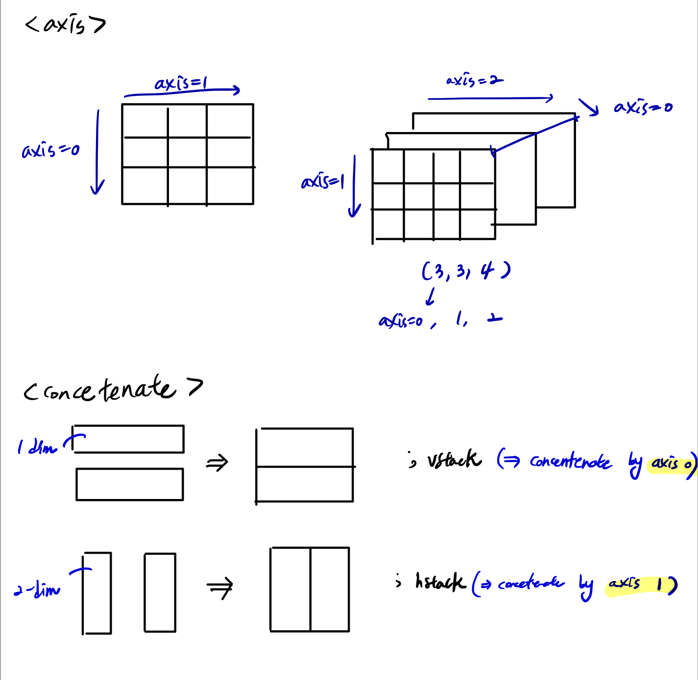
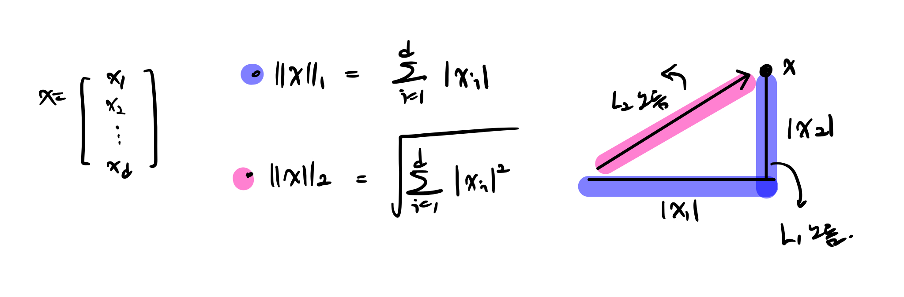
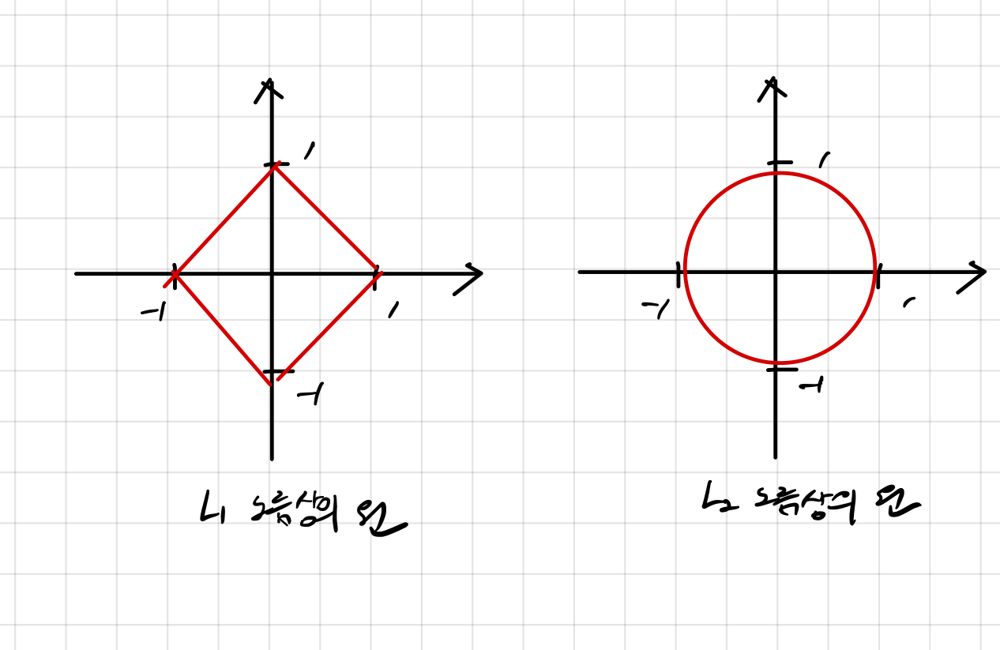
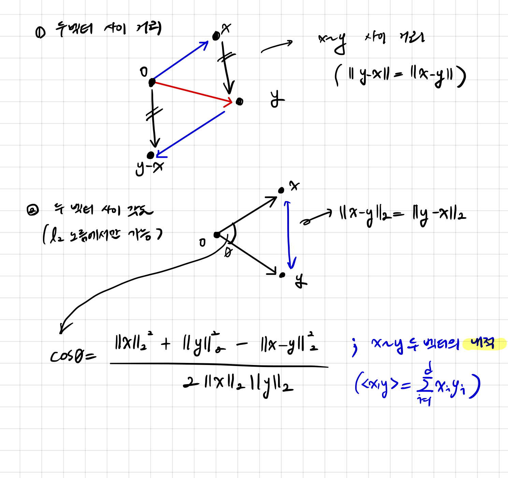
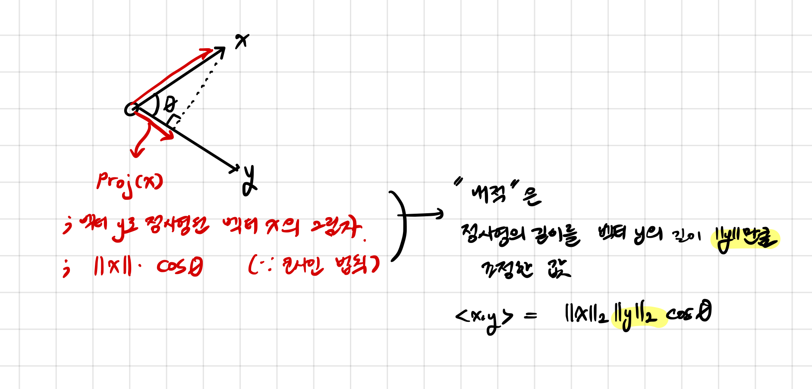
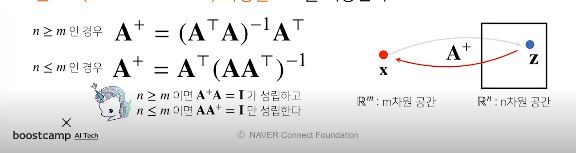
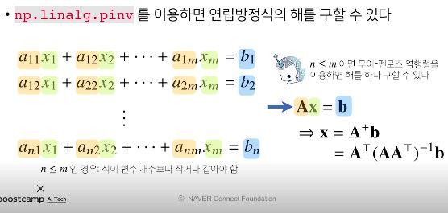
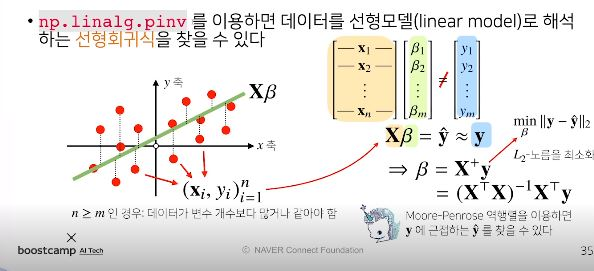

# Day6

[1.numpy](#numpy)


[2.벡터](#벡터)


[3.행렬](#행렬)

# | 회고
오늘은 과제 정리 후에도, 배운 연산들을 코드로 쳐보는 연습들을 해야할 것 같습니다. 그리고 유사역행렬에 대해 확실히 이해하지 못해서 심화적으로 공부해 블로그에 올리겠습니다!

피어세션은 정말 유익했습니다. 고차원상의 모형의 복잡성을 줄이는 L1/L2 Regularization, PCA에 대한 개념 그리고 베이지안 분류기에 대해서 피어분들이 발표해 주셨습니다. 이 과정에서 한 개념을 "끝까지 파보려는" 자세가 참 중요하구나 라고 느꼈습니다. 얕게 많이 알려고 하는 태도를 버리고 한 가지를 정확하게 알면서 넘어가는 습관을 들여야겠다고 다짐했습니다.

그리고 저는 피어세션에서 이전에 웹어필리케이션을 도커로 컴포징해 배포한 적이 있었는데, 그 부분을 발표했습니다. 
https://blog.naver.com/sjy263942/222174661210

딥러닝과 연관성이 좀 떨어질 수도 있지만, 파이토치 이미지를 도커상으로 pull받아 사용할 수도 있고 p-stage에서도 구현 단계에서 필요할 수 있을 것이라 생각해 발표했습니다. 지식을 나누는 순간들은 참 즐겁습니다. ㅎㅎ 오늘도 감사한 하루였습니다! 🙏

---

## numpy

- [x] jupyter folder에 실습 파일 저장
- 파이썬의 고성능 과학 계산용 패키지
- 어떻게 행렬과 매트릭스를 코드로 표현할 것인가에 답을 줬다.
- 다양한/큰 매트릭스 계산에 유용
- 파이썬은 인터프리터 언어지만 처리 속도 문제 개선 가능
- 매트릭스와 vector와 같은 array 연산의 사실상의 표준
- 일반 list에 비해 빠르고 메모리 효율적
- **반복문 없이 데이터 배열에 대한 처리를 지원함**
- 선형 대수 관련된 다양한 기능을 제공
- C,C++,포트란 등 언어와 통합 가능
      

</br>
</br>

# 벡터

* 숫자를 원소로 가지는 리스트 또는 배열

  ```
  x=[1,7,2]
  x=np.array([1,7,2]) # 보통 행 벡터로 처리
  ```

* 벡터는 공간에서 `한 점`을 나타낸다. 

* 벡터는 원점으로부터 상대적 위치를 표현한다.

* 벡터의 숫자를 곱하면(->스칼라곱), `길이만 변한다`. 
  * 스칼라 a
  * a > 1 :벡터 길이 늘어남
  * a < 1 :벡터 길이 줄어듬
  * a < 0 :반대 방향 벡터
  
* `같은 모양`을 가지면, 덧셈 뺄셈 성분곱(Hadamard product) 등을 계산할 수 있다.

* 두 벡터의 덧셈은 다른 벡터로부터 `상대적 위치이동` 표현

* 두 벡터의 뺄셈은, 벡터의 방향 뒤집은 덧셈

</br>


# 벡터의 노름(norm) (|| ||): 원점에서부터의 거리

  * 임의의 차원 d에 대해 성립한다.
  * 벡터의 차원의 개수와 상관없이 구할 수 있다.
  * L1-노름은 각 성분의 `변화량의 절대값`을 모두 더한다.
  * L2-노름은 피타고라스 정리를 이용해 `유클리드 거리`를 계산
    
    * np.linalg.norm을 이용해도 구현 가능
    ```python
    def l1_norm(x): 
        x_norm=np.abs(x)
        x_norm=np.sum(x_norm)
        return x_norm
    
    def l2_norm(x):
        x_norm=x*x
        x_norm=np.sum(x_norm)
        x_norm=np.sqrt(x_norm)
        return x_norm
    ```

  * 노름의 종류에 따라 기하학적 성질이 달라진다.
    
  * 머신러닝에선 각 성질들 필요할 때 있으므로 둘다 사용
    * **L1노름상의 원 : Robust 학습, Lasso 회귀**
    * **L2노름상의 원 : Laplace 근사, Ridge 회귀**
  * L1,L2 노름을 이용해 `두 벡터 사이의 거리`를 계산할 수 있다.</br>  두 벡터 사이의 거리 계산할 때는 벡터의 뺄셈을 사용 
    
  * **L2 노름 이용**해서라면 `제2 코사인 법칙`에 의해 두 벡터 사이의 각도 구할 수 있다. </br>(+ 1차원,2차원에서만 이야기하는 것이 아니라, **임의의 D-차원에서도 구할 수 있다**.)
    

- [x] 내적
  - 정사영(orthogonal projection)된 벡터의 길이와 관련
  - 내적은 두 벡터의 **유사도**를 측정하는데 사용 가능하다.


# 행렬

## 1. 행렬은 벡터를 원소로 가지는 2차원 배열

* 같은 모양을 가지면, 덧셈 뺄셈 성분곱 스칼라곱 모두 가능  (벡터와 다를게 없음)

* 그러나, 행렬 곱셈(matrix multiplication)은 다름

  * **i번째 <u>행벡터</u>와 j번째 <u>열벡터</u> 사이의 내적**을 성분으로 가지는 행렬을 계산 (X*Y일때 X의 열 개수의 Y의 행의 개수 같아야함)

    ```python
    import numpy as np
    
    X=np.array([
        [1,-2,3],
        [7,5,0],
        [-2,-1,2]
    ])
    
    Y=np.array([
        [0,1],
        [1,-1],
        [-2,1]
    ])
    
    print(X@Y)
    ```

    ```
    [[-8  6]
     [ 5  2]
     [-5  1]]
    ```

  * (주의) `np.inner` **: i번째 <u>행벡터</u>와 j번째 <u>행벡터</u> 사이의 내적**을 성분으로 가지는 행렬을 계산 - 수학에서의 내적과 다름

    ```python
    import numpy as np
    
    X=np.array([
        [1,-2,3],
        [7,5,0],
        [-2,-1,2]
    ])
    
    Y=np.array([
        [0,1,-1],
        [1,-1,0],
    ])
    
    print(np.inner(X,Y))
    ```

    ```
    [[-5  3]
     [ 5  2]
     [-3 -1]]
    ```

    

* numpy에서는 **행(row)**이 기본 단위

* 행과 열이라는 index를 가진다. 

* 행렬의 i번째 행 벡터는 i번째 데이터, 따라서
</br>
    $$
    X_{i,j}=\text{i번째 데이터의 j번째 변수의 값}
    $$
</br>

## 2. 행렬은 벡터공간에서 사용되는 연산자

* 행렬곱을 통해 벡터를 다른 차원의 공간으로 보낼 수 있다.
* (ex) Z와 X라는 두 벡터를 a라는 행렬을 통해 이을 수 있다.
  </br>
  $$
  Zi=\sum_j(a_ijX_ij)
  $$
  </br>
  

* 모든 선형변환(linear transform)은 행렬곱으로 계산할 수 있다.

  행렬곱을 통해 **패턴을 추출할 수 있고, 데이터를 압축**할 수도 있다.

  딥러닝은 선형변환과 비선형 함수들의 합성으로 이루어지므로 중요!


## 3. 역행렬

* **(1)행과 열 숫자가 같고 (2) 행렬식(determinant)가 0이 아닌 경우에만** 계산할 수 있다.

  ```python
  import numpy as np
  
  X=np.array([
      [1,-2,3],
      [7,5,0],
      [-2,-1,2]
  ])
  
  print(np.linalg.inv(X)) # 역행렬
  print()
  print(X@np.linalg.inv(X)) # 유사 항등 행렬
  ```

  ```
  [[ 0.21276596  0.0212766  -0.31914894]
   [-0.29787234  0.17021277  0.44680851]
   [ 0.06382979  0.10638298  0.40425532]]
   
  [[ 1.00000000e+00 -1.38777878e-17  0.00000000e+00]
   [ 0.00000000e+00  1.00000000e+00  0.00000000e+00]
   [-2.77555756e-17  0.00000000e+00  1.00000000e+00]]
  ```

* 만약, 역행렬 계산할 수 없다면, 유사역행렬(pseudo-inverse) 또는 무어-펜로즈(Moore-Penrose) 역행렬 A+를 이용한다.

  

  ```python
  import numpy as np
  
  Y=np.array([
      [0,1],
      [1,-1],
      [-2,1]
  ])
  print(np.linalg.pinv(Y)) 
  print()
  print(np.linalg.pinv(Y)@Y) 
  ```

  ```
  [[ 5.00000000e-01  1.11022302e-16 -5.00000000e-01]
   [ 8.33333333e-01 -3.33333333e-01 -1.66666667e-01]]
  
  [[ 1.00000000e+00 -2.22044605e-16]
   [ 1.11022302e-16  1.00000000e+00]]
  ```

  [EXAMPLE1] - 연립방정식 풀기(변수 개수 > 식의 개수)

  

  [EXAMPLE2] - 선형 회귀분석(변수 개수 < 식의 개수)

  

  ```python
  from sklearn.linear_model import LinearRegression
  import numpy as np
  
  # 1. scikit learn을 활용한 회귀 분석
  model=LinearRegression()
  model.fit(X,y)
  y_test=model.predict(x_test)
  
  # 2. Moore-Penrose 역행렬 - y절편 항 직접 추가해야
  X=np.array([np.append(x,[1]) for x in X])
  beta=np.linalg.pinv(X)@y
  y_test=np.append(x_test)@beta
  ```

  

