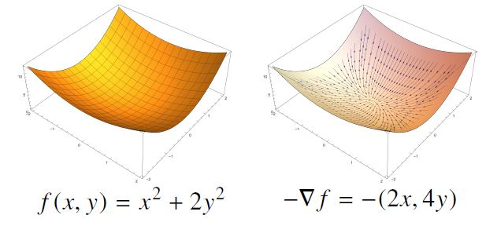
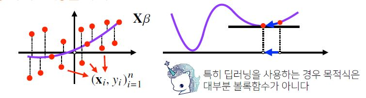

# Day7

[0.복습](#|-복습)

[1.미분](#미분)

[2.경사하강법과 수렴](#경사하강법)

[3.확률적 경사하강법](#확률적-경사하강법-sgd)


# | 회고
오늘 강의를 통해 gd,sgd에 대한 개념을 명확히 할 수 있었습니다. 그리고 코드를 스스로 다시 구현해보면서 정확히 수식을 이해할 수 있도록 남은 시간을 활용할 예정입니다. 수학이라고 하면, 어렵다는 생각이 많이 들지만 익숙해질 수 있도록 마음가짐, 머리(?)가짐을 잘 해보겠습니다. ㅎㅎ

아침 학습시간에는, 피어세션에서 활용할 github-organization을 만들었습니다. slack이랑 연동해두었는데, 다른 피어분이 유용하게 공부팁들을 남기시는 모습을 보면서 뿌듯하고 기뻤습니다. 동료들과 함께 지식을 모으고 끝까지 u-stage를 정복할 수 있도록 정보를 잘 관리하겠습니다! 어려운 개념들을 끝까지 파보고 그 과정을 공유해주시는 피어분들을 더 부지런하게 따라가겠습니다. 오늘도 감사한 하루였습니다! :sparkles: 


# | 복습
## 벡터의 노름
* 벡터 : 공간에서의 한 `점`
* 벡터의 노름 : `원점에서부터의 거리`
* L1,L2 노름을 이용해 두 벡터 사이의 거리 계산(벡터의 뺄셈 이용) 가능
* L1 norm의 경우 두 벡터간 거리를 절대값으로 더해 구하는 것
* L2 norm의 경우 유클리드 거리를 계산하는 것

    
    - [x] 초록색이 L2 노름, 그 외 L1 노름 
* L1노름
```python
def l1_norm(x): # x는 벡터
    x_norm=sum(np.abs(x))
    return x_norm
print(l1_norm([-1,2,-3])) # 6
print(np.linalg.norm([-1,2,-3],ord=1)) # 6.0
```
* L2노름
```python
print(np.linalg.norm([-6,-8],ord=2)) # 10.0
```
* 두 벡터 사이의 거리 (L2노름 이용)
```python
a=np.array([-3,0])
b=np.array([0,4])
print(np.linalg.norm(a-b,ord=2)) # 5
```
* 두 벡터의 내적
```python
a=np.array([1,-1,1,-1])
b=np.array([4,-4,4,-4])
print(np.inner(a,b)) # 16
```
* 두 벡터의 사이의 각도
```python
def angle(x,y):
    norm_a=np.linalg.norm(x,ord=2)
    norm_b=np.linalg.norm(y,ord=2)
    v=np.inner(x,y)/(norm_a*norm_b)
    theta=np.arccos(v)
    return theta

a=np.array([0,1])
b=np.array([0,2])
print(angle(a,b)) # 0.0
```

</br>

## 행렬
* 행렬의 곱셈(matrix multiplication)
    - i번째 행벡터와 j번째 열벡터 사이 내적을 성분으로 가지는 행렬 계산
```python
a=np.array([[1,-2,3],
            [7,5,0],
            [-2,-1,2]])
b=np.array([[0,1],
           [1,-1],
           [-2,1]])
print(a@b) 
```
```
[[-8  6]
 [ 5  2]
 [-5  1]]
```
*주의할 점 : np.inner()은 i번째 행벡터~j번째 행벡터 사이의 내적을 연산*

* 역행렬
```python
a=np.array([[1,-2,3],
            [7,5,0],
            [-2,-1,2]])
print(np.linalg.inv(a))
```
```
[[ 0.21276596  0.0212766  -0.31914894]
 [-0.29787234  0.17021277  0.44680851]
 [ 0.06382979  0.10638298  0.40425532]]
```
* 유사 역행렬
    * "무어-펜로즈 역행렬"이라고도 함
    * 역행렬을 계산할 수 없을 때 사용
    1. n<=m : 변수의 개수(m)가 데이터(n)보다 많거나 같을 때 해를 하나 구할 수 있다. (`연립방정식의 해`)
        * $(Ax=b)$ 
        * $x=A^+b$ 
        * $x=A^T(AA^T)^{-1}b$ 
    2. n>=m  : 데이터가 변수 개수보다 많거나 같을 때 y에 근접하는 $\widehat{y}$을 찾을 수 있다.
        *  $X\beta=\widehat{y}\approx y$
        *  $\beta=X^+y$
        *  $\beta=(X^TX)^{-1}X^Ty$
        *  단, $\min_{\beta}\left \|y-\widehat{y}\right \|_2$
        *  무어-역행렬 통해 l2노름을 최소화하는 계수를 찾는다.


# | 강의

# 미분
* 변수 움직임에 따른 함수값의 변화를 측정하기 위한 도구
* 최적화에서 제일 많이 사용
* 미분은 함수F의 주어진 점 (x,F(x))에서의 `접선의 기울기`를 구한다.
- [x] 변수 x 기준으로 미분
```python
import sympy as sym
from sympy.abc import x

print(sym.diff(sym.poly(x**2+2*x+3),x))
# Poly(2*x + 2, x, domain='ZZ')
```
- [x] 변수가 벡터인 다변수 함수의 경우 편미분 활용
- [x] x 기준으로 편미분 가정
```python
print(sym.diff(sym.poly(x**2+2*x*y+3)+sym.cos(x+2*y),x))
# 2*x + 2*y - sin(x + 2*y)
```
* 따라서, 미분을 계산하려면 함수의 모양이 매끄러워야(연속이어야) 한다.
* 한 점에서 접선의 기울기를 알면,어느 방향으로 점을 움직여야 증가/감소하는지 알 수 있다.
    * 미분값이 `음수`면,
        * 점이 `왼쪽`으로 이동할 때 함수값 `증가`
        
        * 점이 `오른쪽`으로 이동할 때 함수값 `감소`
        
    * 미분값이 `양수`면
        * 점이 `오른쪽`으로 이동할 때 함수값 `증가`
        
        * 점이 `왼쪽`으로 이동할 때 함수값 `감소`
        
* 미분값을 더하면 `경사상승법(gradient ascent)`라고 하며 함수의 극대값의 위치를 구할 때 사용한다. 즉, 목적함수를 `최대화`할 때 사용한다.

* 미분값을 빼면 `경사하강법(gradient descent)`라고 하며 함수의 극소값의 위치를 구할 때 사용한다. 즉, 목적함수를 `최소화`할 때 사용한다.

* 경사상승/하강 방법은 `극값`에 도달하면 움직임을 멈춘다.
    * 극값에선 미분값이 0이므로 목적함수 최적화가 자동으로 끝난다.
    * 그러나, 컴퓨터 계산시 `미분이 정확히 0이 되는 경우는 불가능하므로` 설정한 `eps`(학습 종료조건)보다 작을 때 종료한다.


# 경사하강법

* $\text{f(x)=}x^2+2x+3$ 일때 경사하강법으로 최소점을 찾는 코드
```python
import numpy as np
import sympy as sym

def func(val):
    fun=sym.poly(x**2+2*x+3)
    return fun.subs(x,val),fun

def func_gradient(fun,val):
    _, function=fun(val)
    diff=sym.diff(function,x)
    return diff.subs(x,val),diff

# eps:알고리즘 종료조건
def gradient_descent(fun,init_point,lr=1e-2,eps=1e-5):
    cnt=0
    val=init_point
    diff,_=func_gradient(fun,init_point)
    while np.abs(diff)>eps:
        val=val-lr*diff
        diff,_=func_gradient(fun,val)
        cnt+=1
    print(f"함수:{fun(val)[1]}, 연산횟수:{cnt}, 최소점: ({val},{fun(val)[0]})")

gradient_descent(fun=func,init_point=np.random.uniform(-2,2))
``` 

* 변수가 `벡터`인 다변수 함수의 경우에는, 각 변수별로 편미분을 계산한 `그레디언트 벡터`를 이용해 경사하강/경사상승법에 사용할 수 있다.
    - [x] 그레디언트 벡터 nabla f(x,y)는 각 점 (x,y)에서 가장 빨리 감소하는 방향으로 흐르게 된다.
    
    
    - 이 경우에도 경사하강법 알고리즘은 그대로 적용되나, 벡터는 절대값 대신 `노름(norm)`을 계산해서 종료조건을 설정한다. 
  
* $\text{f(x)=}x^2+2y^2$ 일때 경사하강법으로 최소점을 찾는 코드
```python
import numpy as np
import sympy as sym
from sympy.abc import x,y

# Multivariate Gradient Descent
def eval_(fun,val):
    val_x,val_y=val
    fun_eval=fun.subs(x,val_x).subs(y,val_y)
    return fun_eval

def func_multi(val):
    x_,y_=val
    func=sym.poly(x**2+2*y**2)
    return eval_(func,[x_,y_]),func

def func_gradient(fun,val):
    x_,y_=val
    _, function=fun(val)
    diff_x=sym.diff(function,x)
    diff_y=sym.diff(function,y)
    grad_vec=np.array([eval_(diff_x,[x_,y_]),eval_(diff_y,[x_,y_])],dtype=float)
    return grad_vec, [diff_x,diff_y]

# eps:알고리즘 종료조건
def gradient_descent(fun,init_point,lr=1e-2,eps=1e-5):
    cnt=0
    val=init_point
    diff,_=func_gradient(fun,val)
    while np.linalg.norm(diff)>eps: # norm!
        val=val-lr*diff
        diff,_=func_gradient(fun,val)
        cnt+=1
    print(f"함수:{fun(val)[1]}, 연산횟수:{cnt}, 최소점: ({val},{fun(val)[0]})")

pt=[np.random.uniform(-2,2),np.random.uniform(-2,2)]
gradient_descent(fun=func_multi,init_point=pt)
```

# 경사하강법 기반 선형회귀 알고리즘
* 선형 회귀식에서 회귀 계수를 찾을 때, 유사 역행렬이 아니라 `경사하강법`을 이용할 수도 있다.
* 역행렬과 달리 경사하강법은 선형 모델이 아닌 경우에도 사용될 수 있다.
* 목적식 $\left \|y-X\beta\right \|$을 최소화하는 베타를 찾아야 하므로 아래의 그레디언트 벡터를 구해야 한다.


*l2노름을 최소화하는 벡터를 찾나, l2노름 제곱한 벡터를 찾나는 똑같은 문제! gradient vector 쉽게 계산하려 제곱*

- [x] 목적식 최소화하는 베타 구하는 경사하강법 알고리즘

```python
import numpy as np

X=np.array([[1,1],[1,2],[2,2],[2,3]])
y=np.dot(X,np.array([1,2]))+3

beta_gd=[1.1,15.1,-6.5]
X_=np.array([np.append(x,[1]) for x in X])

for t in range(1000): # 만약 학습 횟수를 100으로 주면 [1,2,3]에 근접하지 않다.
    error=y-X_@beta_gd
    grad=-np.transpose(X_)@error
    beta_gd=beta_gd-0.01*grad #lr=0.01

print(beta_gd)
```
* 경사하강법 알고리즘에서는 `학습률`과 `학습횟수`가 중요한 hyperparameter가 된다. 

# 경사하강법과 수렴
* 이론적으로 경사하강법은 `미분가능, 볼록한 함수`에 대해서는 적절한 lr,T를 선택하면 `수렴이 보장`되어 있다.
* 즉, `볼록`한 함수는 그레디언트 벡터가 `항상 최소점`을 향한다.
* 특히 `선형회귀`의 경우 목적식 $\left \|y-X\beta\right \|$은 회귀계수 beta에 대해 `볼록`함수이기 때문에 알고리즘을 충분히 돌리면 `수렴이 보장`된다.

* 그러나 `비선형회귀` 문제는 목적식이 볼록하지 않아 `수렴이 항상 보장되지는 않는다`.


# 확률적 경사하강법 (SGD)
* stochastic gradient descent
* `볼록이 아닌 목적식은 SGD를 통해 최적화` 가능
* 모든 데이터를 사용해 업데이트를 하는 대신 데이터 한개 또는 일부를 활용해 업데이트
    * 연산 자원을 좀 더 효율적으로 활용하는데 도움
    
* 딥러닝의 경우 SGD가 경사하강법보다 실증적으로 더 낫다고 검증됨


* 하드웨어를 고려해보면, 
    * 일반 경사하강법처럼 모든 데이터를 업로드하면 Out-of-memory 발생
    * 반면, 미니배치로 쪼갤 경우 GPU에서 행렬 연산과 모델 파라미터를 업데이트하는 동안 CPU는 전처리와 CPU에서 업로드할 데이터를 준비하면 된다.