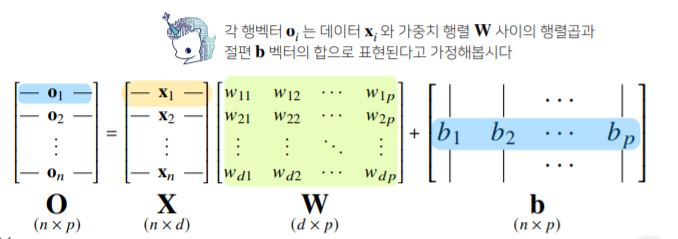

# Day8


[1. 소프트맥스](#softmax)

[2. 신경망](#신경망)

[3. Backpropagation](#역전파-알고리즘)

# | 회고

다중 클래스 분류에 대해서 이해할 수 있는 하루였습니다. 피어세션에서는 (1) Y 절편 벡터 구성 방식 + 회귀 계수가 추정되지 않은 상태에서 절편 빼고 시작해도 되는지, (2) 신경망이 선형 모델과 활성 함수의 결합인데, DNN에서는 어떻게 연결되는지 (3) git에서의 fork는 무엇인지 등등에 대해서 논의했습니다. 오늘도 감사한 하루였습니다!

# | 강의

# softmax
* 모델의 출력을 확률로 해석할 수 있게 변환해주는 연산
* 분류 문제를 풀 때, `선형모델과 소프트맥스 함수를 결합해 예측`한다.

* 특정 벡터가 어떤 클래스에 속할지 그 확률을 구해줌
```python
import numpy as np

def softmax(vec):
    denumerator=np.exp(vec-np.max(vec,axis=-1,keepdims=True))
    numerator=np.sum(denumerator,axis=-1,keepdims=True)
    val=denumerator/numerator
    return val

vec=np.array([[1,2,0],[-1,0,1],[-10,0,10]])
print(softmax(vec))
```
* `학습`에는 softmax를 쓰지만, `추론`을 할 때에는 one-hot 벡터를 만드는 함수를 사용한다.
    * `추론` : 학습된 모델에 새로운 데이터를 적용하는 것
* 분류문제는 softmax를 이용해서 선형 모델로 나온 출력값에 softmax를 씌워줌. 선형모델을 원하는 의도로 바꿔 해석할 수 있다.

# 활성 함수
* 실수값을 입력받고 다시 실수값을 뱉는 비선형(nonlinear)함수
* 활성함수 쓰지 않으면 딥러닝은 선형 모형과 차이가 없다.
* sigmoid함수나 tanh함수는 전통적으로 많이 쓰이던 활성함수지만, 딥러닝에선 `ReLU함수`를 많이 쓰고 있다.

*ReLU : x가 0보다 작을 땐 0이고, x가 0보다 클 때는 x*
* softmax 트릭처럼, 다른 activation func도 선형 -> 비선형 함수로 모델링할 때 사용할 수 있다.
* softmax는 출력물 모든 걸 고려해 출력한다면, 활성 함수는 특정 주소에 대한 출력값만 가지고 계산함. 따라서 벡터가 인풋이 아니라 실수값이 인풋으로 들어옴. 
* 활성함수로 선형모델로 나온 출력물을 비선형모델로 출력하고, 변형시킨 출력물이 `뉴런(=잠재벡터)`이다. (활성 함수 한번 씌운 것)

# 신경망
* `선형 모델`과 `활성함수`(:non-linear)를 합성한 함수
* 비선형모델 



O: 출력 행렬

X: 각 행벡터는 각각의 데이터들. 데이터를 모아둔 행렬

W: 출력으로 뱉어주는 가중치 행렬. 행렬을 다른 벡터 공간으로 보내주는 "연산"기능 (d -> p차원으로 출력되도록 만들어줌)

b: y절편에 해당하는 벡터들을 모든 행에 대해서 똑같이 복제. 각 행에는 모두 똑같이 들어있다.

* 화살표가 Wij의 역할. 화살표는 p*d개임. 가중치행렬 W의 원소 개수가 결국, 신경망에서 화살표 값을 의미한다고 보면 됨

* 2-layers perceptron
    * 잠재벡터 H에서 가중치 행렬 $W^{(2)}$와 $b^{(2)}$를 통해 다시 한번 선형 변환해 출력하면 ($W^{(2)}$,$W^{(1)}$)를 파라미터로 가진 2-layers 신경망이다.
    
* multi-layer perceptron (MLP)
    * 신경망이 여러층 합성된 함수
    
    * forward-propagation
        * 학습이 아니라 주어진 입력이 왔을 때 출력을 내뱉는 과정
    * 층을 여러개 쌓는 이유?
        * 사실, `이론적`으로는 2층 신경망으로도 임의의 연속함수를 근사할 수 있다.(universal approximation therorem)
        * `층이 깊을수록`, 목적함수를 근사하는데 필요한 `뉴런(노드)의 숫자가 훨씬 빨리 줄어들어` 좀 더 효율적으로 학습이 가능하다.
        
        * 주의할 점은, 층을 깊게 쌓아 복잡한 함수를 표현할 수록 최적화에 더 힘써야 한다. 학습이 어려워질 수도 있다(CNN 공부 시 다시 다룸)
    
# 역전파 알고리즘
* backpropagation알고리즘을 이용해 각 층에 사용된 패러미터 ${(W^{(l)},b^{(l)})}^{L}_{l=1}$을 학습한다.
* 경사하강법을 적용해서 각각의 가중치 행렬 학습시킬 때, 각 층에 존재하는 그레디언트를 계산하며 가중치를 업데이트해야 한다. 
* 선형 모델의 경우는 경사하강법 적용할 때, 한층만 하면 되지만 DL과 같은 경우는 순차적으로 미분을 계산해야 한다. 


    *각 층에서 계산된 그레디언트를 밑에 층으로 전달한다.*
* 각 층의 패러미터의 그레디언트 벡터는 윗층부터 역순으로 계산하게 된다. (by 연쇄법칙)

* 결국, 역접파 알고리즘은 합성함수 미분법인 `chain-rule 기반 자동미분(auto-differentiation)`을 사용한다.
    * $z={(x+y)^2}$
    * $\frac{\partial z}{\partial x}=\frac{\partial z}{\partial w}*\frac{\partial w}{\partial x}$
    * $\therefore 2(x+y)$
    * x에 대한 미분을 계산하기 위해서는 x,y 노드에 해당하는 텐서값을 메모리에 미리 저장해둬야 한다. 따라서 forward propagation보다 메모리를 더 많이 사용하게 된다. 
* 2-layers 신경망에서 chain-rule(빨간색 방향이 back-propagation)


# 정리
* 딥러닝 학습 원리 : 역전파
* 역전파 가장 중요 원리 : 체인룰
* 딥러닝 수식적 구성이 선형 모델+활성함수들의 여러 층에 대한 합성 함수
* 합성함수이다 보니까 그레디언트를 계산하려면 연쇄법칙이 필요
* 연쇄법칙을 적용한 알고리즘이 역전파
* 수식이 아니라, 원리적으로 이해하자